# P-E2M2E - Dossier Technique Detaille


\pagebreak

## Page 1 - P-E2M2E - Fiche Technique Detaillee

> Concepteur: Charmant Nyungu K.<br>Consultant en innovation technologique, panafricaniste.<br>Site web: www.charmantnyungu.com<br>Email: consultant@charmantnyungu.com<br>Téléphone: +243 835 137 837

Imaginez un monde où vos données ne sont lisibles que par vous, non parce qu'elles sont simplement cachées, mais parce qu'elles perdent leur sens dès qu'elles quittent votre contexte physique.

Imaginez que les serveurs les plus sophistiqués puissent stocker vos fragments sans jamais voir le message, sans jamais comprendre sa forme, sans jamais posséder la possibilité de le reconstituer.

Imaginez encore que les pirates informatiques les plus expérimentés se retrouvent face à une matière numérique devenue inutile: des fragments sans temps, sans lieu, sans état ambiant, donc sans existence exploitable.

C'est précisément la rupture introduite par P-E2M2E. Cette technologie ne s'ajoute pas à la confidentialité traditionnelle; elle redéfinit la manière d'accéder aux données, de les manipuler, de les transmettre et de leur donner existence.

Ce volume ouvre la spécification de cette cryptographie physicalisée: une architecture où la donnée n'est plus seulement protégée, mais conditionnée par le réel.


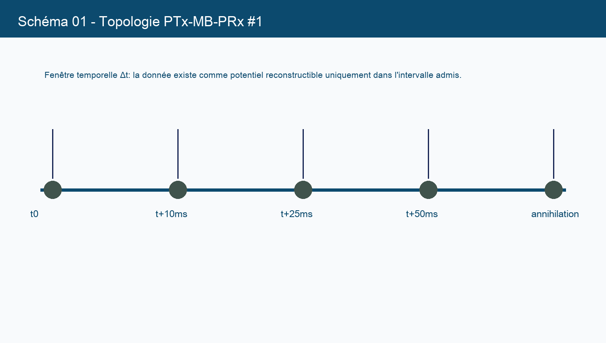


\pagebreak

## Page 2 - Resume Executif

P-E2M2E établit une sécurité de l'information où la donnée n'existe sous forme reconstruisible que lorsque trois familles de vecteurs convergent: le temps, l'espace et l'état physique ambiant.

Le protocole abolit la dépendance centrale à la clé statique. L'accès se produit par cristallisation contextuelle: hors temps, hors lieu ou hors état physique, le message cesse d'être reconstructible.

Le serveur intermédiaire MB reste aveugle par construction. Il orchestre des fragments, vérifie des tags de session et applique des politiques sans posséder le message clair ni la capacité de le reconstituer.

J'y formalise P-E2M2E comme un système conçu, étudié et organisé par mes soins après six années de maturation conceptuelle, logique et technique.


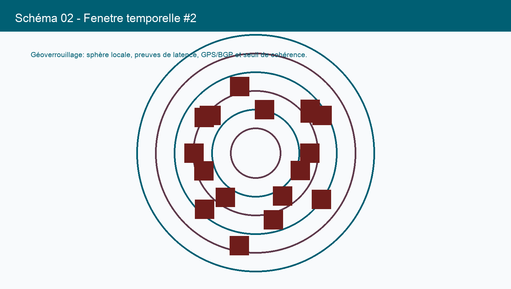


\pagebreak

## Page 3 - Fiche Technique Synthetique

Nom: P-E2M2E. Extension: Physicalized End-to-Middle-to-End Cryptography. Domaine: cryptographie contextuelle physicalisee, cloud aveugle, securite reseau et protection de donnees sensibles.

Entites: PTx pour l'emetteur physique, MB pour le milieu aveugle, PRx pour le recepteur physique. Objet central: vecteur d'etat Φ(t, loc, s).

Principe directeur: rendre la reconstruction d'une donnee dependante d'une coherence physique temporaire et non d'une cle statique durable.

Position du concepteur: le protocole transforme la securite en phenomene vivant. La donnée n'est pas seulement chiffrée; elle est conditionnée par son environnement d'existence.


| Parametre | Role | Exemple |

| --- | --- | --- |

| Δt | fenetre temporelle | fenetre nominale 10-50 ms |

| loc | preuve spatiale | GPS/BGP/latence |

| s | etat ambiant | jitter, bruit, capteur |


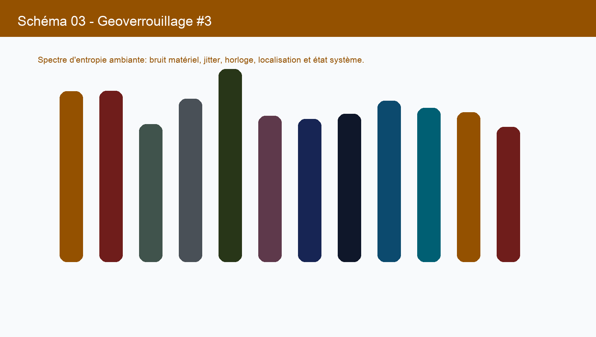


\pagebreak

## Page 4 - Chapitre 1 - Vision Fondatrice

Ce chapitre formalise l'annihilation contextuelle. Il expose la matrice P-E2M2E dans sa logique propre, sans la ramener a une architecture conventionnelle.

Dans le protocole P-E2M2E, l'annihilation contextuelle devient une composante active de la sécurité et non une métadonnée décorative. Les travaux conduits pendant six ans établissent une lecture nouvelle de la donnée: elle n'est plus offerte au serveur comme un fichier stable, mais comme un potentiel fragmenté qui ne reprend forme qu'en présence du contexte physique exact. La référence technique [332d3b737f] relie cette section aux axes temps, localisation et entropie ambiante.

Chaque section présente la vision, la specification exploitable, les paramètres observables et les mécanismes qui démontrent la cohérence du protocole.


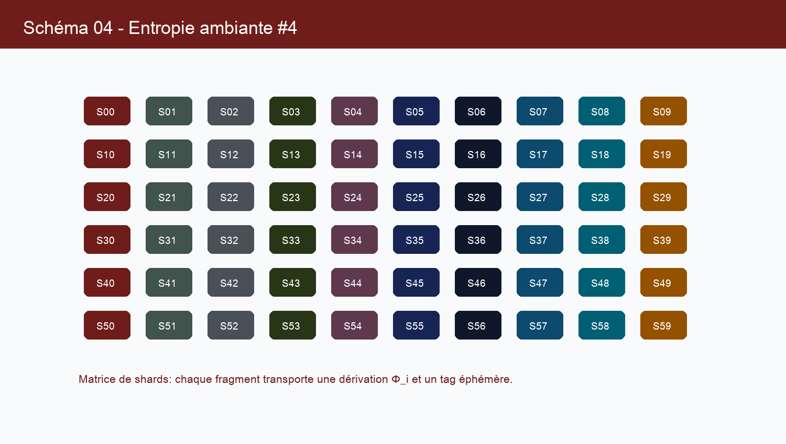


\pagebreak

## Page 5 - Vision Fondatrice - Section 1

Dans le protocole P-E2M2E, l'annihilation contextuelle devient une composante active de la sécurité et non une métadonnée décorative. Les travaux conduits pendant six ans établissent une lecture nouvelle de la donnée: elle n'est plus offerte au serveur comme un fichier stable, mais comme un potentiel fragmenté qui ne reprend forme qu'en présence du contexte physique exact. La référence technique [fe141c22c4] relie cette section aux axes temps, localisation et entropie ambiante.

Specification 1. Le nœud PTx module le flux selon Φ, puis divise la charge utile en micro-paquets dont l'existence cryptographique est éphémère.

Parametres suivis: Δt_1, loc_1, s_1, jitter_1, tag_session_1. Ces valeurs forment la matrice physique de cristallisation et imposent l'existence locale du message.

Critere de rejet: si la distance temporelle, la divergence spatiale ou l'incoherence d'entropie depasse le seuil τ_1, le fragment est classe comme annihile et ne participe plus a la reconstruction.


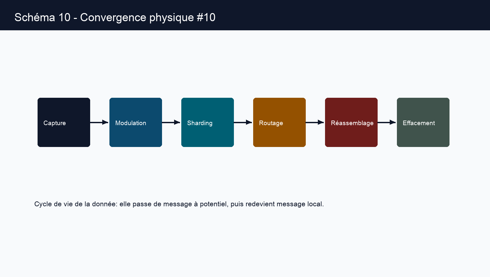


\pagebreak

## Page 6 - Vision Fondatrice - Section 2

Dans le protocole P-E2M2E, l'annihilation contextuelle devient une composante active de la sécurité et non une métadonnée décorative. Les travaux conduits pendant six ans établissent une lecture nouvelle de la donnée: elle n'est plus offerte au serveur comme un fichier stable, mais comme un potentiel fragmenté qui ne reprend forme qu'en présence du contexte physique exact. La référence technique [e30468af74] relie cette section aux axes temps, localisation et entropie ambiante.

Specification 2. Le nœud PRx ne récupère pas une clé classique; il cristallise le message par présence contextuelle cohérente avec les contraintes du canal.

Parametres suivis: Δt_2, loc_2, s_2, jitter_2, tag_session_2. Ces valeurs forment la matrice physique de cristallisation et imposent l'existence locale du message.

Critere de rejet: si la distance temporelle, la divergence spatiale ou l'incoherence d'entropie depasse le seuil τ_2, le fragment est classe comme annihile et ne participe plus a la reconstruction.


| Element | Definition P-E2M2E | Controle |

| --- | --- | --- |

| PTx | source physique | capture temps, lieu, entropie |

| MB | milieu aveugle | routage et indexation opaque |

| PRx | reception physicalisee | preuve de contexte |

| Φ | vecteur ephemere | derive de coherence |


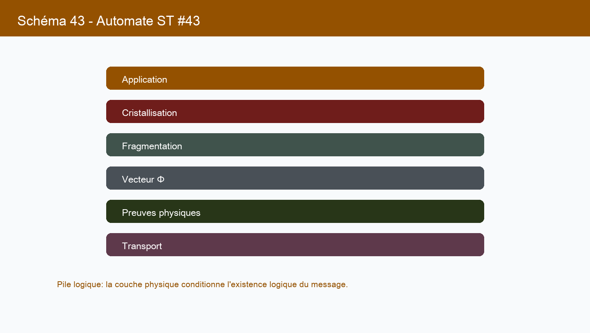


\pagebreak

## Page 7 - Vision Fondatrice - Section 3

Dans le protocole P-E2M2E, l'annihilation contextuelle devient une composante active de la sécurité et non une métadonnée décorative. Les travaux conduits pendant six ans établissent une lecture nouvelle de la donnée: elle n'est plus offerte au serveur comme un fichier stable, mais comme un potentiel fragmenté qui ne reprend forme qu'en présence du contexte physique exact. La référence technique [d3e4a79824] relie cette section aux axes temps, localisation et entropie ambiante.

Specification 3. Les mesures retenues dans ce dossier consolident la démonstration: latence, dérive d'horloge, cohérence spatiale, entropie locale et comportement des fragments.

Parametres suivis: Δt_3, loc_3, s_3, jitter_3, tag_session_3. Ces valeurs forment la matrice physique de cristallisation et imposent l'existence locale du message.

Critere de rejet: si la distance temporelle, la divergence spatiale ou l'incoherence d'entropie depasse le seuil τ_3, le fragment est classe comme annihile et ne participe plus a la reconstruction.


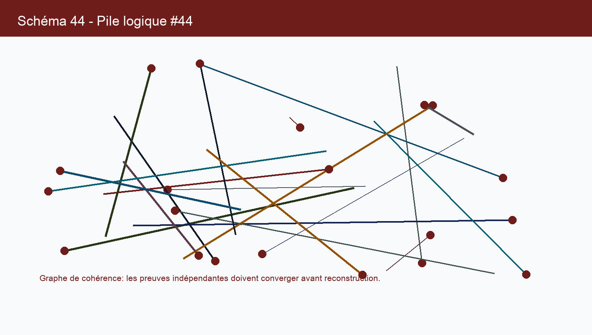


\pagebreak

## Page 8 - Vision Fondatrice - Section 4

Dans le protocole P-E2M2E, l'annihilation contextuelle devient une composante active de la sécurité et non une métadonnée décorative. Les travaux conduits pendant six ans établissent une lecture nouvelle de la donnée: elle n'est plus offerte au serveur comme un fichier stable, mais comme un potentiel fragmenté qui ne reprend forme qu'en présence du contexte physique exact. La référence technique [2201c79e70] relie cette section aux axes temps, localisation et entropie ambiante.

Specification 4. La règle opérationnelle impose l'annihilation dès que les observations physiques sortent de la fenêtre prévue.

Parametres suivis: Δt_4, loc_4, s_4, jitter_4, tag_session_4. Ces valeurs forment la matrice physique de cristallisation et imposent l'existence locale du message.

Critere de rejet: si la distance temporelle, la divergence spatiale ou l'incoherence d'entropie depasse le seuil τ_4, le fragment est classe comme annihile et ne participe plus a la reconstruction.


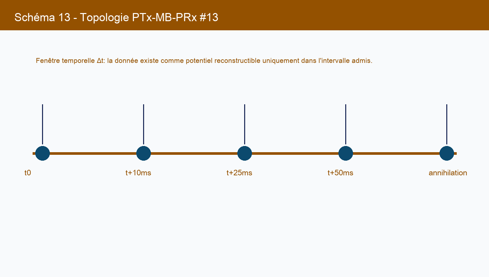


\pagebreak

## Page 9 - Vision Fondatrice - Section 5

Dans le protocole P-E2M2E, l'annihilation contextuelle devient une composante active de la sécurité et non une métadonnée décorative. Les travaux conduits pendant six ans établissent une lecture nouvelle de la donnée: elle n'est plus offerte au serveur comme un fichier stable, mais comme un potentiel fragmenté qui ne reprend forme qu'en présence du contexte physique exact. La référence technique [ea36bb477d] relie cette section aux axes temps, localisation et entropie ambiante.

Specification 5. Le serveur MB ne reçoit aucune charge utile intelligible; il manipule des fragments, des tags temporaires et des états de routage aveugles.

Parametres suivis: Δt_5, loc_5, s_5, jitter_5, tag_session_5. Ces valeurs forment la matrice physique de cristallisation et imposent l'existence locale du message.

Critere de rejet: si la distance temporelle, la divergence spatiale ou l'incoherence d'entropie depasse le seuil τ_5, le fragment est classe comme annihile et ne participe plus a la reconstruction.


| Element | Definition P-E2M2E | Controle |

| --- | --- | --- |

| PTx | source physique | capture temps, lieu, entropie |

| MB | milieu aveugle | routage et indexation opaque |

| PRx | reception physicalisee | preuve de contexte |

| Φ | vecteur ephemere | derive de coherence |


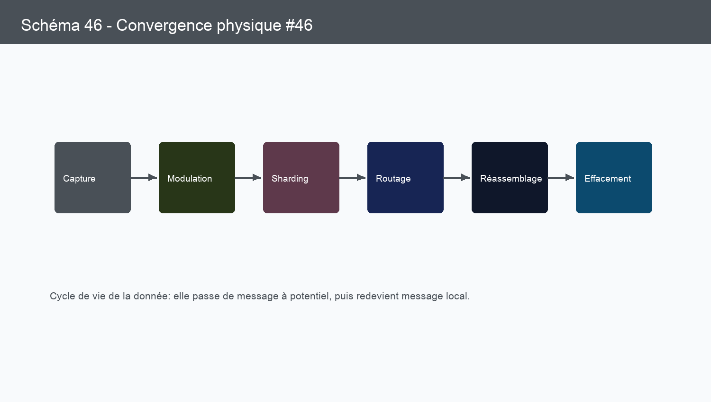


\pagebreak

## Page 10 - Vision Fondatrice - Section 6

Dans le protocole P-E2M2E, l'annihilation contextuelle devient une composante active de la sécurité et non une métadonnée décorative. Les travaux conduits pendant six ans établissent une lecture nouvelle de la donnée: elle n'est plus offerte au serveur comme un fichier stable, mais comme un potentiel fragmenté qui ne reprend forme qu'en présence du contexte physique exact. La référence technique [6d3665719d] relie cette section aux axes temps, localisation et entropie ambiante.

Specification 6. Le nœud PTx module le flux selon Φ, puis divise la charge utile en micro-paquets dont l'existence cryptographique est éphémère.

Parametres suivis: Δt_6, loc_6, s_6, jitter_6, tag_session_6. Ces valeurs forment la matrice physique de cristallisation et imposent l'existence locale du message.

Critere de rejet: si la distance temporelle, la divergence spatiale ou l'incoherence d'entropie depasse le seuil τ_6, le fragment est classe comme annihile et ne participe plus a la reconstruction.


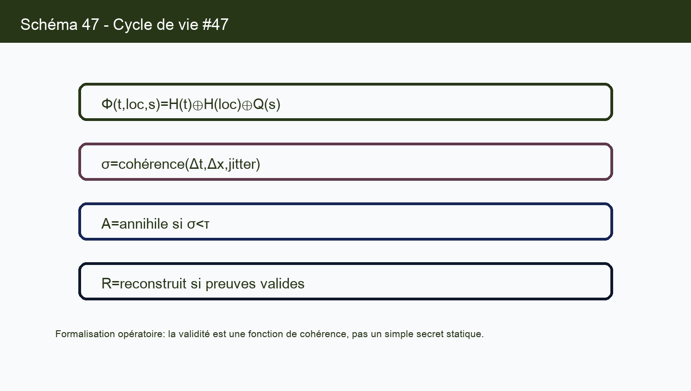


\pagebreak

## Page 11 - Vision Fondatrice - Section 7

Dans le protocole P-E2M2E, l'annihilation contextuelle devient une composante active de la sécurité et non une métadonnée décorative. Les travaux conduits pendant six ans établissent une lecture nouvelle de la donnée: elle n'est plus offerte au serveur comme un fichier stable, mais comme un potentiel fragmenté qui ne reprend forme qu'en présence du contexte physique exact. La référence technique [6c2960c1a3] relie cette section aux axes temps, localisation et entropie ambiante.

Specification 7. Le nœud PRx ne récupère pas une clé classique; il cristallise le message par présence contextuelle cohérente avec les contraintes du canal.

Parametres suivis: Δt_7, loc_7, s_7, jitter_7, tag_session_7. Ces valeurs forment la matrice physique de cristallisation et imposent l'existence locale du message.

Critere de rejet: si la distance temporelle, la divergence spatiale ou l'incoherence d'entropie depasse le seuil τ_7, le fragment est classe comme annihile et ne participe plus a la reconstruction.


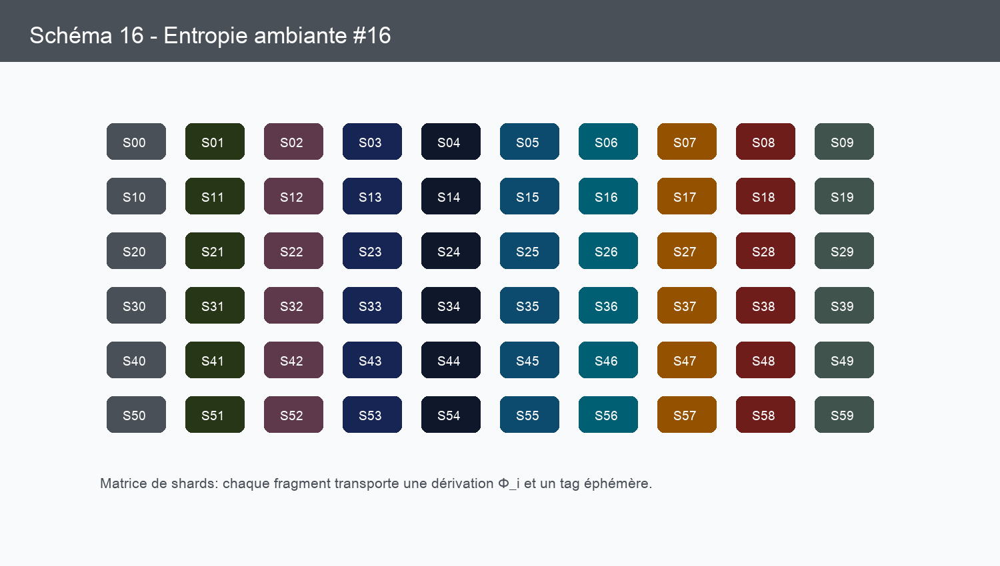


\pagebreak

## Page 12 - Vision Fondatrice - Section 8

Dans le protocole P-E2M2E, l'annihilation contextuelle devient une composante active de la sécurité et non une métadonnée décorative. Les travaux conduits pendant six ans établissent une lecture nouvelle de la donnée: elle n'est plus offerte au serveur comme un fichier stable, mais comme un potentiel fragmenté qui ne reprend forme qu'en présence du contexte physique exact. La référence technique [4afe664c0b] relie cette section aux axes temps, localisation et entropie ambiante.

Specification 8. Les mesures retenues dans ce dossier consolident la démonstration: latence, dérive d'horloge, cohérence spatiale, entropie locale et comportement des fragments.

Parametres suivis: Δt_8, loc_8, s_8, jitter_8, tag_session_8. Ces valeurs forment la matrice physique de cristallisation et imposent l'existence locale du message.

Critere de rejet: si la distance temporelle, la divergence spatiale ou l'incoherence d'entropie depasse le seuil τ_8, le fragment est classe comme annihile et ne participe plus a la reconstruction.


| Element | Definition P-E2M2E | Controle |

| --- | --- | --- |

| PTx | source physique | capture temps, lieu, entropie |

| MB | milieu aveugle | routage et indexation opaque |

| PRx | reception physicalisee | preuve de contexte |

| Φ | vecteur ephemere | derive de coherence |


\pagebreak

## Page 13 - Chapitre 2 - Postulat Physique

Ce chapitre formalise la transformation du message en potentiel. Il expose la matrice P-E2M2E dans sa logique propre, sans la ramener a une architecture conventionnelle.

Dans le protocole P-E2M2E, la transformation du message en potentiel devient une composante active de la sécurité et non une métadonnée décorative. Les travaux conduits pendant six ans établissent une lecture nouvelle de la donnée: elle n'est plus offerte au serveur comme un fichier stable, mais comme un potentiel fragmenté qui ne reprend forme qu'en présence du contexte physique exact. La référence technique [36fc73c71d] relie cette section aux axes temps, localisation et entropie ambiante.

Chaque section présente la vision, la specification exploitable, les paramètres observables et les mécanismes qui démontrent la cohérence du protocole.


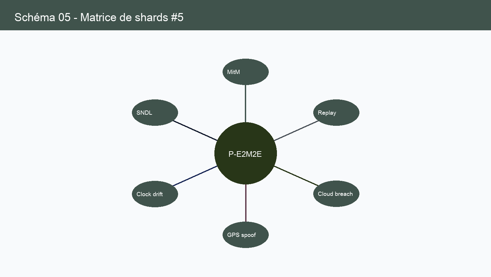


\pagebreak

## Page 14 - Postulat Physique - Section 1

Dans le protocole P-E2M2E, la transformation du message en potentiel devient une composante active de la sécurité et non une métadonnée décorative. Les travaux conduits pendant six ans établissent une lecture nouvelle de la donnée: elle n'est plus offerte au serveur comme un fichier stable, mais comme un potentiel fragmenté qui ne reprend forme qu'en présence du contexte physique exact. La référence technique [f7ce76ab93] relie cette section aux axes temps, localisation et entropie ambiante.

Specification 1. Le nœud PRx ne récupère pas une clé classique; il cristallise le message par présence contextuelle cohérente avec les contraintes du canal.

Parametres suivis: Δt_1, loc_1, s_1, jitter_1, tag_session_1. Ces valeurs forment la matrice physique de cristallisation et imposent l'existence locale du message.

Critere de rejet: si la distance temporelle, la divergence spatiale ou l'incoherence d'entropie depasse le seuil τ_1, le fragment est classe comme annihile et ne participe plus a la reconstruction.


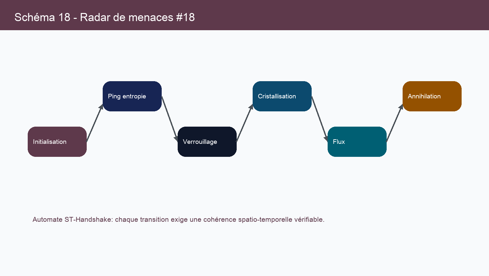


\pagebreak

## Page 15 - Postulat Physique - Section 2

Dans le protocole P-E2M2E, la transformation du message en potentiel devient une composante active de la sécurité et non une métadonnée décorative. Les travaux conduits pendant six ans établissent une lecture nouvelle de la donnée: elle n'est plus offerte au serveur comme un fichier stable, mais comme un potentiel fragmenté qui ne reprend forme qu'en présence du contexte physique exact. La référence technique [4be6f35c2f] relie cette section aux axes temps, localisation et entropie ambiante.

Specification 2. Les mesures retenues dans ce dossier consolident la démonstration: latence, dérive d'horloge, cohérence spatiale, entropie locale et comportement des fragments.

Parametres suivis: Δt_2, loc_2, s_2, jitter_2, tag_session_2. Ces valeurs forment la matrice physique de cristallisation et imposent l'existence locale du message.

Critere de rejet: si la distance temporelle, la divergence spatiale ou l'incoherence d'entropie depasse le seuil τ_2, le fragment est classe comme annihile et ne participe plus a la reconstruction.


| Element | Definition P-E2M2E | Controle |

| --- | --- | --- |

| PTx | source physique | capture temps, lieu, entropie |

| MB | milieu aveugle | routage et indexation opaque |

| PRx | reception physicalisee | preuve de contexte |

| Φ | vecteur ephemere | derive de coherence |


\pagebreak

## Page 16 - Postulat Physique - Section 3

Dans le protocole P-E2M2E, la transformation du message en potentiel devient une composante active de la sécurité et non une métadonnée décorative. Les travaux conduits pendant six ans établissent une lecture nouvelle de la donnée: elle n'est plus offerte au serveur comme un fichier stable, mais comme un potentiel fragmenté qui ne reprend forme qu'en présence du contexte physique exact. La référence technique [350f80b864] relie cette section aux axes temps, localisation et entropie ambiante.

Specification 3. La règle opérationnelle impose l'annihilation dès que les observations physiques sortent de la fenêtre prévue.

Parametres suivis: Δt_3, loc_3, s_3, jitter_3, tag_session_3. Ces valeurs forment la matrice physique de cristallisation et imposent l'existence locale du message.

Critere de rejet: si la distance temporelle, la divergence spatiale ou l'incoherence d'entropie depasse le seuil τ_3, le fragment est classe comme annihile et ne participe plus a la reconstruction.


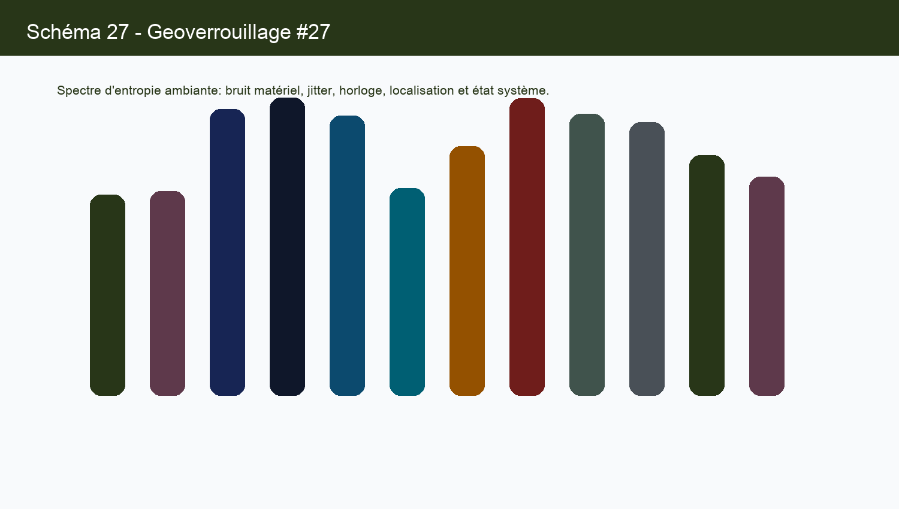


\pagebreak

## Page 17 - Postulat Physique - Section 4

Dans le protocole P-E2M2E, la transformation du message en potentiel devient une composante active de la sécurité et non une métadonnée décorative. Les travaux conduits pendant six ans établissent une lecture nouvelle de la donnée: elle n'est plus offerte au serveur comme un fichier stable, mais comme un potentiel fragmenté qui ne reprend forme qu'en présence du contexte physique exact. La référence technique [d0f2deee07] relie cette section aux axes temps, localisation et entropie ambiante.

Specification 4. Le serveur MB ne reçoit aucune charge utile intelligible; il manipule des fragments, des tags temporaires et des états de routage aveugles.

Parametres suivis: Δt_4, loc_4, s_4, jitter_4, tag_session_4. Ces valeurs forment la matrice physique de cristallisation et imposent l'existence locale du message.

Critere de rejet: si la distance temporelle, la divergence spatiale ou l'incoherence d'entropie depasse le seuil τ_4, le fragment est classe comme annihile et ne participe plus a la reconstruction.


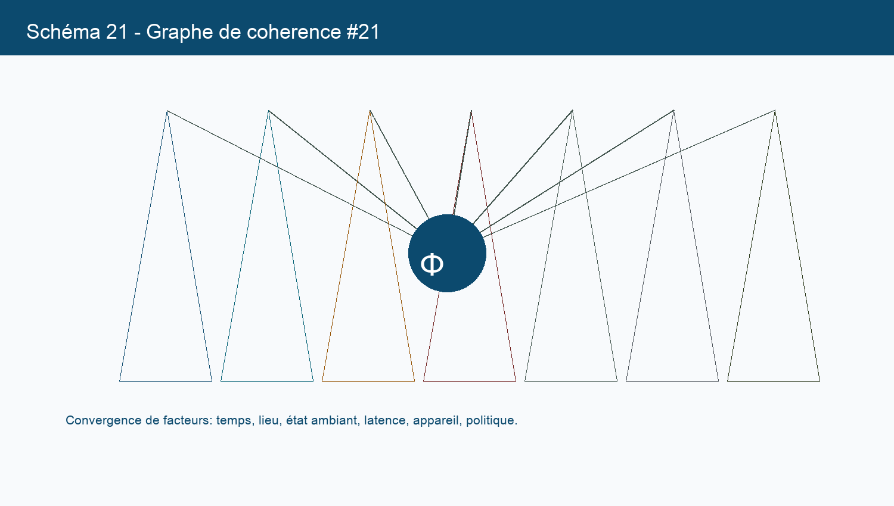


\pagebreak

## Page 18 - Postulat Physique - Section 5

Dans le protocole P-E2M2E, la transformation du message en potentiel devient une composante active de la sécurité et non une métadonnée décorative. Les travaux conduits pendant six ans établissent une lecture nouvelle de la donnée: elle n'est plus offerte au serveur comme un fichier stable, mais comme un potentiel fragmenté qui ne reprend forme qu'en présence du contexte physique exact. La référence technique [4ab624134e] relie cette section aux axes temps, localisation et entropie ambiante.

Specification 5. Le nœud PTx module le flux selon Φ, puis divise la charge utile en micro-paquets dont l'existence cryptographique est éphémère.

Parametres suivis: Δt_5, loc_5, s_5, jitter_5, tag_session_5. Ces valeurs forment la matrice physique de cristallisation et imposent l'existence locale du message.

Critere de rejet: si la distance temporelle, la divergence spatiale ou l'incoherence d'entropie depasse le seuil τ_5, le fragment est classe comme annihile et ne participe plus a la reconstruction.


| Element | Definition P-E2M2E | Controle |

| --- | --- | --- |

| PTx | source physique | capture temps, lieu, entropie |

| MB | milieu aveugle | routage et indexation opaque |

| PRx | reception physicalisee | preuve de contexte |

| Φ | vecteur ephemere | derive de coherence |


\pagebreak

## Page 19 - Postulat Physique - Section 6

Dans le protocole P-E2M2E, la transformation du message en potentiel devient une composante active de la sécurité et non une métadonnée décorative. Les travaux conduits pendant six ans établissent une lecture nouvelle de la donnée: elle n'est plus offerte au serveur comme un fichier stable, mais comme un potentiel fragmenté qui ne reprend forme qu'en présence du contexte physique exact. La référence technique [359410eb45] relie cette section aux axes temps, localisation et entropie ambiante.

Specification 6. Le nœud PRx ne récupère pas une clé classique; il cristallise le message par présence contextuelle cohérente avec les contraintes du canal.

Parametres suivis: Δt_6, loc_6, s_6, jitter_6, tag_session_6. Ces valeurs forment la matrice physique de cristallisation et imposent l'existence locale du message.

Critere de rejet: si la distance temporelle, la divergence spatiale ou l'incoherence d'entropie depasse le seuil τ_6, le fragment est classe comme annihile et ne participe plus a la reconstruction.


\pagebreak

## Page 20 - Postulat Physique - Section 7

Dans le protocole P-E2M2E, la transformation du message en potentiel devient une composante active de la sécurité et non une métadonnée décorative. Les travaux conduits pendant six ans établissent une lecture nouvelle de la donnée: elle n'est plus offerte au serveur comme un fichier stable, mais comme un potentiel fragmenté qui ne reprend forme qu'en présence du contexte physique exact. La référence technique [0790c1e397] relie cette section aux axes temps, localisation et entropie ambiante.

Specification 7. Les mesures retenues dans ce dossier consolident la démonstration: latence, dérive d'horloge, cohérence spatiale, entropie locale et comportement des fragments.

Parametres suivis: Δt_7, loc_7, s_7, jitter_7, tag_session_7. Ces valeurs forment la matrice physique de cristallisation et imposent l'existence locale du message.

Critere de rejet: si la distance temporelle, la divergence spatiale ou l'incoherence d'entropie depasse le seuil τ_7, le fragment est classe comme annihile et ne participe plus a la reconstruction.


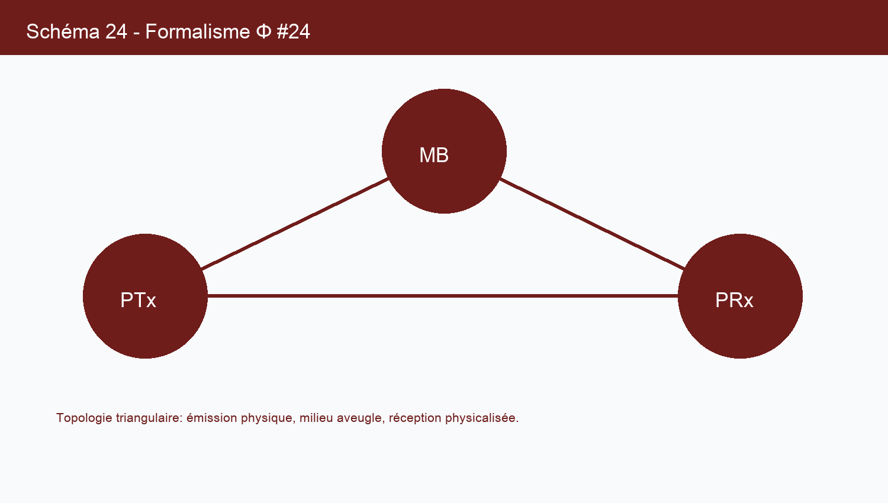


\pagebreak

## Page 21 - Postulat Physique - Section 8

Dans le protocole P-E2M2E, la transformation du message en potentiel devient une composante active de la sécurité et non une métadonnée décorative. Les travaux conduits pendant six ans établissent une lecture nouvelle de la donnée: elle n'est plus offerte au serveur comme un fichier stable, mais comme un potentiel fragmenté qui ne reprend forme qu'en présence du contexte physique exact. La référence technique [54a8791978] relie cette section aux axes temps, localisation et entropie ambiante.

Specification 8. La règle opérationnelle impose l'annihilation dès que les observations physiques sortent de la fenêtre prévue.

Parametres suivis: Δt_8, loc_8, s_8, jitter_8, tag_session_8. Ces valeurs forment la matrice physique de cristallisation et imposent l'existence locale du message.

Critere de rejet: si la distance temporelle, la divergence spatiale ou l'incoherence d'entropie depasse le seuil τ_8, le fragment est classe comme annihile et ne participe plus a la reconstruction.


| Element | Definition P-E2M2E | Controle |

| --- | --- | --- |

| PTx | source physique | capture temps, lieu, entropie |

| MB | milieu aveugle | routage et indexation opaque |

| PRx | reception physicalisee | preuve de contexte |

| Φ | vecteur ephemere | derive de coherence |


\pagebreak

## Page 22 - Chapitre 3 - Modele Mathematique

Ce chapitre formalise le vecteur Φ et ses composantes. Il expose la matrice P-E2M2E dans sa logique propre, sans la ramener a une architecture conventionnelle.

Dans le protocole P-E2M2E, le vecteur Φ et ses composantes devient une composante active de la sécurité et non une métadonnée décorative. Les travaux conduits pendant six ans établissent une lecture nouvelle de la donnée: elle n'est plus offerte au serveur comme un fichier stable, mais comme un potentiel fragmenté qui ne reprend forme qu'en présence du contexte physique exact. La référence technique [c1bfe7f807] relie cette section aux axes temps, localisation et entropie ambiante.

Chaque section présente la vision, la specification exploitable, les paramètres observables et les mécanismes qui démontrent la cohérence du protocole.


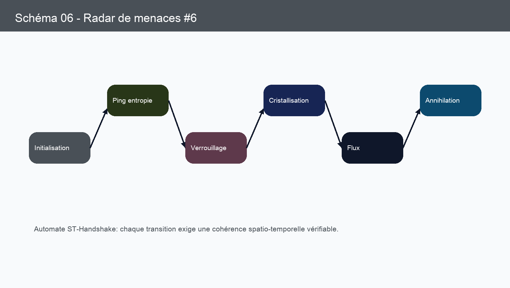


\pagebreak

## Page 23 - Modele Mathematique - Section 1

Dans le protocole P-E2M2E, le vecteur Φ et ses composantes devient une composante active de la sécurité et non une métadonnée décorative. Les travaux conduits pendant six ans établissent une lecture nouvelle de la donnée: elle n'est plus offerte au serveur comme un fichier stable, mais comme un potentiel fragmenté qui ne reprend forme qu'en présence du contexte physique exact. La référence technique [6f4367f6a8] relie cette section aux axes temps, localisation et entropie ambiante.

Specification 1. Les mesures retenues dans ce dossier consolident la démonstration: latence, dérive d'horloge, cohérence spatiale, entropie locale et comportement des fragments.

Parametres suivis: Δt_1, loc_1, s_1, jitter_1, tag_session_1. Ces valeurs forment la matrice physique de cristallisation et imposent l'existence locale du message.

Critere de rejet: si la distance temporelle, la divergence spatiale ou l'incoherence d'entropie depasse le seuil τ_1, le fragment est classe comme annihile et ne participe plus a la reconstruction.


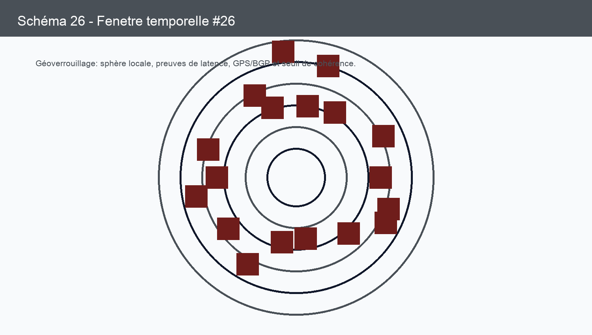


\pagebreak

## Page 24 - Modele Mathematique - Section 2

Dans le protocole P-E2M2E, le vecteur Φ et ses composantes devient une composante active de la sécurité et non une métadonnée décorative. Les travaux conduits pendant six ans établissent une lecture nouvelle de la donnée: elle n'est plus offerte au serveur comme un fichier stable, mais comme un potentiel fragmenté qui ne reprend forme qu'en présence du contexte physique exact. La référence technique [5552a472a6] relie cette section aux axes temps, localisation et entropie ambiante.

Specification 2. La règle opérationnelle impose l'annihilation dès que les observations physiques sortent de la fenêtre prévue.

Parametres suivis: Δt_2, loc_2, s_2, jitter_2, tag_session_2. Ces valeurs forment la matrice physique de cristallisation et imposent l'existence locale du message.

Critere de rejet: si la distance temporelle, la divergence spatiale ou l'incoherence d'entropie depasse le seuil τ_2, le fragment est classe comme annihile et ne participe plus a la reconstruction.


| Element | Definition P-E2M2E | Controle |

| --- | --- | --- |

| PTx | source physique | capture temps, lieu, entropie |

| MB | milieu aveugle | routage et indexation opaque |

| PRx | reception physicalisee | preuve de contexte |

| Φ | vecteur ephemere | derive de coherence |


\pagebreak

## Page 25 - Modele Mathematique - Section 3

Dans le protocole P-E2M2E, le vecteur Φ et ses composantes devient une composante active de la sécurité et non une métadonnée décorative. Les travaux conduits pendant six ans établissent une lecture nouvelle de la donnée: elle n'est plus offerte au serveur comme un fichier stable, mais comme un potentiel fragmenté qui ne reprend forme qu'en présence du contexte physique exact. La référence technique [d3492407a3] relie cette section aux axes temps, localisation et entropie ambiante.

Specification 3. Le serveur MB ne reçoit aucune charge utile intelligible; il manipule des fragments, des tags temporaires et des états de routage aveugles.

Parametres suivis: Δt_3, loc_3, s_3, jitter_3, tag_session_3. Ces valeurs forment la matrice physique de cristallisation et imposent l'existence locale du message.

Critere de rejet: si la distance temporelle, la divergence spatiale ou l'incoherence d'entropie depasse le seuil τ_3, le fragment est classe comme annihile et ne participe plus a la reconstruction.


\pagebreak

## Page 26 - Modele Mathematique - Section 4

Dans le protocole P-E2M2E, le vecteur Φ et ses composantes devient une composante active de la sécurité et non une métadonnée décorative. Les travaux conduits pendant six ans établissent une lecture nouvelle de la donnée: elle n'est plus offerte au serveur comme un fichier stable, mais comme un potentiel fragmenté qui ne reprend forme qu'en présence du contexte physique exact. La référence technique [cce1bbc75d] relie cette section aux axes temps, localisation et entropie ambiante.

Specification 4. Le nœud PTx module le flux selon Φ, puis divise la charge utile en micro-paquets dont l'existence cryptographique est éphémère.

Parametres suivis: Δt_4, loc_4, s_4, jitter_4, tag_session_4. Ces valeurs forment la matrice physique de cristallisation et imposent l'existence locale du message.

Critere de rejet: si la distance temporelle, la divergence spatiale ou l'incoherence d'entropie depasse le seuil τ_4, le fragment est classe comme annihile et ne participe plus a la reconstruction.


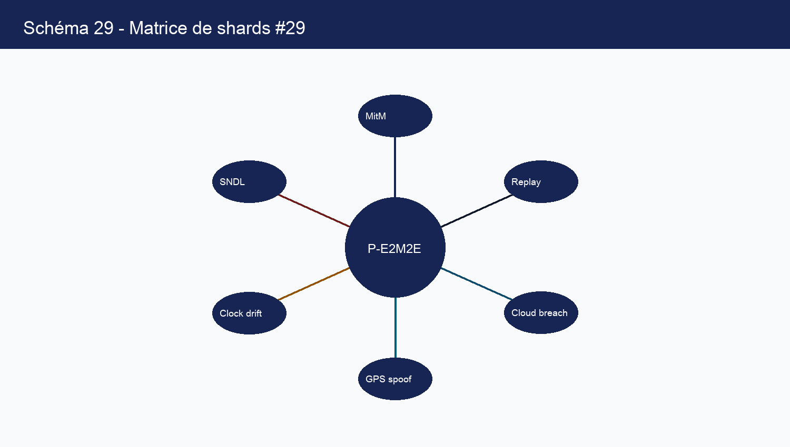


\pagebreak

## Page 27 - Modele Mathematique - Section 5

Dans le protocole P-E2M2E, le vecteur Φ et ses composantes devient une composante active de la sécurité et non une métadonnée décorative. Les travaux conduits pendant six ans établissent une lecture nouvelle de la donnée: elle n'est plus offerte au serveur comme un fichier stable, mais comme un potentiel fragmenté qui ne reprend forme qu'en présence du contexte physique exact. La référence technique [44f90718d2] relie cette section aux axes temps, localisation et entropie ambiante.

Specification 5. Le nœud PRx ne récupère pas une clé classique; il cristallise le message par présence contextuelle cohérente avec les contraintes du canal.

Parametres suivis: Δt_5, loc_5, s_5, jitter_5, tag_session_5. Ces valeurs forment la matrice physique de cristallisation et imposent l'existence locale du message.

Critere de rejet: si la distance temporelle, la divergence spatiale ou l'incoherence d'entropie depasse le seuil τ_5, le fragment est classe comme annihile et ne participe plus a la reconstruction.


| Element | Definition P-E2M2E | Controle |

| --- | --- | --- |

| PTx | source physique | capture temps, lieu, entropie |

| MB | milieu aveugle | routage et indexation opaque |

| PRx | reception physicalisee | preuve de contexte |

| Φ | vecteur ephemere | derive de coherence |


\pagebreak

## Page 28 - Modele Mathematique - Section 6

Dans le protocole P-E2M2E, le vecteur Φ et ses composantes devient une composante active de la sécurité et non une métadonnée décorative. Les travaux conduits pendant six ans établissent une lecture nouvelle de la donnée: elle n'est plus offerte au serveur comme un fichier stable, mais comme un potentiel fragmenté qui ne reprend forme qu'en présence du contexte physique exact. La référence technique [790eb896d6] relie cette section aux axes temps, localisation et entropie ambiante.

Specification 6. Les mesures retenues dans ce dossier consolident la démonstration: latence, dérive d'horloge, cohérence spatiale, entropie locale et comportement des fragments.

Parametres suivis: Δt_6, loc_6, s_6, jitter_6, tag_session_6. Ces valeurs forment la matrice physique de cristallisation et imposent l'existence locale du message.

Critere de rejet: si la distance temporelle, la divergence spatiale ou l'incoherence d'entropie depasse le seuil τ_6, le fragment est classe comme annihile et ne participe plus a la reconstruction.


\pagebreak

## Page 29 - Modele Mathematique - Section 7

Dans le protocole P-E2M2E, le vecteur Φ et ses composantes devient une composante active de la sécurité et non une métadonnée décorative. Les travaux conduits pendant six ans établissent une lecture nouvelle de la donnée: elle n'est plus offerte au serveur comme un fichier stable, mais comme un potentiel fragmenté qui ne reprend forme qu'en présence du contexte physique exact. La référence technique [249d4547fd] relie cette section aux axes temps, localisation et entropie ambiante.

Specification 7. La règle opérationnelle impose l'annihilation dès que les observations physiques sortent de la fenêtre prévue.

Parametres suivis: Δt_7, loc_7, s_7, jitter_7, tag_session_7. Ces valeurs forment la matrice physique de cristallisation et imposent l'existence locale du message.

Critere de rejet: si la distance temporelle, la divergence spatiale ou l'incoherence d'entropie depasse le seuil τ_7, le fragment est classe comme annihile et ne participe plus a la reconstruction.


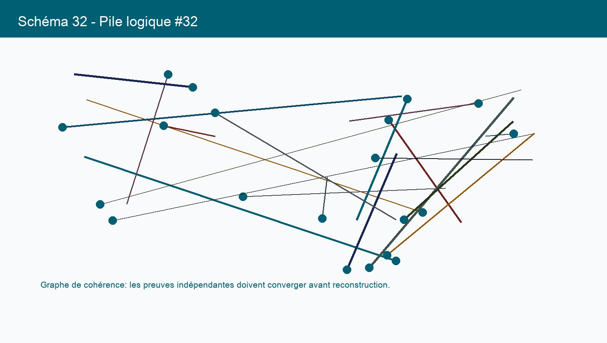


\pagebreak

## Page 30 - Modele Mathematique - Section 8

Dans le protocole P-E2M2E, le vecteur Φ et ses composantes devient une composante active de la sécurité et non une métadonnée décorative. Les travaux conduits pendant six ans établissent une lecture nouvelle de la donnée: elle n'est plus offerte au serveur comme un fichier stable, mais comme un potentiel fragmenté qui ne reprend forme qu'en présence du contexte physique exact. La référence technique [2d5c1f550f] relie cette section aux axes temps, localisation et entropie ambiante.

Specification 8. Le serveur MB ne reçoit aucune charge utile intelligible; il manipule des fragments, des tags temporaires et des états de routage aveugles.

Parametres suivis: Δt_8, loc_8, s_8, jitter_8, tag_session_8. Ces valeurs forment la matrice physique de cristallisation et imposent l'existence locale du message.

Critere de rejet: si la distance temporelle, la divergence spatiale ou l'incoherence d'entropie depasse le seuil τ_8, le fragment est classe comme annihile et ne participe plus a la reconstruction.


| Element | Definition P-E2M2E | Controle |

| --- | --- | --- |

| PTx | source physique | capture temps, lieu, entropie |

| MB | milieu aveugle | routage et indexation opaque |

| PRx | reception physicalisee | preuve de contexte |

| Φ | vecteur ephemere | derive de coherence |


\pagebreak

## Page 31 - Chapitre 4 - Entropie Ambiante

Ce chapitre formalise l'extraction d'etat physique local. Il expose la matrice P-E2M2E dans sa logique propre, sans la ramener a une architecture conventionnelle.

Dans le protocole P-E2M2E, l'extraction d'etat physique local devient une composante active de la sécurité et non une métadonnée décorative. Les travaux conduits pendant six ans établissent une lecture nouvelle de la donnée: elle n'est plus offerte au serveur comme un fichier stable, mais comme un potentiel fragmenté qui ne reprend forme qu'en présence du contexte physique exact. La référence technique [b1c149f650] relie cette section aux axes temps, localisation et entropie ambiante.

Chaque section présente la vision, la specification exploitable, les paramètres observables et les mécanismes qui démontrent la cohérence du protocole.


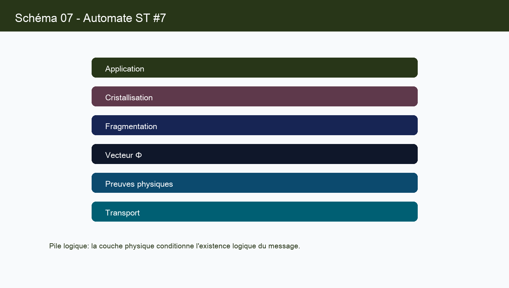


\pagebreak

## Page 32 - Entropie Ambiante - Section 1

Dans le protocole P-E2M2E, l'extraction d'etat physique local devient une composante active de la sécurité et non une métadonnée décorative. Les travaux conduits pendant six ans établissent une lecture nouvelle de la donnée: elle n'est plus offerte au serveur comme un fichier stable, mais comme un potentiel fragmenté qui ne reprend forme qu'en présence du contexte physique exact. La référence technique [d3b7f201d2] relie cette section aux axes temps, localisation et entropie ambiante.

Specification 1. La règle opérationnelle impose l'annihilation dès que les observations physiques sortent de la fenêtre prévue.

Parametres suivis: Δt_1, loc_1, s_1, jitter_1, tag_session_1. Ces valeurs forment la matrice physique de cristallisation et imposent l'existence locale du message.

Critere de rejet: si la distance temporelle, la divergence spatiale ou l'incoherence d'entropie depasse le seuil τ_1, le fragment est classe comme annihile et ne participe plus a la reconstruction.


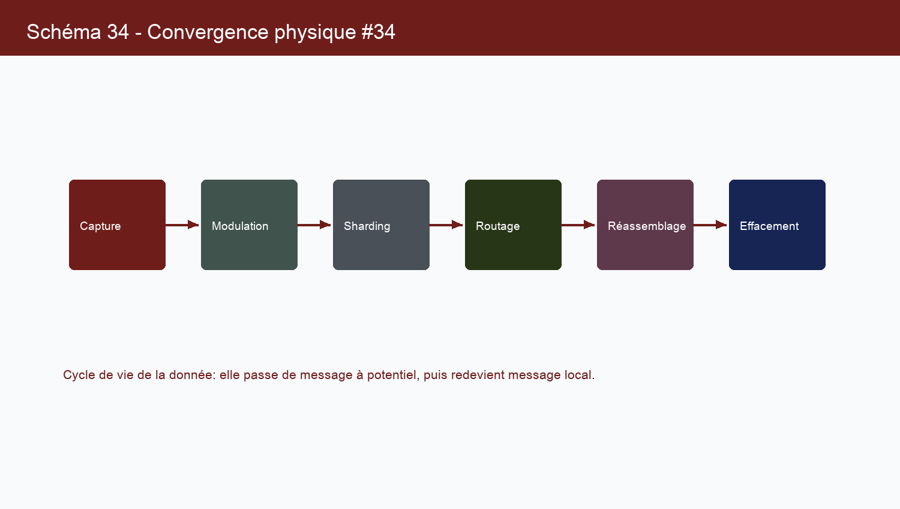


\pagebreak

## Page 33 - Entropie Ambiante - Section 2

Dans le protocole P-E2M2E, l'extraction d'etat physique local devient une composante active de la sécurité et non une métadonnée décorative. Les travaux conduits pendant six ans établissent une lecture nouvelle de la donnée: elle n'est plus offerte au serveur comme un fichier stable, mais comme un potentiel fragmenté qui ne reprend forme qu'en présence du contexte physique exact. La référence technique [83d1bdaaee] relie cette section aux axes temps, localisation et entropie ambiante.

Specification 2. Le serveur MB ne reçoit aucune charge utile intelligible; il manipule des fragments, des tags temporaires et des états de routage aveugles.

Parametres suivis: Δt_2, loc_2, s_2, jitter_2, tag_session_2. Ces valeurs forment la matrice physique de cristallisation et imposent l'existence locale du message.

Critere de rejet: si la distance temporelle, la divergence spatiale ou l'incoherence d'entropie depasse le seuil τ_2, le fragment est classe comme annihile et ne participe plus a la reconstruction.


| Element | Definition P-E2M2E | Controle |

| --- | --- | --- |

| PTx | source physique | capture temps, lieu, entropie |

| MB | milieu aveugle | routage et indexation opaque |

| PRx | reception physicalisee | preuve de contexte |

| Φ | vecteur ephemere | derive de coherence |


\pagebreak

## Page 34 - Entropie Ambiante - Section 3

Dans le protocole P-E2M2E, l'extraction d'etat physique local devient une composante active de la sécurité et non une métadonnée décorative. Les travaux conduits pendant six ans établissent une lecture nouvelle de la donnée: elle n'est plus offerte au serveur comme un fichier stable, mais comme un potentiel fragmenté qui ne reprend forme qu'en présence du contexte physique exact. La référence technique [a73a027700] relie cette section aux axes temps, localisation et entropie ambiante.

Specification 3. Le nœud PTx module le flux selon Φ, puis divise la charge utile en micro-paquets dont l'existence cryptographique est éphémère.

Parametres suivis: Δt_3, loc_3, s_3, jitter_3, tag_session_3. Ces valeurs forment la matrice physique de cristallisation et imposent l'existence locale du message.

Critere de rejet: si la distance temporelle, la divergence spatiale ou l'incoherence d'entropie depasse le seuil τ_3, le fragment est classe comme annihile et ne participe plus a la reconstruction.


\pagebreak

## Page 35 - Entropie Ambiante - Section 4

Dans le protocole P-E2M2E, l'extraction d'etat physique local devient une composante active de la sécurité et non une métadonnée décorative. Les travaux conduits pendant six ans établissent une lecture nouvelle de la donnée: elle n'est plus offerte au serveur comme un fichier stable, mais comme un potentiel fragmenté qui ne reprend forme qu'en présence du contexte physique exact. La référence technique [75bb6baa9f] relie cette section aux axes temps, localisation et entropie ambiante.

Specification 4. Le nœud PRx ne récupère pas une clé classique; il cristallise le message par présence contextuelle cohérente avec les contraintes du canal.

Parametres suivis: Δt_4, loc_4, s_4, jitter_4, tag_session_4. Ces valeurs forment la matrice physique de cristallisation et imposent l'existence locale du message.

Critere de rejet: si la distance temporelle, la divergence spatiale ou l'incoherence d'entropie depasse le seuil τ_4, le fragment est classe comme annihile et ne participe plus a la reconstruction.


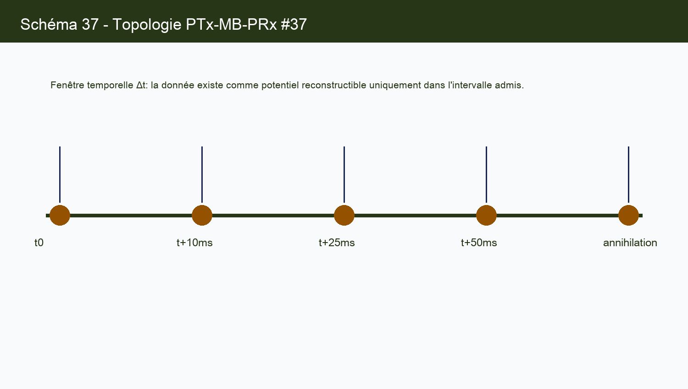


\pagebreak

## Page 36 - Entropie Ambiante - Section 5

Dans le protocole P-E2M2E, l'extraction d'etat physique local devient une composante active de la sécurité et non une métadonnée décorative. Les travaux conduits pendant six ans établissent une lecture nouvelle de la donnée: elle n'est plus offerte au serveur comme un fichier stable, mais comme un potentiel fragmenté qui ne reprend forme qu'en présence du contexte physique exact. La référence technique [8ce0b47fea] relie cette section aux axes temps, localisation et entropie ambiante.

Specification 5. Les mesures retenues dans ce dossier consolident la démonstration: latence, dérive d'horloge, cohérence spatiale, entropie locale et comportement des fragments.

Parametres suivis: Δt_5, loc_5, s_5, jitter_5, tag_session_5. Ces valeurs forment la matrice physique de cristallisation et imposent l'existence locale du message.

Critere de rejet: si la distance temporelle, la divergence spatiale ou l'incoherence d'entropie depasse le seuil τ_5, le fragment est classe comme annihile et ne participe plus a la reconstruction.


| Element | Definition P-E2M2E | Controle |

| --- | --- | --- |

| PTx | source physique | capture temps, lieu, entropie |

| MB | milieu aveugle | routage et indexation opaque |

| PRx | reception physicalisee | preuve de contexte |

| Φ | vecteur ephemere | derive de coherence |


\pagebreak

## Page 37 - Entropie Ambiante - Section 6

Dans le protocole P-E2M2E, l'extraction d'etat physique local devient une composante active de la sécurité et non une métadonnée décorative. Les travaux conduits pendant six ans établissent une lecture nouvelle de la donnée: elle n'est plus offerte au serveur comme un fichier stable, mais comme un potentiel fragmenté qui ne reprend forme qu'en présence du contexte physique exact. La référence technique [96bdf89fcb] relie cette section aux axes temps, localisation et entropie ambiante.

Specification 6. La règle opérationnelle impose l'annihilation dès que les observations physiques sortent de la fenêtre prévue.

Parametres suivis: Δt_6, loc_6, s_6, jitter_6, tag_session_6. Ces valeurs forment la matrice physique de cristallisation et imposent l'existence locale du message.

Critere de rejet: si la distance temporelle, la divergence spatiale ou l'incoherence d'entropie depasse le seuil τ_6, le fragment est classe comme annihile et ne participe plus a la reconstruction.


\pagebreak

## Page 38 - Entropie Ambiante - Section 7

Dans le protocole P-E2M2E, l'extraction d'etat physique local devient une composante active de la sécurité et non une métadonnée décorative. Les travaux conduits pendant six ans établissent une lecture nouvelle de la donnée: elle n'est plus offerte au serveur comme un fichier stable, mais comme un potentiel fragmenté qui ne reprend forme qu'en présence du contexte physique exact. La référence technique [43263373c1] relie cette section aux axes temps, localisation et entropie ambiante.

Specification 7. Le serveur MB ne reçoit aucune charge utile intelligible; il manipule des fragments, des tags temporaires et des états de routage aveugles.

Parametres suivis: Δt_7, loc_7, s_7, jitter_7, tag_session_7. Ces valeurs forment la matrice physique de cristallisation et imposent l'existence locale du message.

Critere de rejet: si la distance temporelle, la divergence spatiale ou l'incoherence d'entropie depasse le seuil τ_7, le fragment est classe comme annihile et ne participe plus a la reconstruction.


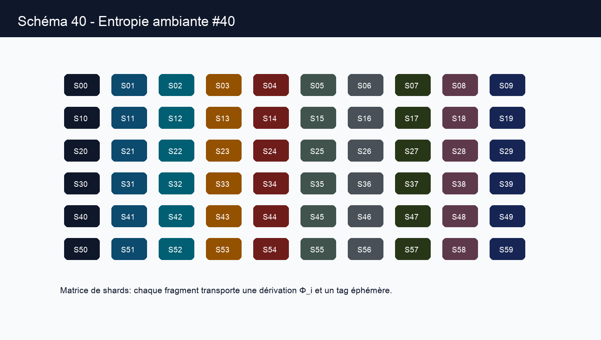


\pagebreak

## Page 39 - Entropie Ambiante - Section 8

Dans le protocole P-E2M2E, l'extraction d'etat physique local devient une composante active de la sécurité et non une métadonnée décorative. Les travaux conduits pendant six ans établissent une lecture nouvelle de la donnée: elle n'est plus offerte au serveur comme un fichier stable, mais comme un potentiel fragmenté qui ne reprend forme qu'en présence du contexte physique exact. La référence technique [0e93b50448] relie cette section aux axes temps, localisation et entropie ambiante.

Specification 8. Le nœud PTx module le flux selon Φ, puis divise la charge utile en micro-paquets dont l'existence cryptographique est éphémère.

Parametres suivis: Δt_8, loc_8, s_8, jitter_8, tag_session_8. Ces valeurs forment la matrice physique de cristallisation et imposent l'existence locale du message.

Critere de rejet: si la distance temporelle, la divergence spatiale ou l'incoherence d'entropie depasse le seuil τ_8, le fragment est classe comme annihile et ne participe plus a la reconstruction.


| Element | Definition P-E2M2E | Controle |

| --- | --- | --- |

| PTx | source physique | capture temps, lieu, entropie |

| MB | milieu aveugle | routage et indexation opaque |

| PRx | reception physicalisee | preuve de contexte |

| Φ | vecteur ephemere | derive de coherence |


\pagebreak

## Page 40 - Chapitre 5 - Temps et Horloge

Ce chapitre formalise la fenetre Δt et la derive. Il expose la matrice P-E2M2E dans sa logique propre, sans la ramener a une architecture conventionnelle.

Dans le protocole P-E2M2E, la fenetre Δt et la derive devient une composante active de la sécurité et non une métadonnée décorative. Les travaux conduits pendant six ans établissent une lecture nouvelle de la donnée: elle n'est plus offerte au serveur comme un fichier stable, mais comme un potentiel fragmenté qui ne reprend forme qu'en présence du contexte physique exact. La référence technique [fa538caf77] relie cette section aux axes temps, localisation et entropie ambiante.

Chaque section présente la vision, la specification exploitable, les paramètres observables et les mécanismes qui démontrent la cohérence du protocole.


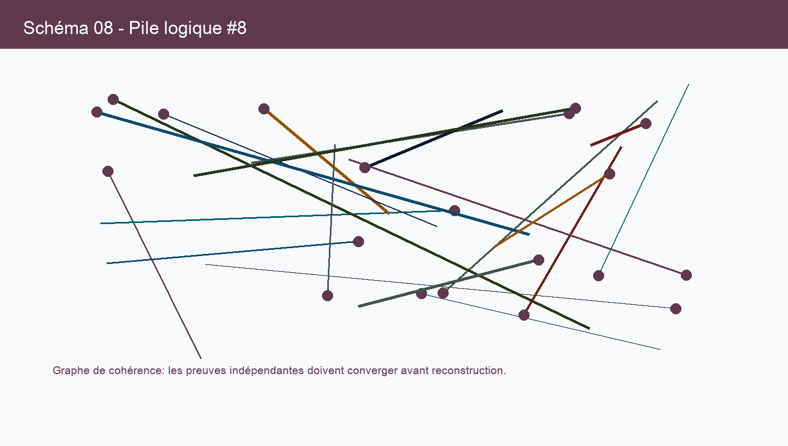


\pagebreak

## Page 41 - Temps et Horloge - Section 1

Dans le protocole P-E2M2E, la fenetre Δt et la derive devient une composante active de la sécurité et non une métadonnée décorative. Les travaux conduits pendant six ans établissent une lecture nouvelle de la donnée: elle n'est plus offerte au serveur comme un fichier stable, mais comme un potentiel fragmenté qui ne reprend forme qu'en présence du contexte physique exact. La référence technique [708b99e1a2] relie cette section aux axes temps, localisation et entropie ambiante.

Specification 1. Le serveur MB ne reçoit aucune charge utile intelligible; il manipule des fragments, des tags temporaires et des états de routage aveugles.

Parametres suivis: Δt_1, loc_1, s_1, jitter_1, tag_session_1. Ces valeurs forment la matrice physique de cristallisation et imposent l'existence locale du message.

Critere de rejet: si la distance temporelle, la divergence spatiale ou l'incoherence d'entropie depasse le seuil τ_1, le fragment est classe comme annihile et ne participe plus a la reconstruction.


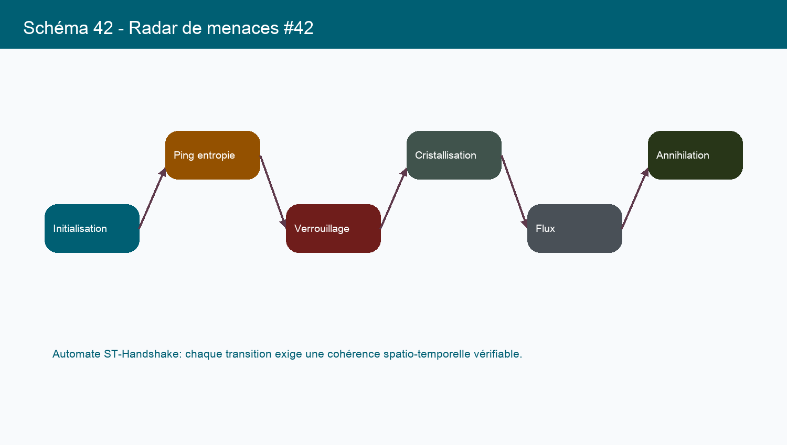


\pagebreak

## Page 42 - Temps et Horloge - Section 2

Dans le protocole P-E2M2E, la fenetre Δt et la derive devient une composante active de la sécurité et non une métadonnée décorative. Les travaux conduits pendant six ans établissent une lecture nouvelle de la donnée: elle n'est plus offerte au serveur comme un fichier stable, mais comme un potentiel fragmenté qui ne reprend forme qu'en présence du contexte physique exact. La référence technique [26f841fe0b] relie cette section aux axes temps, localisation et entropie ambiante.

Specification 2. Le nœud PTx module le flux selon Φ, puis divise la charge utile en micro-paquets dont l'existence cryptographique est éphémère.

Parametres suivis: Δt_2, loc_2, s_2, jitter_2, tag_session_2. Ces valeurs forment la matrice physique de cristallisation et imposent l'existence locale du message.

Critere de rejet: si la distance temporelle, la divergence spatiale ou l'incoherence d'entropie depasse le seuil τ_2, le fragment est classe comme annihile et ne participe plus a la reconstruction.


| Element | Definition P-E2M2E | Controle |

| --- | --- | --- |

| PTx | source physique | capture temps, lieu, entropie |

| MB | milieu aveugle | routage et indexation opaque |

| PRx | reception physicalisee | preuve de contexte |

| Φ | vecteur ephemere | derive de coherence |


\pagebreak

## Page 43 - Temps et Horloge - Section 3

Dans le protocole P-E2M2E, la fenetre Δt et la derive devient une composante active de la sécurité et non une métadonnée décorative. Les travaux conduits pendant six ans établissent une lecture nouvelle de la donnée: elle n'est plus offerte au serveur comme un fichier stable, mais comme un potentiel fragmenté qui ne reprend forme qu'en présence du contexte physique exact. La référence technique [3ef5f54cf6] relie cette section aux axes temps, localisation et entropie ambiante.

Specification 3. Le nœud PRx ne récupère pas une clé classique; il cristallise le message par présence contextuelle cohérente avec les contraintes du canal.

Parametres suivis: Δt_3, loc_3, s_3, jitter_3, tag_session_3. Ces valeurs forment la matrice physique de cristallisation et imposent l'existence locale du message.

Critere de rejet: si la distance temporelle, la divergence spatiale ou l'incoherence d'entropie depasse le seuil τ_3, le fragment est classe comme annihile et ne participe plus a la reconstruction.


\pagebreak

## Page 44 - Temps et Horloge - Section 4

Dans le protocole P-E2M2E, la fenetre Δt et la derive devient une composante active de la sécurité et non une métadonnée décorative. Les travaux conduits pendant six ans établissent une lecture nouvelle de la donnée: elle n'est plus offerte au serveur comme un fichier stable, mais comme un potentiel fragmenté qui ne reprend forme qu'en présence du contexte physique exact. La référence technique [24441fa5d7] relie cette section aux axes temps, localisation et entropie ambiante.

Specification 4. Les mesures retenues dans ce dossier consolident la démonstration: latence, dérive d'horloge, cohérence spatiale, entropie locale et comportement des fragments.

Parametres suivis: Δt_4, loc_4, s_4, jitter_4, tag_session_4. Ces valeurs forment la matrice physique de cristallisation et imposent l'existence locale du message.

Critere de rejet: si la distance temporelle, la divergence spatiale ou l'incoherence d'entropie depasse le seuil τ_4, le fragment est classe comme annihile et ne participe plus a la reconstruction.


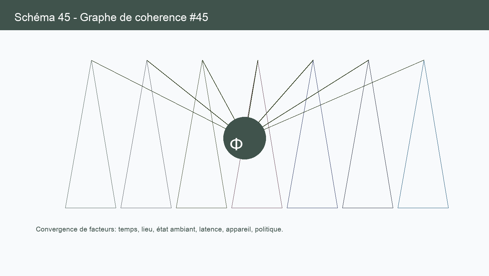


\pagebreak

## Page 45 - Temps et Horloge - Section 5

Dans le protocole P-E2M2E, la fenetre Δt et la derive devient une composante active de la sécurité et non une métadonnée décorative. Les travaux conduits pendant six ans établissent une lecture nouvelle de la donnée: elle n'est plus offerte au serveur comme un fichier stable, mais comme un potentiel fragmenté qui ne reprend forme qu'en présence du contexte physique exact. La référence technique [f0357d6408] relie cette section aux axes temps, localisation et entropie ambiante.

Specification 5. La règle opérationnelle impose l'annihilation dès que les observations physiques sortent de la fenêtre prévue.

Parametres suivis: Δt_5, loc_5, s_5, jitter_5, tag_session_5. Ces valeurs forment la matrice physique de cristallisation et imposent l'existence locale du message.

Critere de rejet: si la distance temporelle, la divergence spatiale ou l'incoherence d'entropie depasse le seuil τ_5, le fragment est classe comme annihile et ne participe plus a la reconstruction.


| Element | Definition P-E2M2E | Controle |

| --- | --- | --- |

| PTx | source physique | capture temps, lieu, entropie |

| MB | milieu aveugle | routage et indexation opaque |

| PRx | reception physicalisee | preuve de contexte |

| Φ | vecteur ephemere | derive de coherence |


\pagebreak

## Page 46 - Temps et Horloge - Section 6

Dans le protocole P-E2M2E, la fenetre Δt et la derive devient une composante active de la sécurité et non une métadonnée décorative. Les travaux conduits pendant six ans établissent une lecture nouvelle de la donnée: elle n'est plus offerte au serveur comme un fichier stable, mais comme un potentiel fragmenté qui ne reprend forme qu'en présence du contexte physique exact. La référence technique [6b554f2365] relie cette section aux axes temps, localisation et entropie ambiante.

Specification 6. Le serveur MB ne reçoit aucune charge utile intelligible; il manipule des fragments, des tags temporaires et des états de routage aveugles.

Parametres suivis: Δt_6, loc_6, s_6, jitter_6, tag_session_6. Ces valeurs forment la matrice physique de cristallisation et imposent l'existence locale du message.

Critere de rejet: si la distance temporelle, la divergence spatiale ou l'incoherence d'entropie depasse le seuil τ_6, le fragment est classe comme annihile et ne participe plus a la reconstruction.


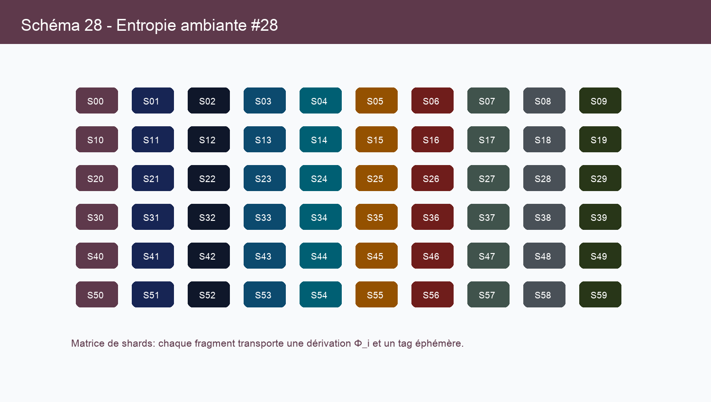


\pagebreak

## Page 47 - Temps et Horloge - Section 7

Dans le protocole P-E2M2E, la fenetre Δt et la derive devient une composante active de la sécurité et non une métadonnée décorative. Les travaux conduits pendant six ans établissent une lecture nouvelle de la donnée: elle n'est plus offerte au serveur comme un fichier stable, mais comme un potentiel fragmenté qui ne reprend forme qu'en présence du contexte physique exact. La référence technique [35397dc993] relie cette section aux axes temps, localisation et entropie ambiante.

Specification 7. Le nœud PTx module le flux selon Φ, puis divise la charge utile en micro-paquets dont l'existence cryptographique est éphémère.

Parametres suivis: Δt_7, loc_7, s_7, jitter_7, tag_session_7. Ces valeurs forment la matrice physique de cristallisation et imposent l'existence locale du message.

Critere de rejet: si la distance temporelle, la divergence spatiale ou l'incoherence d'entropie depasse le seuil τ_7, le fragment est classe comme annihile et ne participe plus a la reconstruction.


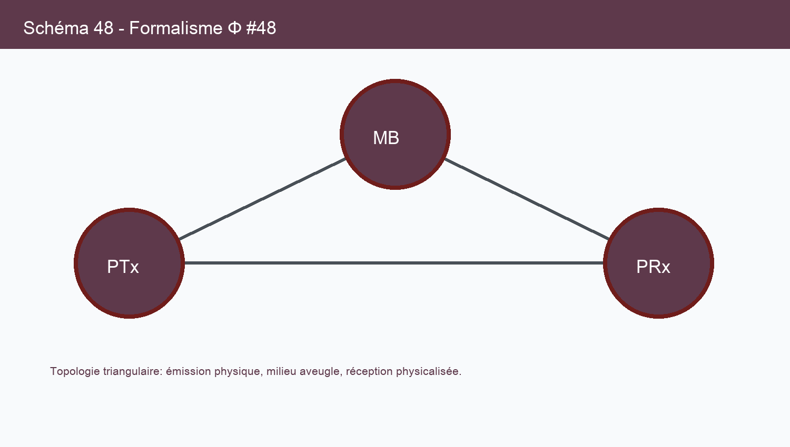


\pagebreak

## Page 48 - Temps et Horloge - Section 8

Dans le protocole P-E2M2E, la fenetre Δt et la derive devient une composante active de la sécurité et non une métadonnée décorative. Les travaux conduits pendant six ans établissent une lecture nouvelle de la donnée: elle n'est plus offerte au serveur comme un fichier stable, mais comme un potentiel fragmenté qui ne reprend forme qu'en présence du contexte physique exact. La référence technique [3e9d1c9da6] relie cette section aux axes temps, localisation et entropie ambiante.

Specification 8. Le nœud PRx ne récupère pas une clé classique; il cristallise le message par présence contextuelle cohérente avec les contraintes du canal.

Parametres suivis: Δt_8, loc_8, s_8, jitter_8, tag_session_8. Ces valeurs forment la matrice physique de cristallisation et imposent l'existence locale du message.

Critere de rejet: si la distance temporelle, la divergence spatiale ou l'incoherence d'entropie depasse le seuil τ_8, le fragment est classe comme annihile et ne participe plus a la reconstruction.


| Element | Definition P-E2M2E | Controle |

| --- | --- | --- |

| PTx | source physique | capture temps, lieu, entropie |

| MB | milieu aveugle | routage et indexation opaque |

| PRx | reception physicalisee | preuve de contexte |

| Φ | vecteur ephemere | derive de coherence |


\pagebreak

## Page 49 - Chapitre 6 - Localisation et Reseau

Ce chapitre formalise la coherence GPS, BGP et latence. Il expose la matrice P-E2M2E dans sa logique propre, sans la ramener a une architecture conventionnelle.

Dans le protocole P-E2M2E, la coherence GPS, BGP et latence devient une composante active de la sécurité et non une métadonnée décorative. Les travaux conduits pendant six ans établissent une lecture nouvelle de la donnée: elle n'est plus offerte au serveur comme un fichier stable, mais comme un potentiel fragmenté qui ne reprend forme qu'en présence du contexte physique exact. La référence technique [f9a5ee02fa] relie cette section aux axes temps, localisation et entropie ambiante.

Chaque section présente la vision, la specification exploitable, les paramètres observables et les mécanismes qui démontrent la cohérence du protocole.


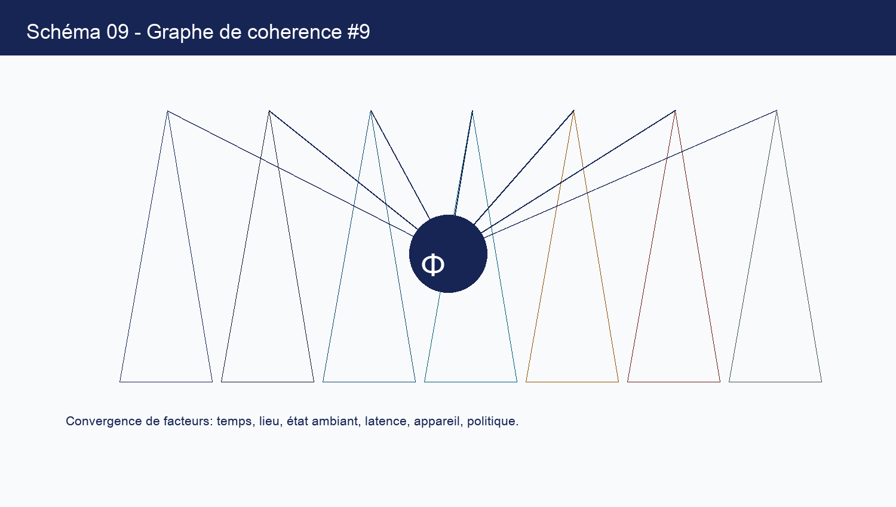


\pagebreak

## Page 50 - Localisation et Reseau - Section 1

Dans le protocole P-E2M2E, la coherence GPS, BGP et latence devient une composante active de la sécurité et non une métadonnée décorative. Les travaux conduits pendant six ans établissent une lecture nouvelle de la donnée: elle n'est plus offerte au serveur comme un fichier stable, mais comme un potentiel fragmenté qui ne reprend forme qu'en présence du contexte physique exact. La référence technique [c7bd8213e1] relie cette section aux axes temps, localisation et entropie ambiante.

Specification 1. Le nœud PTx module le flux selon Φ, puis divise la charge utile en micro-paquets dont l'existence cryptographique est éphémère.

Parametres suivis: Δt_1, loc_1, s_1, jitter_1, tag_session_1. Ces valeurs forment la matrice physique de cristallisation et imposent l'existence locale du message.

Critere de rejet: si la distance temporelle, la divergence spatiale ou l'incoherence d'entropie depasse le seuil τ_1, le fragment est classe comme annihile et ne participe plus a la reconstruction.


\pagebreak

## Page 51 - Localisation et Reseau - Section 2

Dans le protocole P-E2M2E, la coherence GPS, BGP et latence devient une composante active de la sécurité et non une métadonnée décorative. Les travaux conduits pendant six ans établissent une lecture nouvelle de la donnée: elle n'est plus offerte au serveur comme un fichier stable, mais comme un potentiel fragmenté qui ne reprend forme qu'en présence du contexte physique exact. La référence technique [2eb53d7f05] relie cette section aux axes temps, localisation et entropie ambiante.

Specification 2. Le nœud PRx ne récupère pas une clé classique; il cristallise le message par présence contextuelle cohérente avec les contraintes du canal.

Parametres suivis: Δt_2, loc_2, s_2, jitter_2, tag_session_2. Ces valeurs forment la matrice physique de cristallisation et imposent l'existence locale du message.

Critere de rejet: si la distance temporelle, la divergence spatiale ou l'incoherence d'entropie depasse le seuil τ_2, le fragment est classe comme annihile et ne participe plus a la reconstruction.


| Element | Definition P-E2M2E | Controle |

| --- | --- | --- |

| PTx | source physique | capture temps, lieu, entropie |

| MB | milieu aveugle | routage et indexation opaque |

| PRx | reception physicalisee | preuve de contexte |

| Φ | vecteur ephemere | derive de coherence |


\pagebreak

## Page 52 - Localisation et Reseau - Section 3

Dans le protocole P-E2M2E, la coherence GPS, BGP et latence devient une composante active de la sécurité et non une métadonnée décorative. Les travaux conduits pendant six ans établissent une lecture nouvelle de la donnée: elle n'est plus offerte au serveur comme un fichier stable, mais comme un potentiel fragmenté qui ne reprend forme qu'en présence du contexte physique exact. La référence technique [5333ba3fe1] relie cette section aux axes temps, localisation et entropie ambiante.

Specification 3. Les mesures retenues dans ce dossier consolident la démonstration: latence, dérive d'horloge, cohérence spatiale, entropie locale et comportement des fragments.

Parametres suivis: Δt_3, loc_3, s_3, jitter_3, tag_session_3. Ces valeurs forment la matrice physique de cristallisation et imposent l'existence locale du message.

Critere de rejet: si la distance temporelle, la divergence spatiale ou l'incoherence d'entropie depasse le seuil τ_3, le fragment est classe comme annihile et ne participe plus a la reconstruction.


\pagebreak

## Page 53 - Localisation et Reseau - Section 4

Dans le protocole P-E2M2E, la coherence GPS, BGP et latence devient une composante active de la sécurité et non une métadonnée décorative. Les travaux conduits pendant six ans établissent une lecture nouvelle de la donnée: elle n'est plus offerte au serveur comme un fichier stable, mais comme un potentiel fragmenté qui ne reprend forme qu'en présence du contexte physique exact. La référence technique [4148a98730] relie cette section aux axes temps, localisation et entropie ambiante.

Specification 4. La règle opérationnelle impose l'annihilation dès que les observations physiques sortent de la fenêtre prévue.

Parametres suivis: Δt_4, loc_4, s_4, jitter_4, tag_session_4. Ces valeurs forment la matrice physique de cristallisation et imposent l'existence locale du message.

Critere de rejet: si la distance temporelle, la divergence spatiale ou l'incoherence d'entropie depasse le seuil τ_4, le fragment est classe comme annihile et ne participe plus a la reconstruction.


\pagebreak

## Page 54 - Localisation et Reseau - Section 5

Dans le protocole P-E2M2E, la coherence GPS, BGP et latence devient une composante active de la sécurité et non une métadonnée décorative. Les travaux conduits pendant six ans établissent une lecture nouvelle de la donnée: elle n'est plus offerte au serveur comme un fichier stable, mais comme un potentiel fragmenté qui ne reprend forme qu'en présence du contexte physique exact. La référence technique [6bd113190d] relie cette section aux axes temps, localisation et entropie ambiante.

Specification 5. Le serveur MB ne reçoit aucune charge utile intelligible; il manipule des fragments, des tags temporaires et des états de routage aveugles.

Parametres suivis: Δt_5, loc_5, s_5, jitter_5, tag_session_5. Ces valeurs forment la matrice physique de cristallisation et imposent l'existence locale du message.

Critere de rejet: si la distance temporelle, la divergence spatiale ou l'incoherence d'entropie depasse le seuil τ_5, le fragment est classe comme annihile et ne participe plus a la reconstruction.


| Element | Definition P-E2M2E | Controle |

| --- | --- | --- |

| PTx | source physique | capture temps, lieu, entropie |

| MB | milieu aveugle | routage et indexation opaque |

| PRx | reception physicalisee | preuve de contexte |

| Φ | vecteur ephemere | derive de coherence |


\pagebreak

## Page 55 - Localisation et Reseau - Section 6

Dans le protocole P-E2M2E, la coherence GPS, BGP et latence devient une composante active de la sécurité et non une métadonnée décorative. Les travaux conduits pendant six ans établissent une lecture nouvelle de la donnée: elle n'est plus offerte au serveur comme un fichier stable, mais comme un potentiel fragmenté qui ne reprend forme qu'en présence du contexte physique exact. La référence technique [0cf6997c2d] relie cette section aux axes temps, localisation et entropie ambiante.

Specification 6. Le nœud PTx module le flux selon Φ, puis divise la charge utile en micro-paquets dont l'existence cryptographique est éphémère.

Parametres suivis: Δt_6, loc_6, s_6, jitter_6, tag_session_6. Ces valeurs forment la matrice physique de cristallisation et imposent l'existence locale du message.

Critere de rejet: si la distance temporelle, la divergence spatiale ou l'incoherence d'entropie depasse le seuil τ_6, le fragment est classe comme annihile et ne participe plus a la reconstruction.


\pagebreak

## Page 56 - Localisation et Reseau - Section 7

Dans le protocole P-E2M2E, la coherence GPS, BGP et latence devient une composante active de la sécurité et non une métadonnée décorative. Les travaux conduits pendant six ans établissent une lecture nouvelle de la donnée: elle n'est plus offerte au serveur comme un fichier stable, mais comme un potentiel fragmenté qui ne reprend forme qu'en présence du contexte physique exact. La référence technique [b59a650ccb] relie cette section aux axes temps, localisation et entropie ambiante.

Specification 7. Le nœud PRx ne récupère pas une clé classique; il cristallise le message par présence contextuelle cohérente avec les contraintes du canal.

Parametres suivis: Δt_7, loc_7, s_7, jitter_7, tag_session_7. Ces valeurs forment la matrice physique de cristallisation et imposent l'existence locale du message.

Critere de rejet: si la distance temporelle, la divergence spatiale ou l'incoherence d'entropie depasse le seuil τ_7, le fragment est classe comme annihile et ne participe plus a la reconstruction.


\pagebreak

## Page 57 - Localisation et Reseau - Section 8

Dans le protocole P-E2M2E, la coherence GPS, BGP et latence devient une composante active de la sécurité et non une métadonnée décorative. Les travaux conduits pendant six ans établissent une lecture nouvelle de la donnée: elle n'est plus offerte au serveur comme un fichier stable, mais comme un potentiel fragmenté qui ne reprend forme qu'en présence du contexte physique exact. La référence technique [eb22438e1c] relie cette section aux axes temps, localisation et entropie ambiante.

Specification 8. Les mesures retenues dans ce dossier consolident la démonstration: latence, dérive d'horloge, cohérence spatiale, entropie locale et comportement des fragments.

Parametres suivis: Δt_8, loc_8, s_8, jitter_8, tag_session_8. Ces valeurs forment la matrice physique de cristallisation et imposent l'existence locale du message.

Critere de rejet: si la distance temporelle, la divergence spatiale ou l'incoherence d'entropie depasse le seuil τ_8, le fragment est classe comme annihile et ne participe plus a la reconstruction.


| Element | Definition P-E2M2E | Controle |

| --- | --- | --- |

| PTx | source physique | capture temps, lieu, entropie |

| MB | milieu aveugle | routage et indexation opaque |

| PRx | reception physicalisee | preuve de contexte |

| Φ | vecteur ephemere | derive de coherence |


\pagebreak

## Page 58 - Chapitre 7 - Topologie PTx-MB-PRx

Ce chapitre formalise la separation des responsabilites. Il expose la matrice P-E2M2E dans sa logique propre, sans la ramener a une architecture conventionnelle.

Dans le protocole P-E2M2E, la separation des responsabilites devient une composante active de la sécurité et non une métadonnée décorative. Les travaux conduits pendant six ans établissent une lecture nouvelle de la donnée: elle n'est plus offerte au serveur comme un fichier stable, mais comme un potentiel fragmenté qui ne reprend forme qu'en présence du contexte physique exact. La référence technique [6eb7159fd5] relie cette section aux axes temps, localisation et entropie ambiante.

Chaque section présente la vision, la specification exploitable, les paramètres observables et les mécanismes qui démontrent la cohérence du protocole.


\pagebreak

## Page 59 - Topologie PTx-MB-PRx - Section 1

Dans le protocole P-E2M2E, la separation des responsabilites devient une composante active de la sécurité et non une métadonnée décorative. Les travaux conduits pendant six ans établissent une lecture nouvelle de la donnée: elle n'est plus offerte au serveur comme un fichier stable, mais comme un potentiel fragmenté qui ne reprend forme qu'en présence du contexte physique exact. La référence technique [c6b7f52876] relie cette section aux axes temps, localisation et entropie ambiante.

Specification 1. Le nœud PRx ne récupère pas une clé classique; il cristallise le message par présence contextuelle cohérente avec les contraintes du canal.

Parametres suivis: Δt_1, loc_1, s_1, jitter_1, tag_session_1. Ces valeurs forment la matrice physique de cristallisation et imposent l'existence locale du message.

Critere de rejet: si la distance temporelle, la divergence spatiale ou l'incoherence d'entropie depasse le seuil τ_1, le fragment est classe comme annihile et ne participe plus a la reconstruction.


\pagebreak

## Page 60 - Topologie PTx-MB-PRx - Section 2

Dans le protocole P-E2M2E, la separation des responsabilites devient une composante active de la sécurité et non une métadonnée décorative. Les travaux conduits pendant six ans établissent une lecture nouvelle de la donnée: elle n'est plus offerte au serveur comme un fichier stable, mais comme un potentiel fragmenté qui ne reprend forme qu'en présence du contexte physique exact. La référence technique [13eee00eda] relie cette section aux axes temps, localisation et entropie ambiante.

Specification 2. Les mesures retenues dans ce dossier consolident la démonstration: latence, dérive d'horloge, cohérence spatiale, entropie locale et comportement des fragments.

Parametres suivis: Δt_2, loc_2, s_2, jitter_2, tag_session_2. Ces valeurs forment la matrice physique de cristallisation et imposent l'existence locale du message.

Critere de rejet: si la distance temporelle, la divergence spatiale ou l'incoherence d'entropie depasse le seuil τ_2, le fragment est classe comme annihile et ne participe plus a la reconstruction.


| Element | Definition P-E2M2E | Controle |

| --- | --- | --- |

| PTx | source physique | capture temps, lieu, entropie |

| MB | milieu aveugle | routage et indexation opaque |

| PRx | reception physicalisee | preuve de contexte |

| Φ | vecteur ephemere | derive de coherence |


\pagebreak

## Page 61 - Topologie PTx-MB-PRx - Section 3

Dans le protocole P-E2M2E, la separation des responsabilites devient une composante active de la sécurité et non une métadonnée décorative. Les travaux conduits pendant six ans établissent une lecture nouvelle de la donnée: elle n'est plus offerte au serveur comme un fichier stable, mais comme un potentiel fragmenté qui ne reprend forme qu'en présence du contexte physique exact. La référence technique [e83f5d1d8c] relie cette section aux axes temps, localisation et entropie ambiante.

Specification 3. La règle opérationnelle impose l'annihilation dès que les observations physiques sortent de la fenêtre prévue.

Parametres suivis: Δt_3, loc_3, s_3, jitter_3, tag_session_3. Ces valeurs forment la matrice physique de cristallisation et imposent l'existence locale du message.

Critere de rejet: si la distance temporelle, la divergence spatiale ou l'incoherence d'entropie depasse le seuil τ_3, le fragment est classe comme annihile et ne participe plus a la reconstruction.


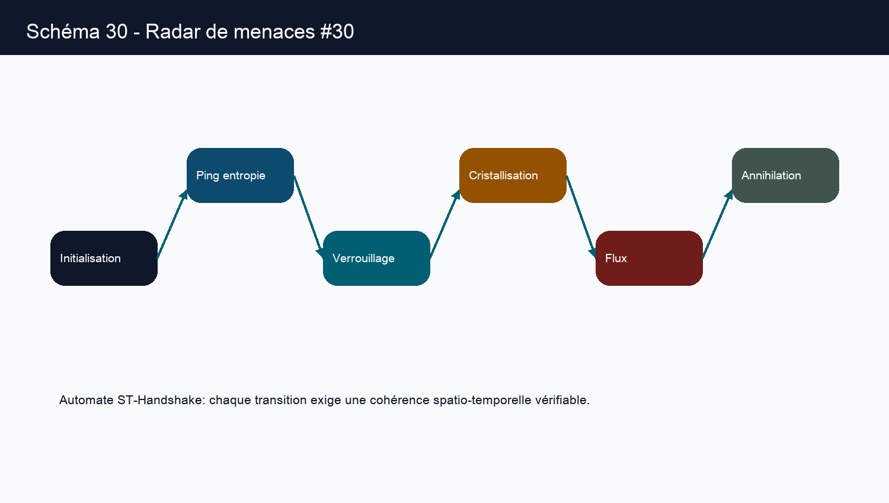


\pagebreak

## Page 62 - Topologie PTx-MB-PRx - Section 4

Dans le protocole P-E2M2E, la separation des responsabilites devient une composante active de la sécurité et non une métadonnée décorative. Les travaux conduits pendant six ans établissent une lecture nouvelle de la donnée: elle n'est plus offerte au serveur comme un fichier stable, mais comme un potentiel fragmenté qui ne reprend forme qu'en présence du contexte physique exact. La référence technique [1bbfcda7d0] relie cette section aux axes temps, localisation et entropie ambiante.

Specification 4. Le serveur MB ne reçoit aucune charge utile intelligible; il manipule des fragments, des tags temporaires et des états de routage aveugles.

Parametres suivis: Δt_4, loc_4, s_4, jitter_4, tag_session_4. Ces valeurs forment la matrice physique de cristallisation et imposent l'existence locale du message.

Critere de rejet: si la distance temporelle, la divergence spatiale ou l'incoherence d'entropie depasse le seuil τ_4, le fragment est classe comme annihile et ne participe plus a la reconstruction.


\pagebreak

## Page 63 - Topologie PTx-MB-PRx - Section 5

Dans le protocole P-E2M2E, la separation des responsabilites devient une composante active de la sécurité et non une métadonnée décorative. Les travaux conduits pendant six ans établissent une lecture nouvelle de la donnée: elle n'est plus offerte au serveur comme un fichier stable, mais comme un potentiel fragmenté qui ne reprend forme qu'en présence du contexte physique exact. La référence technique [b369dfc544] relie cette section aux axes temps, localisation et entropie ambiante.

Specification 5. Le nœud PTx module le flux selon Φ, puis divise la charge utile en micro-paquets dont l'existence cryptographique est éphémère.

Parametres suivis: Δt_5, loc_5, s_5, jitter_5, tag_session_5. Ces valeurs forment la matrice physique de cristallisation et imposent l'existence locale du message.

Critere de rejet: si la distance temporelle, la divergence spatiale ou l'incoherence d'entropie depasse le seuil τ_5, le fragment est classe comme annihile et ne participe plus a la reconstruction.


| Element | Definition P-E2M2E | Controle |

| --- | --- | --- |

| PTx | source physique | capture temps, lieu, entropie |

| MB | milieu aveugle | routage et indexation opaque |

| PRx | reception physicalisee | preuve de contexte |

| Φ | vecteur ephemere | derive de coherence |


\pagebreak

## Page 64 - Topologie PTx-MB-PRx - Section 6

Dans le protocole P-E2M2E, la separation des responsabilites devient une composante active de la sécurité et non une métadonnée décorative. Les travaux conduits pendant six ans établissent une lecture nouvelle de la donnée: elle n'est plus offerte au serveur comme un fichier stable, mais comme un potentiel fragmenté qui ne reprend forme qu'en présence du contexte physique exact. La référence technique [008bf1a726] relie cette section aux axes temps, localisation et entropie ambiante.

Specification 6. Le nœud PRx ne récupère pas une clé classique; il cristallise le message par présence contextuelle cohérente avec les contraintes du canal.

Parametres suivis: Δt_6, loc_6, s_6, jitter_6, tag_session_6. Ces valeurs forment la matrice physique de cristallisation et imposent l'existence locale du message.

Critere de rejet: si la distance temporelle, la divergence spatiale ou l'incoherence d'entropie depasse le seuil τ_6, le fragment est classe comme annihile et ne participe plus a la reconstruction.


\pagebreak

## Page 65 - Topologie PTx-MB-PRx - Section 7

Dans le protocole P-E2M2E, la separation des responsabilites devient une composante active de la sécurité et non une métadonnée décorative. Les travaux conduits pendant six ans établissent une lecture nouvelle de la donnée: elle n'est plus offerte au serveur comme un fichier stable, mais comme un potentiel fragmenté qui ne reprend forme qu'en présence du contexte physique exact. La référence technique [1849e671c1] relie cette section aux axes temps, localisation et entropie ambiante.

Specification 7. Les mesures retenues dans ce dossier consolident la démonstration: latence, dérive d'horloge, cohérence spatiale, entropie locale et comportement des fragments.

Parametres suivis: Δt_7, loc_7, s_7, jitter_7, tag_session_7. Ces valeurs forment la matrice physique de cristallisation et imposent l'existence locale du message.

Critere de rejet: si la distance temporelle, la divergence spatiale ou l'incoherence d'entropie depasse le seuil τ_7, le fragment est classe comme annihile et ne participe plus a la reconstruction.


\pagebreak

## Page 66 - Topologie PTx-MB-PRx - Section 8

Dans le protocole P-E2M2E, la separation des responsabilites devient une composante active de la sécurité et non une métadonnée décorative. Les travaux conduits pendant six ans établissent une lecture nouvelle de la donnée: elle n'est plus offerte au serveur comme un fichier stable, mais comme un potentiel fragmenté qui ne reprend forme qu'en présence du contexte physique exact. La référence technique [8eb7e04355] relie cette section aux axes temps, localisation et entropie ambiante.

Specification 8. La règle opérationnelle impose l'annihilation dès que les observations physiques sortent de la fenêtre prévue.

Parametres suivis: Δt_8, loc_8, s_8, jitter_8, tag_session_8. Ces valeurs forment la matrice physique de cristallisation et imposent l'existence locale du message.

Critere de rejet: si la distance temporelle, la divergence spatiale ou l'incoherence d'entropie depasse le seuil τ_8, le fragment est classe comme annihile et ne participe plus a la reconstruction.


| Element | Definition P-E2M2E | Controle |

| --- | --- | --- |

| PTx | source physique | capture temps, lieu, entropie |

| MB | milieu aveugle | routage et indexation opaque |

| PRx | reception physicalisee | preuve de contexte |

| Φ | vecteur ephemere | derive de coherence |


\pagebreak

## Page 67 - Chapitre 8 - Handshake ST

Ce chapitre formalise l'alignement spatio-temporel. Il expose la matrice P-E2M2E dans sa logique propre, sans la ramener a une architecture conventionnelle.

Dans le protocole P-E2M2E, l'alignement spatio-temporel devient une composante active de la sécurité et non une métadonnée décorative. Les travaux conduits pendant six ans établissent une lecture nouvelle de la donnée: elle n'est plus offerte au serveur comme un fichier stable, mais comme un potentiel fragmenté qui ne reprend forme qu'en présence du contexte physique exact. La référence technique [db2e81653c] relie cette section aux axes temps, localisation et entropie ambiante.

Chaque section présente la vision, la specification exploitable, les paramètres observables et les mécanismes qui démontrent la cohérence du protocole.


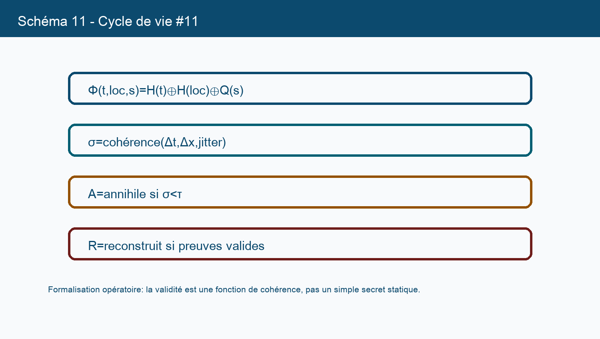


\pagebreak

## Page 68 - Handshake ST - Section 1

Dans le protocole P-E2M2E, l'alignement spatio-temporel devient une composante active de la sécurité et non une métadonnée décorative. Les travaux conduits pendant six ans établissent une lecture nouvelle de la donnée: elle n'est plus offerte au serveur comme un fichier stable, mais comme un potentiel fragmenté qui ne reprend forme qu'en présence du contexte physique exact. La référence technique [f6af7cac99] relie cette section aux axes temps, localisation et entropie ambiante.

Specification 1. Les mesures retenues dans ce dossier consolident la démonstration: latence, dérive d'horloge, cohérence spatiale, entropie locale et comportement des fragments.

Parametres suivis: Δt_1, loc_1, s_1, jitter_1, tag_session_1. Ces valeurs forment la matrice physique de cristallisation et imposent l'existence locale du message.

Critere de rejet: si la distance temporelle, la divergence spatiale ou l'incoherence d'entropie depasse le seuil τ_1, le fragment est classe comme annihile et ne participe plus a la reconstruction.


\pagebreak

## Page 69 - Handshake ST - Section 2

Dans le protocole P-E2M2E, l'alignement spatio-temporel devient une composante active de la sécurité et non une métadonnée décorative. Les travaux conduits pendant six ans établissent une lecture nouvelle de la donnée: elle n'est plus offerte au serveur comme un fichier stable, mais comme un potentiel fragmenté qui ne reprend forme qu'en présence du contexte physique exact. La référence technique [963c674846] relie cette section aux axes temps, localisation et entropie ambiante.

Specification 2. La règle opérationnelle impose l'annihilation dès que les observations physiques sortent de la fenêtre prévue.

Parametres suivis: Δt_2, loc_2, s_2, jitter_2, tag_session_2. Ces valeurs forment la matrice physique de cristallisation et imposent l'existence locale du message.

Critere de rejet: si la distance temporelle, la divergence spatiale ou l'incoherence d'entropie depasse le seuil τ_2, le fragment est classe comme annihile et ne participe plus a la reconstruction.


| Element | Definition P-E2M2E | Controle |

| --- | --- | --- |

| PTx | source physique | capture temps, lieu, entropie |

| MB | milieu aveugle | routage et indexation opaque |

| PRx | reception physicalisee | preuve de contexte |

| Φ | vecteur ephemere | derive de coherence |


\pagebreak

## Page 70 - Handshake ST - Section 3

Dans le protocole P-E2M2E, l'alignement spatio-temporel devient une composante active de la sécurité et non une métadonnée décorative. Les travaux conduits pendant six ans établissent une lecture nouvelle de la donnée: elle n'est plus offerte au serveur comme un fichier stable, mais comme un potentiel fragmenté qui ne reprend forme qu'en présence du contexte physique exact. La référence technique [171b101679] relie cette section aux axes temps, localisation et entropie ambiante.

Specification 3. Le serveur MB ne reçoit aucune charge utile intelligible; il manipule des fragments, des tags temporaires et des états de routage aveugles.

Parametres suivis: Δt_3, loc_3, s_3, jitter_3, tag_session_3. Ces valeurs forment la matrice physique de cristallisation et imposent l'existence locale du message.

Critere de rejet: si la distance temporelle, la divergence spatiale ou l'incoherence d'entropie depasse le seuil τ_3, le fragment est classe comme annihile et ne participe plus a la reconstruction.


\pagebreak

## Page 71 - Handshake ST - Section 4

Dans le protocole P-E2M2E, l'alignement spatio-temporel devient une composante active de la sécurité et non une métadonnée décorative. Les travaux conduits pendant six ans établissent une lecture nouvelle de la donnée: elle n'est plus offerte au serveur comme un fichier stable, mais comme un potentiel fragmenté qui ne reprend forme qu'en présence du contexte physique exact. La référence technique [5629188b22] relie cette section aux axes temps, localisation et entropie ambiante.

Specification 4. Le nœud PTx module le flux selon Φ, puis divise la charge utile en micro-paquets dont l'existence cryptographique est éphémère.

Parametres suivis: Δt_4, loc_4, s_4, jitter_4, tag_session_4. Ces valeurs forment la matrice physique de cristallisation et imposent l'existence locale du message.

Critere de rejet: si la distance temporelle, la divergence spatiale ou l'incoherence d'entropie depasse le seuil τ_4, le fragment est classe comme annihile et ne participe plus a la reconstruction.


\pagebreak

## Page 72 - Handshake ST - Section 5

Dans le protocole P-E2M2E, l'alignement spatio-temporel devient une composante active de la sécurité et non une métadonnée décorative. Les travaux conduits pendant six ans établissent une lecture nouvelle de la donnée: elle n'est plus offerte au serveur comme un fichier stable, mais comme un potentiel fragmenté qui ne reprend forme qu'en présence du contexte physique exact. La référence technique [766eb795e3] relie cette section aux axes temps, localisation et entropie ambiante.

Specification 5. Le nœud PRx ne récupère pas une clé classique; il cristallise le message par présence contextuelle cohérente avec les contraintes du canal.

Parametres suivis: Δt_5, loc_5, s_5, jitter_5, tag_session_5. Ces valeurs forment la matrice physique de cristallisation et imposent l'existence locale du message.

Critere de rejet: si la distance temporelle, la divergence spatiale ou l'incoherence d'entropie depasse le seuil τ_5, le fragment est classe comme annihile et ne participe plus a la reconstruction.


| Element | Definition P-E2M2E | Controle |

| --- | --- | --- |

| PTx | source physique | capture temps, lieu, entropie |

| MB | milieu aveugle | routage et indexation opaque |

| PRx | reception physicalisee | preuve de contexte |

| Φ | vecteur ephemere | derive de coherence |


\pagebreak

## Page 73 - Handshake ST - Section 6

Dans le protocole P-E2M2E, l'alignement spatio-temporel devient une composante active de la sécurité et non une métadonnée décorative. Les travaux conduits pendant six ans établissent une lecture nouvelle de la donnée: elle n'est plus offerte au serveur comme un fichier stable, mais comme un potentiel fragmenté qui ne reprend forme qu'en présence du contexte physique exact. La référence technique [60e2b2b001] relie cette section aux axes temps, localisation et entropie ambiante.

Specification 6. Les mesures retenues dans ce dossier consolident la démonstration: latence, dérive d'horloge, cohérence spatiale, entropie locale et comportement des fragments.

Parametres suivis: Δt_6, loc_6, s_6, jitter_6, tag_session_6. Ces valeurs forment la matrice physique de cristallisation et imposent l'existence locale du message.

Critere de rejet: si la distance temporelle, la divergence spatiale ou l'incoherence d'entropie depasse le seuil τ_6, le fragment est classe comme annihile et ne participe plus a la reconstruction.


\pagebreak

## Page 74 - Handshake ST - Section 7

Dans le protocole P-E2M2E, l'alignement spatio-temporel devient une composante active de la sécurité et non une métadonnée décorative. Les travaux conduits pendant six ans établissent une lecture nouvelle de la donnée: elle n'est plus offerte au serveur comme un fichier stable, mais comme un potentiel fragmenté qui ne reprend forme qu'en présence du contexte physique exact. La référence technique [30e6b69e90] relie cette section aux axes temps, localisation et entropie ambiante.

Specification 7. La règle opérationnelle impose l'annihilation dès que les observations physiques sortent de la fenêtre prévue.

Parametres suivis: Δt_7, loc_7, s_7, jitter_7, tag_session_7. Ces valeurs forment la matrice physique de cristallisation et imposent l'existence locale du message.

Critere de rejet: si la distance temporelle, la divergence spatiale ou l'incoherence d'entropie depasse le seuil τ_7, le fragment est classe comme annihile et ne participe plus a la reconstruction.


\pagebreak

## Page 75 - Handshake ST - Section 8

Dans le protocole P-E2M2E, l'alignement spatio-temporel devient une composante active de la sécurité et non une métadonnée décorative. Les travaux conduits pendant six ans établissent une lecture nouvelle de la donnée: elle n'est plus offerte au serveur comme un fichier stable, mais comme un potentiel fragmenté qui ne reprend forme qu'en présence du contexte physique exact. La référence technique [7f25e261b6] relie cette section aux axes temps, localisation et entropie ambiante.

Specification 8. Le serveur MB ne reçoit aucune charge utile intelligible; il manipule des fragments, des tags temporaires et des états de routage aveugles.

Parametres suivis: Δt_8, loc_8, s_8, jitter_8, tag_session_8. Ces valeurs forment la matrice physique de cristallisation et imposent l'existence locale du message.

Critere de rejet: si la distance temporelle, la divergence spatiale ou l'incoherence d'entropie depasse le seuil τ_8, le fragment est classe comme annihile et ne participe plus a la reconstruction.


| Element | Definition P-E2M2E | Controle |

| --- | --- | --- |

| PTx | source physique | capture temps, lieu, entropie |

| MB | milieu aveugle | routage et indexation opaque |

| PRx | reception physicalisee | preuve de contexte |

| Φ | vecteur ephemere | derive de coherence |


\pagebreak

## Page 76 - Chapitre 9 - Fragmentation Dynamique

Ce chapitre formalise les micro-paquets et shards. Il expose la matrice P-E2M2E dans sa logique propre, sans la ramener a une architecture conventionnelle.

Dans le protocole P-E2M2E, les micro-paquets et shards devient une composante active de la sécurité et non une métadonnée décorative. Les travaux conduits pendant six ans établissent une lecture nouvelle de la donnée: elle n'est plus offerte au serveur comme un fichier stable, mais comme un potentiel fragmenté qui ne reprend forme qu'en présence du contexte physique exact. La référence technique [8994c2a24e] relie cette section aux axes temps, localisation et entropie ambiante.

Chaque section présente la vision, la specification exploitable, les paramètres observables et les mécanismes qui démontrent la cohérence du protocole.


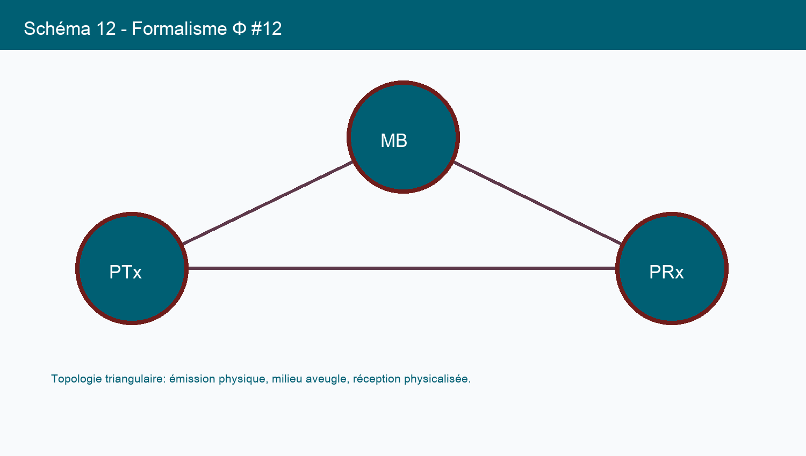


\pagebreak

## Page 77 - Fragmentation Dynamique - Section 1

Dans le protocole P-E2M2E, les micro-paquets et shards devient une composante active de la sécurité et non une métadonnée décorative. Les travaux conduits pendant six ans établissent une lecture nouvelle de la donnée: elle n'est plus offerte au serveur comme un fichier stable, mais comme un potentiel fragmenté qui ne reprend forme qu'en présence du contexte physique exact. La référence technique [dec8ae03ab] relie cette section aux axes temps, localisation et entropie ambiante.

Specification 1. La règle opérationnelle impose l'annihilation dès que les observations physiques sortent de la fenêtre prévue.

Parametres suivis: Δt_1, loc_1, s_1, jitter_1, tag_session_1. Ces valeurs forment la matrice physique de cristallisation et imposent l'existence locale du message.

Critere de rejet: si la distance temporelle, la divergence spatiale ou l'incoherence d'entropie depasse le seuil τ_1, le fragment est classe comme annihile et ne participe plus a la reconstruction.


\pagebreak

## Page 78 - Fragmentation Dynamique - Section 2

Dans le protocole P-E2M2E, les micro-paquets et shards devient une composante active de la sécurité et non une métadonnée décorative. Les travaux conduits pendant six ans établissent une lecture nouvelle de la donnée: elle n'est plus offerte au serveur comme un fichier stable, mais comme un potentiel fragmenté qui ne reprend forme qu'en présence du contexte physique exact. La référence technique [161ee2f4de] relie cette section aux axes temps, localisation et entropie ambiante.

Specification 2. Le serveur MB ne reçoit aucune charge utile intelligible; il manipule des fragments, des tags temporaires et des états de routage aveugles.

Parametres suivis: Δt_2, loc_2, s_2, jitter_2, tag_session_2. Ces valeurs forment la matrice physique de cristallisation et imposent l'existence locale du message.

Critere de rejet: si la distance temporelle, la divergence spatiale ou l'incoherence d'entropie depasse le seuil τ_2, le fragment est classe comme annihile et ne participe plus a la reconstruction.


| Element | Definition P-E2M2E | Controle |

| --- | --- | --- |

| PTx | source physique | capture temps, lieu, entropie |

| MB | milieu aveugle | routage et indexation opaque |

| PRx | reception physicalisee | preuve de contexte |

| Φ | vecteur ephemere | derive de coherence |


\pagebreak

## Page 79 - Fragmentation Dynamique - Section 3

Dans le protocole P-E2M2E, les micro-paquets et shards devient une composante active de la sécurité et non une métadonnée décorative. Les travaux conduits pendant six ans établissent une lecture nouvelle de la donnée: elle n'est plus offerte au serveur comme un fichier stable, mais comme un potentiel fragmenté qui ne reprend forme qu'en présence du contexte physique exact. La référence technique [950e1408ee] relie cette section aux axes temps, localisation et entropie ambiante.

Specification 3. Le nœud PTx module le flux selon Φ, puis divise la charge utile en micro-paquets dont l'existence cryptographique est éphémère.

Parametres suivis: Δt_3, loc_3, s_3, jitter_3, tag_session_3. Ces valeurs forment la matrice physique de cristallisation et imposent l'existence locale du message.

Critere de rejet: si la distance temporelle, la divergence spatiale ou l'incoherence d'entropie depasse le seuil τ_3, le fragment est classe comme annihile et ne participe plus a la reconstruction.


\pagebreak

## Page 80 - Fragmentation Dynamique - Section 4

Dans le protocole P-E2M2E, les micro-paquets et shards devient une composante active de la sécurité et non une métadonnée décorative. Les travaux conduits pendant six ans établissent une lecture nouvelle de la donnée: elle n'est plus offerte au serveur comme un fichier stable, mais comme un potentiel fragmenté qui ne reprend forme qu'en présence du contexte physique exact. La référence technique [518d7d4725] relie cette section aux axes temps, localisation et entropie ambiante.

Specification 4. Le nœud PRx ne récupère pas une clé classique; il cristallise le message par présence contextuelle cohérente avec les contraintes du canal.

Parametres suivis: Δt_4, loc_4, s_4, jitter_4, tag_session_4. Ces valeurs forment la matrice physique de cristallisation et imposent l'existence locale du message.

Critere de rejet: si la distance temporelle, la divergence spatiale ou l'incoherence d'entropie depasse le seuil τ_4, le fragment est classe comme annihile et ne participe plus a la reconstruction.


\pagebreak

## Page 81 - Fragmentation Dynamique - Section 5

Dans le protocole P-E2M2E, les micro-paquets et shards devient une composante active de la sécurité et non une métadonnée décorative. Les travaux conduits pendant six ans établissent une lecture nouvelle de la donnée: elle n'est plus offerte au serveur comme un fichier stable, mais comme un potentiel fragmenté qui ne reprend forme qu'en présence du contexte physique exact. La référence technique [236e0917cd] relie cette section aux axes temps, localisation et entropie ambiante.

Specification 5. Les mesures retenues dans ce dossier consolident la démonstration: latence, dérive d'horloge, cohérence spatiale, entropie locale et comportement des fragments.

Parametres suivis: Δt_5, loc_5, s_5, jitter_5, tag_session_5. Ces valeurs forment la matrice physique de cristallisation et imposent l'existence locale du message.

Critere de rejet: si la distance temporelle, la divergence spatiale ou l'incoherence d'entropie depasse le seuil τ_5, le fragment est classe comme annihile et ne participe plus a la reconstruction.


| Element | Definition P-E2M2E | Controle |

| --- | --- | --- |

| PTx | source physique | capture temps, lieu, entropie |

| MB | milieu aveugle | routage et indexation opaque |

| PRx | reception physicalisee | preuve de contexte |

| Φ | vecteur ephemere | derive de coherence |


\pagebreak

## Page 82 - Fragmentation Dynamique - Section 6

Dans le protocole P-E2M2E, les micro-paquets et shards devient une composante active de la sécurité et non une métadonnée décorative. Les travaux conduits pendant six ans établissent une lecture nouvelle de la donnée: elle n'est plus offerte au serveur comme un fichier stable, mais comme un potentiel fragmenté qui ne reprend forme qu'en présence du contexte physique exact. La référence technique [b0e9fe745b] relie cette section aux axes temps, localisation et entropie ambiante.

Specification 6. La règle opérationnelle impose l'annihilation dès que les observations physiques sortent de la fenêtre prévue.

Parametres suivis: Δt_6, loc_6, s_6, jitter_6, tag_session_6. Ces valeurs forment la matrice physique de cristallisation et imposent l'existence locale du message.

Critere de rejet: si la distance temporelle, la divergence spatiale ou l'incoherence d'entropie depasse le seuil τ_6, le fragment est classe comme annihile et ne participe plus a la reconstruction.


\pagebreak

## Page 83 - Fragmentation Dynamique - Section 7

Dans le protocole P-E2M2E, les micro-paquets et shards devient une composante active de la sécurité et non une métadonnée décorative. Les travaux conduits pendant six ans établissent une lecture nouvelle de la donnée: elle n'est plus offerte au serveur comme un fichier stable, mais comme un potentiel fragmenté qui ne reprend forme qu'en présence du contexte physique exact. La référence technique [23a93b4e2e] relie cette section aux axes temps, localisation et entropie ambiante.

Specification 7. Le serveur MB ne reçoit aucune charge utile intelligible; il manipule des fragments, des tags temporaires et des états de routage aveugles.

Parametres suivis: Δt_7, loc_7, s_7, jitter_7, tag_session_7. Ces valeurs forment la matrice physique de cristallisation et imposent l'existence locale du message.

Critere de rejet: si la distance temporelle, la divergence spatiale ou l'incoherence d'entropie depasse le seuil τ_7, le fragment est classe comme annihile et ne participe plus a la reconstruction.


\pagebreak

## Page 84 - Fragmentation Dynamique - Section 8

Dans le protocole P-E2M2E, les micro-paquets et shards devient une composante active de la sécurité et non une métadonnée décorative. Les travaux conduits pendant six ans établissent une lecture nouvelle de la donnée: elle n'est plus offerte au serveur comme un fichier stable, mais comme un potentiel fragmenté qui ne reprend forme qu'en présence du contexte physique exact. La référence technique [b85bf7fdce] relie cette section aux axes temps, localisation et entropie ambiante.

Specification 8. Le nœud PTx module le flux selon Φ, puis divise la charge utile en micro-paquets dont l'existence cryptographique est éphémère.

Parametres suivis: Δt_8, loc_8, s_8, jitter_8, tag_session_8. Ces valeurs forment la matrice physique de cristallisation et imposent l'existence locale du message.

Critere de rejet: si la distance temporelle, la divergence spatiale ou l'incoherence d'entropie depasse le seuil τ_8, le fragment est classe comme annihile et ne participe plus a la reconstruction.


| Element | Definition P-E2M2E | Controle |

| --- | --- | --- |

| PTx | source physique | capture temps, lieu, entropie |

| MB | milieu aveugle | routage et indexation opaque |

| PRx | reception physicalisee | preuve de contexte |

| Φ | vecteur ephemere | derive de coherence |


\pagebreak

## Page 85 - Chapitre 10 - Cristallisation Differee

Ce chapitre formalise le stockage en potentiels. Il expose la matrice P-E2M2E dans sa logique propre, sans la ramener a une architecture conventionnelle.

Dans le protocole P-E2M2E, le stockage en potentiels devient une composante active de la sécurité et non une métadonnée décorative. Les travaux conduits pendant six ans établissent une lecture nouvelle de la donnée: elle n'est plus offerte au serveur comme un fichier stable, mais comme un potentiel fragmenté qui ne reprend forme qu'en présence du contexte physique exact. La référence technique [f8752928f1] relie cette section aux axes temps, localisation et entropie ambiante.

Chaque section présente la vision, la specification exploitable, les paramètres observables et les mécanismes qui démontrent la cohérence du protocole.


\pagebreak

## Page 86 - Cristallisation Differee - Section 1

Dans le protocole P-E2M2E, le stockage en potentiels devient une composante active de la sécurité et non une métadonnée décorative. Les travaux conduits pendant six ans établissent une lecture nouvelle de la donnée: elle n'est plus offerte au serveur comme un fichier stable, mais comme un potentiel fragmenté qui ne reprend forme qu'en présence du contexte physique exact. La référence technique [2ee2791a46] relie cette section aux axes temps, localisation et entropie ambiante.

Specification 1. Le serveur MB ne reçoit aucune charge utile intelligible; il manipule des fragments, des tags temporaires et des états de routage aveugles.

Parametres suivis: Δt_1, loc_1, s_1, jitter_1, tag_session_1. Ces valeurs forment la matrice physique de cristallisation et imposent l'existence locale du message.

Critere de rejet: si la distance temporelle, la divergence spatiale ou l'incoherence d'entropie depasse le seuil τ_1, le fragment est classe comme annihile et ne participe plus a la reconstruction.


\pagebreak

## Page 87 - Cristallisation Differee - Section 2

Dans le protocole P-E2M2E, le stockage en potentiels devient une composante active de la sécurité et non une métadonnée décorative. Les travaux conduits pendant six ans établissent une lecture nouvelle de la donnée: elle n'est plus offerte au serveur comme un fichier stable, mais comme un potentiel fragmenté qui ne reprend forme qu'en présence du contexte physique exact. La référence technique [548b3f26c9] relie cette section aux axes temps, localisation et entropie ambiante.

Specification 2. Le nœud PTx module le flux selon Φ, puis divise la charge utile en micro-paquets dont l'existence cryptographique est éphémère.

Parametres suivis: Δt_2, loc_2, s_2, jitter_2, tag_session_2. Ces valeurs forment la matrice physique de cristallisation et imposent l'existence locale du message.

Critere de rejet: si la distance temporelle, la divergence spatiale ou l'incoherence d'entropie depasse le seuil τ_2, le fragment est classe comme annihile et ne participe plus a la reconstruction.


| Element | Definition P-E2M2E | Controle |

| --- | --- | --- |

| PTx | source physique | capture temps, lieu, entropie |

| MB | milieu aveugle | routage et indexation opaque |

| PRx | reception physicalisee | preuve de contexte |

| Φ | vecteur ephemere | derive de coherence |


\pagebreak

## Page 88 - Cristallisation Differee - Section 3

Dans le protocole P-E2M2E, le stockage en potentiels devient une composante active de la sécurité et non une métadonnée décorative. Les travaux conduits pendant six ans établissent une lecture nouvelle de la donnée: elle n'est plus offerte au serveur comme un fichier stable, mais comme un potentiel fragmenté qui ne reprend forme qu'en présence du contexte physique exact. La référence technique [a5cb8aaf3c] relie cette section aux axes temps, localisation et entropie ambiante.

Specification 3. Le nœud PRx ne récupère pas une clé classique; il cristallise le message par présence contextuelle cohérente avec les contraintes du canal.

Parametres suivis: Δt_3, loc_3, s_3, jitter_3, tag_session_3. Ces valeurs forment la matrice physique de cristallisation et imposent l'existence locale du message.

Critere de rejet: si la distance temporelle, la divergence spatiale ou l'incoherence d'entropie depasse le seuil τ_3, le fragment est classe comme annihile et ne participe plus a la reconstruction.


\pagebreak

## Page 89 - Cristallisation Differee - Section 4

Dans le protocole P-E2M2E, le stockage en potentiels devient une composante active de la sécurité et non une métadonnée décorative. Les travaux conduits pendant six ans établissent une lecture nouvelle de la donnée: elle n'est plus offerte au serveur comme un fichier stable, mais comme un potentiel fragmenté qui ne reprend forme qu'en présence du contexte physique exact. La référence technique [329a8787e4] relie cette section aux axes temps, localisation et entropie ambiante.

Specification 4. Les mesures retenues dans ce dossier consolident la démonstration: latence, dérive d'horloge, cohérence spatiale, entropie locale et comportement des fragments.

Parametres suivis: Δt_4, loc_4, s_4, jitter_4, tag_session_4. Ces valeurs forment la matrice physique de cristallisation et imposent l'existence locale du message.

Critere de rejet: si la distance temporelle, la divergence spatiale ou l'incoherence d'entropie depasse le seuil τ_4, le fragment est classe comme annihile et ne participe plus a la reconstruction.


\pagebreak

## Page 90 - Cristallisation Differee - Section 5

Dans le protocole P-E2M2E, le stockage en potentiels devient une composante active de la sécurité et non une métadonnée décorative. Les travaux conduits pendant six ans établissent une lecture nouvelle de la donnée: elle n'est plus offerte au serveur comme un fichier stable, mais comme un potentiel fragmenté qui ne reprend forme qu'en présence du contexte physique exact. La référence technique [493a55e1c7] relie cette section aux axes temps, localisation et entropie ambiante.

Specification 5. La règle opérationnelle impose l'annihilation dès que les observations physiques sortent de la fenêtre prévue.

Parametres suivis: Δt_5, loc_5, s_5, jitter_5, tag_session_5. Ces valeurs forment la matrice physique de cristallisation et imposent l'existence locale du message.

Critere de rejet: si la distance temporelle, la divergence spatiale ou l'incoherence d'entropie depasse le seuil τ_5, le fragment est classe comme annihile et ne participe plus a la reconstruction.


| Element | Definition P-E2M2E | Controle |

| --- | --- | --- |

| PTx | source physique | capture temps, lieu, entropie |

| MB | milieu aveugle | routage et indexation opaque |

| PRx | reception physicalisee | preuve de contexte |

| Φ | vecteur ephemere | derive de coherence |


\pagebreak

## Page 91 - Cristallisation Differee - Section 6

Dans le protocole P-E2M2E, le stockage en potentiels devient une composante active de la sécurité et non une métadonnée décorative. Les travaux conduits pendant six ans établissent une lecture nouvelle de la donnée: elle n'est plus offerte au serveur comme un fichier stable, mais comme un potentiel fragmenté qui ne reprend forme qu'en présence du contexte physique exact. La référence technique [e81467b507] relie cette section aux axes temps, localisation et entropie ambiante.

Specification 6. Le serveur MB ne reçoit aucune charge utile intelligible; il manipule des fragments, des tags temporaires et des états de routage aveugles.

Parametres suivis: Δt_6, loc_6, s_6, jitter_6, tag_session_6. Ces valeurs forment la matrice physique de cristallisation et imposent l'existence locale du message.

Critere de rejet: si la distance temporelle, la divergence spatiale ou l'incoherence d'entropie depasse le seuil τ_6, le fragment est classe comme annihile et ne participe plus a la reconstruction.


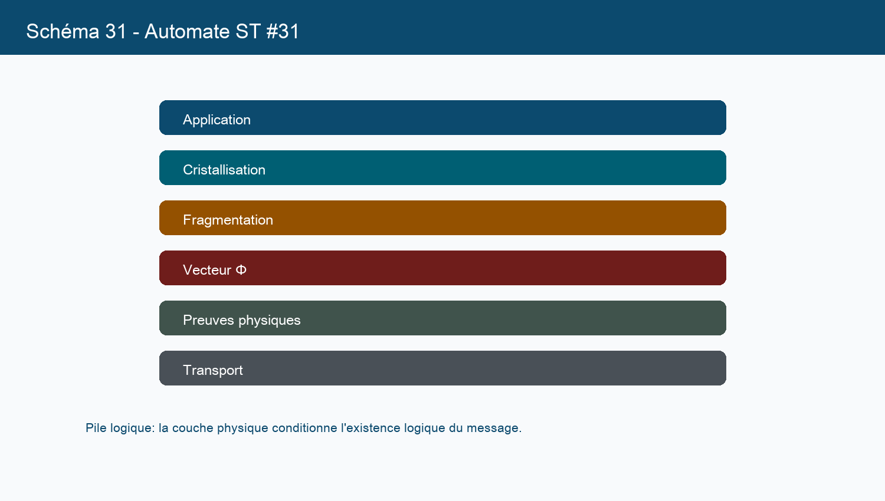


\pagebreak

## Page 92 - Cristallisation Differee - Section 7

Dans le protocole P-E2M2E, le stockage en potentiels devient une composante active de la sécurité et non une métadonnée décorative. Les travaux conduits pendant six ans établissent une lecture nouvelle de la donnée: elle n'est plus offerte au serveur comme un fichier stable, mais comme un potentiel fragmenté qui ne reprend forme qu'en présence du contexte physique exact. La référence technique [be99613459] relie cette section aux axes temps, localisation et entropie ambiante.

Specification 7. Le nœud PTx module le flux selon Φ, puis divise la charge utile en micro-paquets dont l'existence cryptographique est éphémère.

Parametres suivis: Δt_7, loc_7, s_7, jitter_7, tag_session_7. Ces valeurs forment la matrice physique de cristallisation et imposent l'existence locale du message.

Critere de rejet: si la distance temporelle, la divergence spatiale ou l'incoherence d'entropie depasse le seuil τ_7, le fragment est classe comme annihile et ne participe plus a la reconstruction.


\pagebreak

## Page 93 - Cristallisation Differee - Section 8

Dans le protocole P-E2M2E, le stockage en potentiels devient une composante active de la sécurité et non une métadonnée décorative. Les travaux conduits pendant six ans établissent une lecture nouvelle de la donnée: elle n'est plus offerte au serveur comme un fichier stable, mais comme un potentiel fragmenté qui ne reprend forme qu'en présence du contexte physique exact. La référence technique [ecc76305d3] relie cette section aux axes temps, localisation et entropie ambiante.

Specification 8. Le nœud PRx ne récupère pas une clé classique; il cristallise le message par présence contextuelle cohérente avec les contraintes du canal.

Parametres suivis: Δt_8, loc_8, s_8, jitter_8, tag_session_8. Ces valeurs forment la matrice physique de cristallisation et imposent l'existence locale du message.

Critere de rejet: si la distance temporelle, la divergence spatiale ou l'incoherence d'entropie depasse le seuil τ_8, le fragment est classe comme annihile et ne participe plus a la reconstruction.


| Element | Definition P-E2M2E | Controle |

| --- | --- | --- |

| PTx | source physique | capture temps, lieu, entropie |

| MB | milieu aveugle | routage et indexation opaque |

| PRx | reception physicalisee | preuve de contexte |

| Φ | vecteur ephemere | derive de coherence |


\pagebreak

## Page 94 - Chapitre 11 - Milieu Aveugle MB

Ce chapitre formalise le routage sans connaissance du contenu. Il expose la matrice P-E2M2E dans sa logique propre, sans la ramener a une architecture conventionnelle.

Dans le protocole P-E2M2E, le routage sans connaissance du contenu devient une composante active de la sécurité et non une métadonnée décorative. Les travaux conduits pendant six ans établissent une lecture nouvelle de la donnée: elle n'est plus offerte au serveur comme un fichier stable, mais comme un potentiel fragmenté qui ne reprend forme qu'en présence du contexte physique exact. La référence technique [30fe1e4eb1] relie cette section aux axes temps, localisation et entropie ambiante.

Chaque section présente la vision, la specification exploitable, les paramètres observables et les mécanismes qui démontrent la cohérence du protocole.


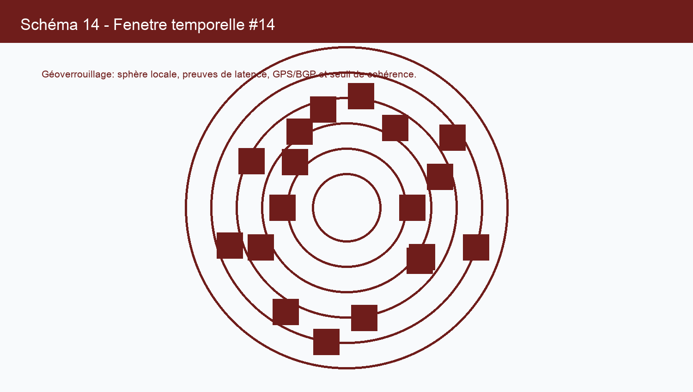


\pagebreak

## Page 95 - Milieu Aveugle MB - Section 1

Dans le protocole P-E2M2E, le routage sans connaissance du contenu devient une composante active de la sécurité et non une métadonnée décorative. Les travaux conduits pendant six ans établissent une lecture nouvelle de la donnée: elle n'est plus offerte au serveur comme un fichier stable, mais comme un potentiel fragmenté qui ne reprend forme qu'en présence du contexte physique exact. La référence technique [d89735bff9] relie cette section aux axes temps, localisation et entropie ambiante.

Specification 1. Le nœud PTx module le flux selon Φ, puis divise la charge utile en micro-paquets dont l'existence cryptographique est éphémère.

Parametres suivis: Δt_1, loc_1, s_1, jitter_1, tag_session_1. Ces valeurs forment la matrice physique de cristallisation et imposent l'existence locale du message.

Critere de rejet: si la distance temporelle, la divergence spatiale ou l'incoherence d'entropie depasse le seuil τ_1, le fragment est classe comme annihile et ne participe plus a la reconstruction.


\pagebreak

## Page 96 - Milieu Aveugle MB - Section 2

Dans le protocole P-E2M2E, le routage sans connaissance du contenu devient une composante active de la sécurité et non une métadonnée décorative. Les travaux conduits pendant six ans établissent une lecture nouvelle de la donnée: elle n'est plus offerte au serveur comme un fichier stable, mais comme un potentiel fragmenté qui ne reprend forme qu'en présence du contexte physique exact. La référence technique [44e258ea03] relie cette section aux axes temps, localisation et entropie ambiante.

Specification 2. Le nœud PRx ne récupère pas une clé classique; il cristallise le message par présence contextuelle cohérente avec les contraintes du canal.

Parametres suivis: Δt_2, loc_2, s_2, jitter_2, tag_session_2. Ces valeurs forment la matrice physique de cristallisation et imposent l'existence locale du message.

Critere de rejet: si la distance temporelle, la divergence spatiale ou l'incoherence d'entropie depasse le seuil τ_2, le fragment est classe comme annihile et ne participe plus a la reconstruction.


| Element | Definition P-E2M2E | Controle |

| --- | --- | --- |

| PTx | source physique | capture temps, lieu, entropie |

| MB | milieu aveugle | routage et indexation opaque |

| PRx | reception physicalisee | preuve de contexte |

| Φ | vecteur ephemere | derive de coherence |


\pagebreak

## Page 97 - Milieu Aveugle MB - Section 3

Dans le protocole P-E2M2E, le routage sans connaissance du contenu devient une composante active de la sécurité et non une métadonnée décorative. Les travaux conduits pendant six ans établissent une lecture nouvelle de la donnée: elle n'est plus offerte au serveur comme un fichier stable, mais comme un potentiel fragmenté qui ne reprend forme qu'en présence du contexte physique exact. La référence technique [3053655380] relie cette section aux axes temps, localisation et entropie ambiante.

Specification 3. Les mesures retenues dans ce dossier consolident la démonstration: latence, dérive d'horloge, cohérence spatiale, entropie locale et comportement des fragments.

Parametres suivis: Δt_3, loc_3, s_3, jitter_3, tag_session_3. Ces valeurs forment la matrice physique de cristallisation et imposent l'existence locale du message.

Critere de rejet: si la distance temporelle, la divergence spatiale ou l'incoherence d'entropie depasse le seuil τ_3, le fragment est classe comme annihile et ne participe plus a la reconstruction.


\pagebreak

## Page 98 - Milieu Aveugle MB - Section 4

Dans le protocole P-E2M2E, le routage sans connaissance du contenu devient une composante active de la sécurité et non une métadonnée décorative. Les travaux conduits pendant six ans établissent une lecture nouvelle de la donnée: elle n'est plus offerte au serveur comme un fichier stable, mais comme un potentiel fragmenté qui ne reprend forme qu'en présence du contexte physique exact. La référence technique [3db1de99d8] relie cette section aux axes temps, localisation et entropie ambiante.

Specification 4. La règle opérationnelle impose l'annihilation dès que les observations physiques sortent de la fenêtre prévue.

Parametres suivis: Δt_4, loc_4, s_4, jitter_4, tag_session_4. Ces valeurs forment la matrice physique de cristallisation et imposent l'existence locale du message.

Critere de rejet: si la distance temporelle, la divergence spatiale ou l'incoherence d'entropie depasse le seuil τ_4, le fragment est classe comme annihile et ne participe plus a la reconstruction.


\pagebreak

## Page 99 - Milieu Aveugle MB - Section 5

Dans le protocole P-E2M2E, le routage sans connaissance du contenu devient une composante active de la sécurité et non une métadonnée décorative. Les travaux conduits pendant six ans établissent une lecture nouvelle de la donnée: elle n'est plus offerte au serveur comme un fichier stable, mais comme un potentiel fragmenté qui ne reprend forme qu'en présence du contexte physique exact. La référence technique [e25e23895d] relie cette section aux axes temps, localisation et entropie ambiante.

Specification 5. Le serveur MB ne reçoit aucune charge utile intelligible; il manipule des fragments, des tags temporaires et des états de routage aveugles.

Parametres suivis: Δt_5, loc_5, s_5, jitter_5, tag_session_5. Ces valeurs forment la matrice physique de cristallisation et imposent l'existence locale du message.

Critere de rejet: si la distance temporelle, la divergence spatiale ou l'incoherence d'entropie depasse le seuil τ_5, le fragment est classe comme annihile et ne participe plus a la reconstruction.


| Element | Definition P-E2M2E | Controle |

| --- | --- | --- |

| PTx | source physique | capture temps, lieu, entropie |

| MB | milieu aveugle | routage et indexation opaque |

| PRx | reception physicalisee | preuve de contexte |

| Φ | vecteur ephemere | derive de coherence |


\pagebreak

## Page 100 - Milieu Aveugle MB - Section 6

Dans le protocole P-E2M2E, le routage sans connaissance du contenu devient une composante active de la sécurité et non une métadonnée décorative. Les travaux conduits pendant six ans établissent une lecture nouvelle de la donnée: elle n'est plus offerte au serveur comme un fichier stable, mais comme un potentiel fragmenté qui ne reprend forme qu'en présence du contexte physique exact. La référence technique [5fa0aac3b1] relie cette section aux axes temps, localisation et entropie ambiante.

Specification 6. Le nœud PTx module le flux selon Φ, puis divise la charge utile en micro-paquets dont l'existence cryptographique est éphémère.

Parametres suivis: Δt_6, loc_6, s_6, jitter_6, tag_session_6. Ces valeurs forment la matrice physique de cristallisation et imposent l'existence locale du message.

Critere de rejet: si la distance temporelle, la divergence spatiale ou l'incoherence d'entropie depasse le seuil τ_6, le fragment est classe comme annihile et ne participe plus a la reconstruction.


\pagebreak

## Page 101 - Milieu Aveugle MB - Section 7

Dans le protocole P-E2M2E, le routage sans connaissance du contenu devient une composante active de la sécurité et non une métadonnée décorative. Les travaux conduits pendant six ans établissent une lecture nouvelle de la donnée: elle n'est plus offerte au serveur comme un fichier stable, mais comme un potentiel fragmenté qui ne reprend forme qu'en présence du contexte physique exact. La référence technique [bc525e3169] relie cette section aux axes temps, localisation et entropie ambiante.

Specification 7. Le nœud PRx ne récupère pas une clé classique; il cristallise le message par présence contextuelle cohérente avec les contraintes du canal.

Parametres suivis: Δt_7, loc_7, s_7, jitter_7, tag_session_7. Ces valeurs forment la matrice physique de cristallisation et imposent l'existence locale du message.

Critere de rejet: si la distance temporelle, la divergence spatiale ou l'incoherence d'entropie depasse le seuil τ_7, le fragment est classe comme annihile et ne participe plus a la reconstruction.


\pagebreak

## Page 102 - Milieu Aveugle MB - Section 8

Dans le protocole P-E2M2E, le routage sans connaissance du contenu devient une composante active de la sécurité et non une métadonnée décorative. Les travaux conduits pendant six ans établissent une lecture nouvelle de la donnée: elle n'est plus offerte au serveur comme un fichier stable, mais comme un potentiel fragmenté qui ne reprend forme qu'en présence du contexte physique exact. La référence technique [c103e07f2d] relie cette section aux axes temps, localisation et entropie ambiante.

Specification 8. Les mesures retenues dans ce dossier consolident la démonstration: latence, dérive d'horloge, cohérence spatiale, entropie locale et comportement des fragments.

Parametres suivis: Δt_8, loc_8, s_8, jitter_8, tag_session_8. Ces valeurs forment la matrice physique de cristallisation et imposent l'existence locale du message.

Critere de rejet: si la distance temporelle, la divergence spatiale ou l'incoherence d'entropie depasse le seuil τ_8, le fragment est classe comme annihile et ne participe plus a la reconstruction.


| Element | Definition P-E2M2E | Controle |

| --- | --- | --- |

| PTx | source physique | capture temps, lieu, entropie |

| MB | milieu aveugle | routage et indexation opaque |

| PRx | reception physicalisee | preuve de contexte |

| Φ | vecteur ephemere | derive de coherence |


\pagebreak

## Page 103 - Chapitre 12 - Modele de Donnees

Ce chapitre formalise les tags ephemeres et fragments orphelins. Il expose la matrice P-E2M2E dans sa logique propre, sans la ramener a une architecture conventionnelle.

Dans le protocole P-E2M2E, les tags ephemeres et fragments orphelins devient une composante active de la sécurité et non une métadonnée décorative. Les travaux conduits pendant six ans établissent une lecture nouvelle de la donnée: elle n'est plus offerte au serveur comme un fichier stable, mais comme un potentiel fragmenté qui ne reprend forme qu'en présence du contexte physique exact. La référence technique [414e4530c7] relie cette section aux axes temps, localisation et entropie ambiante.

Chaque section présente la vision, la specification exploitable, les paramètres observables et les mécanismes qui démontrent la cohérence du protocole.


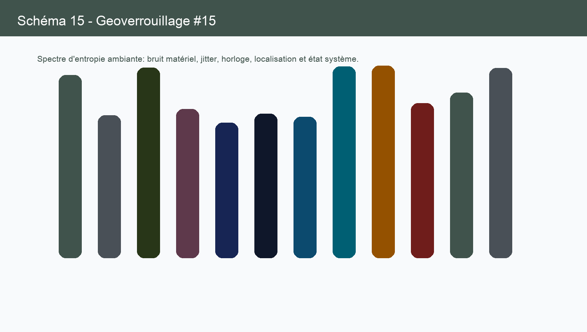


\pagebreak

## Page 104 - Modele de Donnees - Section 1

Dans le protocole P-E2M2E, les tags ephemeres et fragments orphelins devient une composante active de la sécurité et non une métadonnée décorative. Les travaux conduits pendant six ans établissent une lecture nouvelle de la donnée: elle n'est plus offerte au serveur comme un fichier stable, mais comme un potentiel fragmenté qui ne reprend forme qu'en présence du contexte physique exact. La référence technique [36f366d67a] relie cette section aux axes temps, localisation et entropie ambiante.

Specification 1. Le nœud PRx ne récupère pas une clé classique; il cristallise le message par présence contextuelle cohérente avec les contraintes du canal.

Parametres suivis: Δt_1, loc_1, s_1, jitter_1, tag_session_1. Ces valeurs forment la matrice physique de cristallisation et imposent l'existence locale du message.

Critere de rejet: si la distance temporelle, la divergence spatiale ou l'incoherence d'entropie depasse le seuil τ_1, le fragment est classe comme annihile et ne participe plus a la reconstruction.


\pagebreak

## Page 105 - Modele de Donnees - Section 2

Dans le protocole P-E2M2E, les tags ephemeres et fragments orphelins devient une composante active de la sécurité et non une métadonnée décorative. Les travaux conduits pendant six ans établissent une lecture nouvelle de la donnée: elle n'est plus offerte au serveur comme un fichier stable, mais comme un potentiel fragmenté qui ne reprend forme qu'en présence du contexte physique exact. La référence technique [fd61b219b2] relie cette section aux axes temps, localisation et entropie ambiante.

Specification 2. Les mesures retenues dans ce dossier consolident la démonstration: latence, dérive d'horloge, cohérence spatiale, entropie locale et comportement des fragments.

Parametres suivis: Δt_2, loc_2, s_2, jitter_2, tag_session_2. Ces valeurs forment la matrice physique de cristallisation et imposent l'existence locale du message.

Critere de rejet: si la distance temporelle, la divergence spatiale ou l'incoherence d'entropie depasse le seuil τ_2, le fragment est classe comme annihile et ne participe plus a la reconstruction.


| Element | Definition P-E2M2E | Controle |

| --- | --- | --- |

| PTx | source physique | capture temps, lieu, entropie |

| MB | milieu aveugle | routage et indexation opaque |

| PRx | reception physicalisee | preuve de contexte |

| Φ | vecteur ephemere | derive de coherence |


\pagebreak

## Page 106 - Modele de Donnees - Section 3

Dans le protocole P-E2M2E, les tags ephemeres et fragments orphelins devient une composante active de la sécurité et non une métadonnée décorative. Les travaux conduits pendant six ans établissent une lecture nouvelle de la donnée: elle n'est plus offerte au serveur comme un fichier stable, mais comme un potentiel fragmenté qui ne reprend forme qu'en présence du contexte physique exact. La référence technique [40e83e575d] relie cette section aux axes temps, localisation et entropie ambiante.

Specification 3. La règle opérationnelle impose l'annihilation dès que les observations physiques sortent de la fenêtre prévue.

Parametres suivis: Δt_3, loc_3, s_3, jitter_3, tag_session_3. Ces valeurs forment la matrice physique de cristallisation et imposent l'existence locale du message.

Critere de rejet: si la distance temporelle, la divergence spatiale ou l'incoherence d'entropie depasse le seuil τ_3, le fragment est classe comme annihile et ne participe plus a la reconstruction.


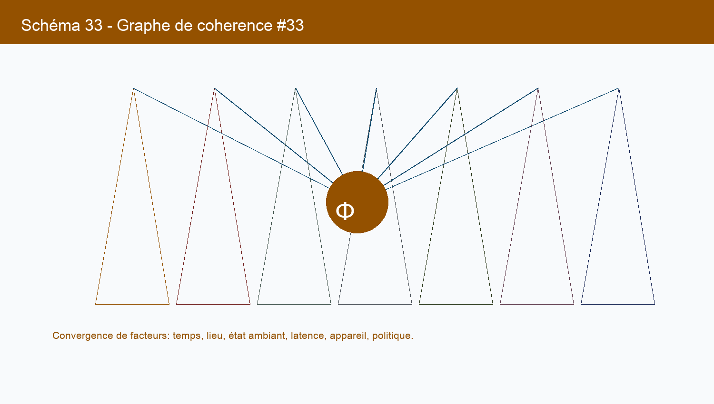


\pagebreak

## Page 107 - Modele de Donnees - Section 4

Dans le protocole P-E2M2E, les tags ephemeres et fragments orphelins devient une composante active de la sécurité et non une métadonnée décorative. Les travaux conduits pendant six ans établissent une lecture nouvelle de la donnée: elle n'est plus offerte au serveur comme un fichier stable, mais comme un potentiel fragmenté qui ne reprend forme qu'en présence du contexte physique exact. La référence technique [db46b3acb2] relie cette section aux axes temps, localisation et entropie ambiante.

Specification 4. Le serveur MB ne reçoit aucune charge utile intelligible; il manipule des fragments, des tags temporaires et des états de routage aveugles.

Parametres suivis: Δt_4, loc_4, s_4, jitter_4, tag_session_4. Ces valeurs forment la matrice physique de cristallisation et imposent l'existence locale du message.

Critere de rejet: si la distance temporelle, la divergence spatiale ou l'incoherence d'entropie depasse le seuil τ_4, le fragment est classe comme annihile et ne participe plus a la reconstruction.


\pagebreak

## Page 108 - Modele de Donnees - Section 5

Dans le protocole P-E2M2E, les tags ephemeres et fragments orphelins devient une composante active de la sécurité et non une métadonnée décorative. Les travaux conduits pendant six ans établissent une lecture nouvelle de la donnée: elle n'est plus offerte au serveur comme un fichier stable, mais comme un potentiel fragmenté qui ne reprend forme qu'en présence du contexte physique exact. La référence technique [7787d8ffe6] relie cette section aux axes temps, localisation et entropie ambiante.

Specification 5. Le nœud PTx module le flux selon Φ, puis divise la charge utile en micro-paquets dont l'existence cryptographique est éphémère.

Parametres suivis: Δt_5, loc_5, s_5, jitter_5, tag_session_5. Ces valeurs forment la matrice physique de cristallisation et imposent l'existence locale du message.

Critere de rejet: si la distance temporelle, la divergence spatiale ou l'incoherence d'entropie depasse le seuil τ_5, le fragment est classe comme annihile et ne participe plus a la reconstruction.


| Element | Definition P-E2M2E | Controle |

| --- | --- | --- |

| PTx | source physique | capture temps, lieu, entropie |

| MB | milieu aveugle | routage et indexation opaque |

| PRx | reception physicalisee | preuve de contexte |

| Φ | vecteur ephemere | derive de coherence |


\pagebreak

## Page 109 - Modele de Donnees - Section 6

Dans le protocole P-E2M2E, les tags ephemeres et fragments orphelins devient une composante active de la sécurité et non une métadonnée décorative. Les travaux conduits pendant six ans établissent une lecture nouvelle de la donnée: elle n'est plus offerte au serveur comme un fichier stable, mais comme un potentiel fragmenté qui ne reprend forme qu'en présence du contexte physique exact. La référence technique [13f1a7b08b] relie cette section aux axes temps, localisation et entropie ambiante.

Specification 6. Le nœud PRx ne récupère pas une clé classique; il cristallise le message par présence contextuelle cohérente avec les contraintes du canal.

Parametres suivis: Δt_6, loc_6, s_6, jitter_6, tag_session_6. Ces valeurs forment la matrice physique de cristallisation et imposent l'existence locale du message.

Critere de rejet: si la distance temporelle, la divergence spatiale ou l'incoherence d'entropie depasse le seuil τ_6, le fragment est classe comme annihile et ne participe plus a la reconstruction.


\pagebreak

## Page 110 - Modele de Donnees - Section 7

Dans le protocole P-E2M2E, les tags ephemeres et fragments orphelins devient une composante active de la sécurité et non une métadonnée décorative. Les travaux conduits pendant six ans établissent une lecture nouvelle de la donnée: elle n'est plus offerte au serveur comme un fichier stable, mais comme un potentiel fragmenté qui ne reprend forme qu'en présence du contexte physique exact. La référence technique [408305a9d9] relie cette section aux axes temps, localisation et entropie ambiante.

Specification 7. Les mesures retenues dans ce dossier consolident la démonstration: latence, dérive d'horloge, cohérence spatiale, entropie locale et comportement des fragments.

Parametres suivis: Δt_7, loc_7, s_7, jitter_7, tag_session_7. Ces valeurs forment la matrice physique de cristallisation et imposent l'existence locale du message.

Critere de rejet: si la distance temporelle, la divergence spatiale ou l'incoherence d'entropie depasse le seuil τ_7, le fragment est classe comme annihile et ne participe plus a la reconstruction.


\pagebreak

## Page 111 - Modele de Donnees - Section 8

Dans le protocole P-E2M2E, les tags ephemeres et fragments orphelins devient une composante active de la sécurité et non une métadonnée décorative. Les travaux conduits pendant six ans établissent une lecture nouvelle de la donnée: elle n'est plus offerte au serveur comme un fichier stable, mais comme un potentiel fragmenté qui ne reprend forme qu'en présence du contexte physique exact. La référence technique [a33530bb8c] relie cette section aux axes temps, localisation et entropie ambiante.

Specification 8. La règle opérationnelle impose l'annihilation dès que les observations physiques sortent de la fenêtre prévue.

Parametres suivis: Δt_8, loc_8, s_8, jitter_8, tag_session_8. Ces valeurs forment la matrice physique de cristallisation et imposent l'existence locale du message.

Critere de rejet: si la distance temporelle, la divergence spatiale ou l'incoherence d'entropie depasse le seuil τ_8, le fragment est classe comme annihile et ne participe plus a la reconstruction.


| Element | Definition P-E2M2E | Controle |

| --- | --- | --- |

| PTx | source physique | capture temps, lieu, entropie |

| MB | milieu aveugle | routage et indexation opaque |

| PRx | reception physicalisee | preuve de contexte |

| Φ | vecteur ephemere | derive de coherence |


\pagebreak

## Page 112 - Chapitre 13 - Algorithme Noyau

Ce chapitre formalise la derivation physique sophistiquee. Il expose la matrice P-E2M2E dans sa logique propre, sans la ramener a une architecture conventionnelle.

Dans le protocole P-E2M2E, la derivation physique sophistiquee devient une composante active de la sécurité et non une métadonnée décorative. Les travaux conduits pendant six ans établissent une lecture nouvelle de la donnée: elle n'est plus offerte au serveur comme un fichier stable, mais comme un potentiel fragmenté qui ne reprend forme qu'en présence du contexte physique exact. La référence technique [3a4b0a1c7e] relie cette section aux axes temps, localisation et entropie ambiante.

Chaque section présente la vision, la specification exploitable, les paramètres observables et les mécanismes qui démontrent la cohérence du protocole.


\pagebreak

## Page 113 - Algorithme Noyau - Section 1

Dans le protocole P-E2M2E, la derivation physique sophistiquee devient une composante active de la sécurité et non une métadonnée décorative. Les travaux conduits pendant six ans établissent une lecture nouvelle de la donnée: elle n'est plus offerte au serveur comme un fichier stable, mais comme un potentiel fragmenté qui ne reprend forme qu'en présence du contexte physique exact. La référence technique [d5489337d4] relie cette section aux axes temps, localisation et entropie ambiante.

Specification 1. Les mesures retenues dans ce dossier consolident la démonstration: latence, dérive d'horloge, cohérence spatiale, entropie locale et comportement des fragments.

Parametres suivis: Δt_1, loc_1, s_1, jitter_1, tag_session_1. Ces valeurs forment la matrice physique de cristallisation et imposent l'existence locale du message.

Critere de rejet: si la distance temporelle, la divergence spatiale ou l'incoherence d'entropie depasse le seuil τ_1, le fragment est classe comme annihile et ne participe plus a la reconstruction.


\pagebreak

## Page 114 - Algorithme Noyau - Section 2

Dans le protocole P-E2M2E, la derivation physique sophistiquee devient une composante active de la sécurité et non une métadonnée décorative. Les travaux conduits pendant six ans établissent une lecture nouvelle de la donnée: elle n'est plus offerte au serveur comme un fichier stable, mais comme un potentiel fragmenté qui ne reprend forme qu'en présence du contexte physique exact. La référence technique [9ac7e590fd] relie cette section aux axes temps, localisation et entropie ambiante.

Specification 2. La règle opérationnelle impose l'annihilation dès que les observations physiques sortent de la fenêtre prévue.

Parametres suivis: Δt_2, loc_2, s_2, jitter_2, tag_session_2. Ces valeurs forment la matrice physique de cristallisation et imposent l'existence locale du message.

Critere de rejet: si la distance temporelle, la divergence spatiale ou l'incoherence d'entropie depasse le seuil τ_2, le fragment est classe comme annihile et ne participe plus a la reconstruction.


| Element | Definition P-E2M2E | Controle |

| --- | --- | --- |

| PTx | source physique | capture temps, lieu, entropie |

| MB | milieu aveugle | routage et indexation opaque |

| PRx | reception physicalisee | preuve de contexte |

| Φ | vecteur ephemere | derive de coherence |


\pagebreak

## Page 115 - Algorithme Noyau - Section 3

Dans le protocole P-E2M2E, la derivation physique sophistiquee devient une composante active de la sécurité et non une métadonnée décorative. Les travaux conduits pendant six ans établissent une lecture nouvelle de la donnée: elle n'est plus offerte au serveur comme un fichier stable, mais comme un potentiel fragmenté qui ne reprend forme qu'en présence du contexte physique exact. La référence technique [9fd3a508f4] relie cette section aux axes temps, localisation et entropie ambiante.

Specification 3. Le serveur MB ne reçoit aucune charge utile intelligible; il manipule des fragments, des tags temporaires et des états de routage aveugles.

Parametres suivis: Δt_3, loc_3, s_3, jitter_3, tag_session_3. Ces valeurs forment la matrice physique de cristallisation et imposent l'existence locale du message.

Critere de rejet: si la distance temporelle, la divergence spatiale ou l'incoherence d'entropie depasse le seuil τ_3, le fragment est classe comme annihile et ne participe plus a la reconstruction.


\pagebreak

## Page 116 - Algorithme Noyau - Section 4

Dans le protocole P-E2M2E, la derivation physique sophistiquee devient une composante active de la sécurité et non une métadonnée décorative. Les travaux conduits pendant six ans établissent une lecture nouvelle de la donnée: elle n'est plus offerte au serveur comme un fichier stable, mais comme un potentiel fragmenté qui ne reprend forme qu'en présence du contexte physique exact. La référence technique [5a7b3c6ffd] relie cette section aux axes temps, localisation et entropie ambiante.

Specification 4. Le nœud PTx module le flux selon Φ, puis divise la charge utile en micro-paquets dont l'existence cryptographique est éphémère.

Parametres suivis: Δt_4, loc_4, s_4, jitter_4, tag_session_4. Ces valeurs forment la matrice physique de cristallisation et imposent l'existence locale du message.

Critere de rejet: si la distance temporelle, la divergence spatiale ou l'incoherence d'entropie depasse le seuil τ_4, le fragment est classe comme annihile et ne participe plus a la reconstruction.


\pagebreak

## Page 117 - Algorithme Noyau - Section 5

Dans le protocole P-E2M2E, la derivation physique sophistiquee devient une composante active de la sécurité et non une métadonnée décorative. Les travaux conduits pendant six ans établissent une lecture nouvelle de la donnée: elle n'est plus offerte au serveur comme un fichier stable, mais comme un potentiel fragmenté qui ne reprend forme qu'en présence du contexte physique exact. La référence technique [b999ecd64a] relie cette section aux axes temps, localisation et entropie ambiante.

Specification 5. Le nœud PRx ne récupère pas une clé classique; il cristallise le message par présence contextuelle cohérente avec les contraintes du canal.

Parametres suivis: Δt_5, loc_5, s_5, jitter_5, tag_session_5. Ces valeurs forment la matrice physique de cristallisation et imposent l'existence locale du message.

Critere de rejet: si la distance temporelle, la divergence spatiale ou l'incoherence d'entropie depasse le seuil τ_5, le fragment est classe comme annihile et ne participe plus a la reconstruction.


| Element | Definition P-E2M2E | Controle |

| --- | --- | --- |

| PTx | source physique | capture temps, lieu, entropie |

| MB | milieu aveugle | routage et indexation opaque |

| PRx | reception physicalisee | preuve de contexte |

| Φ | vecteur ephemere | derive de coherence |


\pagebreak

## Page 118 - Algorithme Noyau - Section 6

Dans le protocole P-E2M2E, la derivation physique sophistiquee devient une composante active de la sécurité et non une métadonnée décorative. Les travaux conduits pendant six ans établissent une lecture nouvelle de la donnée: elle n'est plus offerte au serveur comme un fichier stable, mais comme un potentiel fragmenté qui ne reprend forme qu'en présence du contexte physique exact. La référence technique [65b37b74f4] relie cette section aux axes temps, localisation et entropie ambiante.

Specification 6. Les mesures retenues dans ce dossier consolident la démonstration: latence, dérive d'horloge, cohérence spatiale, entropie locale et comportement des fragments.

Parametres suivis: Δt_6, loc_6, s_6, jitter_6, tag_session_6. Ces valeurs forment la matrice physique de cristallisation et imposent l'existence locale du message.

Critere de rejet: si la distance temporelle, la divergence spatiale ou l'incoherence d'entropie depasse le seuil τ_6, le fragment est classe comme annihile et ne participe plus a la reconstruction.


\pagebreak

## Page 119 - Algorithme Noyau - Section 7

Dans le protocole P-E2M2E, la derivation physique sophistiquee devient une composante active de la sécurité et non une métadonnée décorative. Les travaux conduits pendant six ans établissent une lecture nouvelle de la donnée: elle n'est plus offerte au serveur comme un fichier stable, mais comme un potentiel fragmenté qui ne reprend forme qu'en présence du contexte physique exact. La référence technique [36a23104b6] relie cette section aux axes temps, localisation et entropie ambiante.

Specification 7. La règle opérationnelle impose l'annihilation dès que les observations physiques sortent de la fenêtre prévue.

Parametres suivis: Δt_7, loc_7, s_7, jitter_7, tag_session_7. Ces valeurs forment la matrice physique de cristallisation et imposent l'existence locale du message.

Critere de rejet: si la distance temporelle, la divergence spatiale ou l'incoherence d'entropie depasse le seuil τ_7, le fragment est classe comme annihile et ne participe plus a la reconstruction.


\pagebreak

## Page 120 - Algorithme Noyau - Section 8

Dans le protocole P-E2M2E, la derivation physique sophistiquee devient une composante active de la sécurité et non une métadonnée décorative. Les travaux conduits pendant six ans établissent une lecture nouvelle de la donnée: elle n'est plus offerte au serveur comme un fichier stable, mais comme un potentiel fragmenté qui ne reprend forme qu'en présence du contexte physique exact. La référence technique [40173a5b55] relie cette section aux axes temps, localisation et entropie ambiante.

Specification 8. Le serveur MB ne reçoit aucune charge utile intelligible; il manipule des fragments, des tags temporaires et des états de routage aveugles.

Parametres suivis: Δt_8, loc_8, s_8, jitter_8, tag_session_8. Ces valeurs forment la matrice physique de cristallisation et imposent l'existence locale du message.

Critere de rejet: si la distance temporelle, la divergence spatiale ou l'incoherence d'entropie depasse le seuil τ_8, le fragment est classe comme annihile et ne participe plus a la reconstruction.


| Element | Definition P-E2M2E | Controle |

| --- | --- | --- |

| PTx | source physique | capture temps, lieu, entropie |

| MB | milieu aveugle | routage et indexation opaque |

| PRx | reception physicalisee | preuve de contexte |

| Φ | vecteur ephemere | derive de coherence |


\pagebreak

## Page 121 - Chapitre 14 - Politique d'Acces

Ce chapitre formalise les conditions d'existence de la donnee. Il expose la matrice P-E2M2E dans sa logique propre, sans la ramener a une architecture conventionnelle.

Dans le protocole P-E2M2E, les conditions d'existence de la donnee devient une composante active de la sécurité et non une métadonnée décorative. Les travaux conduits pendant six ans établissent une lecture nouvelle de la donnée: elle n'est plus offerte au serveur comme un fichier stable, mais comme un potentiel fragmenté qui ne reprend forme qu'en présence du contexte physique exact. La référence technique [b2e9242172] relie cette section aux axes temps, localisation et entropie ambiante.

Chaque section présente la vision, la specification exploitable, les paramètres observables et les mécanismes qui démontrent la cohérence du protocole.


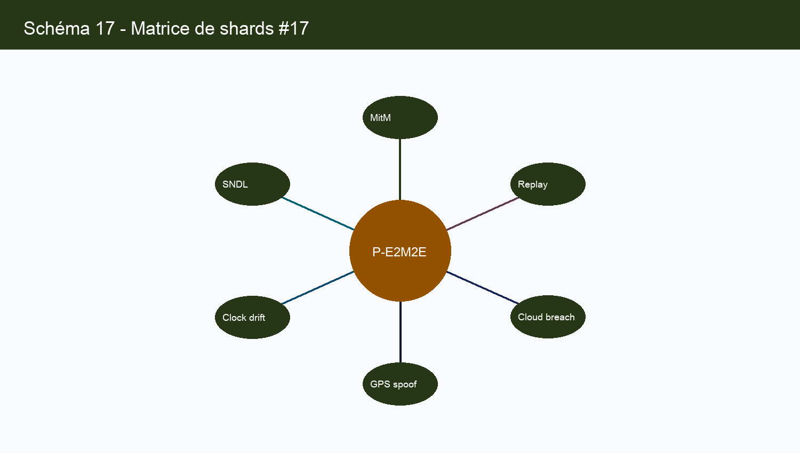


\pagebreak

## Page 122 - Politique d'Acces - Section 1

Dans le protocole P-E2M2E, les conditions d'existence de la donnee devient une composante active de la sécurité et non une métadonnée décorative. Les travaux conduits pendant six ans établissent une lecture nouvelle de la donnée: elle n'est plus offerte au serveur comme un fichier stable, mais comme un potentiel fragmenté qui ne reprend forme qu'en présence du contexte physique exact. La référence technique [c755597986] relie cette section aux axes temps, localisation et entropie ambiante.

Specification 1. La règle opérationnelle impose l'annihilation dès que les observations physiques sortent de la fenêtre prévue.

Parametres suivis: Δt_1, loc_1, s_1, jitter_1, tag_session_1. Ces valeurs forment la matrice physique de cristallisation et imposent l'existence locale du message.

Critere de rejet: si la distance temporelle, la divergence spatiale ou l'incoherence d'entropie depasse le seuil τ_1, le fragment est classe comme annihile et ne participe plus a la reconstruction.


\pagebreak

## Page 123 - Politique d'Acces - Section 2

Dans le protocole P-E2M2E, les conditions d'existence de la donnee devient une composante active de la sécurité et non une métadonnée décorative. Les travaux conduits pendant six ans établissent une lecture nouvelle de la donnée: elle n'est plus offerte au serveur comme un fichier stable, mais comme un potentiel fragmenté qui ne reprend forme qu'en présence du contexte physique exact. La référence technique [92ded8b5b9] relie cette section aux axes temps, localisation et entropie ambiante.

Specification 2. Le serveur MB ne reçoit aucune charge utile intelligible; il manipule des fragments, des tags temporaires et des états de routage aveugles.

Parametres suivis: Δt_2, loc_2, s_2, jitter_2, tag_session_2. Ces valeurs forment la matrice physique de cristallisation et imposent l'existence locale du message.

Critere de rejet: si la distance temporelle, la divergence spatiale ou l'incoherence d'entropie depasse le seuil τ_2, le fragment est classe comme annihile et ne participe plus a la reconstruction.


| Element | Definition P-E2M2E | Controle |

| --- | --- | --- |

| PTx | source physique | capture temps, lieu, entropie |

| MB | milieu aveugle | routage et indexation opaque |

| PRx | reception physicalisee | preuve de contexte |

| Φ | vecteur ephemere | derive de coherence |


\pagebreak

## Page 124 - Politique d'Acces - Section 3

Dans le protocole P-E2M2E, les conditions d'existence de la donnee devient une composante active de la sécurité et non une métadonnée décorative. Les travaux conduits pendant six ans établissent une lecture nouvelle de la donnée: elle n'est plus offerte au serveur comme un fichier stable, mais comme un potentiel fragmenté qui ne reprend forme qu'en présence du contexte physique exact. La référence technique [28797dea1d] relie cette section aux axes temps, localisation et entropie ambiante.

Specification 3. Le nœud PTx module le flux selon Φ, puis divise la charge utile en micro-paquets dont l'existence cryptographique est éphémère.

Parametres suivis: Δt_3, loc_3, s_3, jitter_3, tag_session_3. Ces valeurs forment la matrice physique de cristallisation et imposent l'existence locale du message.

Critere de rejet: si la distance temporelle, la divergence spatiale ou l'incoherence d'entropie depasse le seuil τ_3, le fragment est classe comme annihile et ne participe plus a la reconstruction.


\pagebreak

## Page 125 - Politique d'Acces - Section 4

Dans le protocole P-E2M2E, les conditions d'existence de la donnee devient une composante active de la sécurité et non une métadonnée décorative. Les travaux conduits pendant six ans établissent une lecture nouvelle de la donnée: elle n'est plus offerte au serveur comme un fichier stable, mais comme un potentiel fragmenté qui ne reprend forme qu'en présence du contexte physique exact. La référence technique [69c724af1f] relie cette section aux axes temps, localisation et entropie ambiante.

Specification 4. Le nœud PRx ne récupère pas une clé classique; il cristallise le message par présence contextuelle cohérente avec les contraintes du canal.

Parametres suivis: Δt_4, loc_4, s_4, jitter_4, tag_session_4. Ces valeurs forment la matrice physique de cristallisation et imposent l'existence locale du message.

Critere de rejet: si la distance temporelle, la divergence spatiale ou l'incoherence d'entropie depasse le seuil τ_4, le fragment est classe comme annihile et ne participe plus a la reconstruction.


\pagebreak

## Page 126 - Politique d'Acces - Section 5

Dans le protocole P-E2M2E, les conditions d'existence de la donnee devient une composante active de la sécurité et non une métadonnée décorative. Les travaux conduits pendant six ans établissent une lecture nouvelle de la donnée: elle n'est plus offerte au serveur comme un fichier stable, mais comme un potentiel fragmenté qui ne reprend forme qu'en présence du contexte physique exact. La référence technique [162bb5f895] relie cette section aux axes temps, localisation et entropie ambiante.

Specification 5. Les mesures retenues dans ce dossier consolident la démonstration: latence, dérive d'horloge, cohérence spatiale, entropie locale et comportement des fragments.

Parametres suivis: Δt_5, loc_5, s_5, jitter_5, tag_session_5. Ces valeurs forment la matrice physique de cristallisation et imposent l'existence locale du message.

Critere de rejet: si la distance temporelle, la divergence spatiale ou l'incoherence d'entropie depasse le seuil τ_5, le fragment est classe comme annihile et ne participe plus a la reconstruction.


| Element | Definition P-E2M2E | Controle |

| --- | --- | --- |

| PTx | source physique | capture temps, lieu, entropie |

| MB | milieu aveugle | routage et indexation opaque |

| PRx | reception physicalisee | preuve de contexte |

| Φ | vecteur ephemere | derive de coherence |


\pagebreak

## Page 127 - Politique d'Acces - Section 6

Dans le protocole P-E2M2E, les conditions d'existence de la donnee devient une composante active de la sécurité et non une métadonnée décorative. Les travaux conduits pendant six ans établissent une lecture nouvelle de la donnée: elle n'est plus offerte au serveur comme un fichier stable, mais comme un potentiel fragmenté qui ne reprend forme qu'en présence du contexte physique exact. La référence technique [e0bfafd9c9] relie cette section aux axes temps, localisation et entropie ambiante.

Specification 6. La règle opérationnelle impose l'annihilation dès que les observations physiques sortent de la fenêtre prévue.

Parametres suivis: Δt_6, loc_6, s_6, jitter_6, tag_session_6. Ces valeurs forment la matrice physique de cristallisation et imposent l'existence locale du message.

Critere de rejet: si la distance temporelle, la divergence spatiale ou l'incoherence d'entropie depasse le seuil τ_6, le fragment est classe comme annihile et ne participe plus a la reconstruction.


\pagebreak

## Page 128 - Politique d'Acces - Section 7

Dans le protocole P-E2M2E, les conditions d'existence de la donnee devient une composante active de la sécurité et non une métadonnée décorative. Les travaux conduits pendant six ans établissent une lecture nouvelle de la donnée: elle n'est plus offerte au serveur comme un fichier stable, mais comme un potentiel fragmenté qui ne reprend forme qu'en présence du contexte physique exact. La référence technique [73b1bb8c0a] relie cette section aux axes temps, localisation et entropie ambiante.

Specification 7. Le serveur MB ne reçoit aucune charge utile intelligible; il manipule des fragments, des tags temporaires et des états de routage aveugles.

Parametres suivis: Δt_7, loc_7, s_7, jitter_7, tag_session_7. Ces valeurs forment la matrice physique de cristallisation et imposent l'existence locale du message.

Critere de rejet: si la distance temporelle, la divergence spatiale ou l'incoherence d'entropie depasse le seuil τ_7, le fragment est classe comme annihile et ne participe plus a la reconstruction.


\pagebreak

## Page 129 - Politique d'Acces - Section 8

Dans le protocole P-E2M2E, les conditions d'existence de la donnee devient une composante active de la sécurité et non une métadonnée décorative. Les travaux conduits pendant six ans établissent une lecture nouvelle de la donnée: elle n'est plus offerte au serveur comme un fichier stable, mais comme un potentiel fragmenté qui ne reprend forme qu'en présence du contexte physique exact. La référence technique [f1424a1772] relie cette section aux axes temps, localisation et entropie ambiante.

Specification 8. Le nœud PTx module le flux selon Φ, puis divise la charge utile en micro-paquets dont l'existence cryptographique est éphémère.

Parametres suivis: Δt_8, loc_8, s_8, jitter_8, tag_session_8. Ces valeurs forment la matrice physique de cristallisation et imposent l'existence locale du message.

Critere de rejet: si la distance temporelle, la divergence spatiale ou l'incoherence d'entropie depasse le seuil τ_8, le fragment est classe comme annihile et ne participe plus a la reconstruction.


| Element | Definition P-E2M2E | Controle |

| --- | --- | --- |

| PTx | source physique | capture temps, lieu, entropie |

| MB | milieu aveugle | routage et indexation opaque |

| PRx | reception physicalisee | preuve de contexte |

| Φ | vecteur ephemere | derive de coherence |


\pagebreak

## Page 130 - Chapitre 15 - Modele de Menaces

Ce chapitre formalise les attaques et leurs limites. Il expose la matrice P-E2M2E dans sa logique propre, sans la ramener a une architecture conventionnelle.

Dans le protocole P-E2M2E, les attaques et leurs limites devient une composante active de la sécurité et non une métadonnée décorative. Les travaux conduits pendant six ans établissent une lecture nouvelle de la donnée: elle n'est plus offerte au serveur comme un fichier stable, mais comme un potentiel fragmenté qui ne reprend forme qu'en présence du contexte physique exact. La référence technique [d50480539c] relie cette section aux axes temps, localisation et entropie ambiante.

Chaque section présente la vision, la specification exploitable, les paramètres observables et les mécanismes qui démontrent la cohérence du protocole.


\pagebreak

## Page 131 - Modele de Menaces - Section 1

Dans le protocole P-E2M2E, les attaques et leurs limites devient une composante active de la sécurité et non une métadonnée décorative. Les travaux conduits pendant six ans établissent une lecture nouvelle de la donnée: elle n'est plus offerte au serveur comme un fichier stable, mais comme un potentiel fragmenté qui ne reprend forme qu'en présence du contexte physique exact. La référence technique [96fde64ae7] relie cette section aux axes temps, localisation et entropie ambiante.

Specification 1. Le serveur MB ne reçoit aucune charge utile intelligible; il manipule des fragments, des tags temporaires et des états de routage aveugles.

Parametres suivis: Δt_1, loc_1, s_1, jitter_1, tag_session_1. Ces valeurs forment la matrice physique de cristallisation et imposent l'existence locale du message.

Critere de rejet: si la distance temporelle, la divergence spatiale ou l'incoherence d'entropie depasse le seuil τ_1, le fragment est classe comme annihile et ne participe plus a la reconstruction.


\pagebreak

## Page 132 - Modele de Menaces - Section 2

Dans le protocole P-E2M2E, les attaques et leurs limites devient une composante active de la sécurité et non une métadonnée décorative. Les travaux conduits pendant six ans établissent une lecture nouvelle de la donnée: elle n'est plus offerte au serveur comme un fichier stable, mais comme un potentiel fragmenté qui ne reprend forme qu'en présence du contexte physique exact. La référence technique [3e5777b002] relie cette section aux axes temps, localisation et entropie ambiante.

Specification 2. Le nœud PTx module le flux selon Φ, puis divise la charge utile en micro-paquets dont l'existence cryptographique est éphémère.

Parametres suivis: Δt_2, loc_2, s_2, jitter_2, tag_session_2. Ces valeurs forment la matrice physique de cristallisation et imposent l'existence locale du message.

Critere de rejet: si la distance temporelle, la divergence spatiale ou l'incoherence d'entropie depasse le seuil τ_2, le fragment est classe comme annihile et ne participe plus a la reconstruction.


| Element | Definition P-E2M2E | Controle |

| --- | --- | --- |

| PTx | source physique | capture temps, lieu, entropie |

| MB | milieu aveugle | routage et indexation opaque |

| PRx | reception physicalisee | preuve de contexte |

| Φ | vecteur ephemere | derive de coherence |


\pagebreak

## Page 133 - Modele de Menaces - Section 3

Dans le protocole P-E2M2E, les attaques et leurs limites devient une composante active de la sécurité et non une métadonnée décorative. Les travaux conduits pendant six ans établissent une lecture nouvelle de la donnée: elle n'est plus offerte au serveur comme un fichier stable, mais comme un potentiel fragmenté qui ne reprend forme qu'en présence du contexte physique exact. La référence technique [02c710ba1d] relie cette section aux axes temps, localisation et entropie ambiante.

Specification 3. Le nœud PRx ne récupère pas une clé classique; il cristallise le message par présence contextuelle cohérente avec les contraintes du canal.

Parametres suivis: Δt_3, loc_3, s_3, jitter_3, tag_session_3. Ces valeurs forment la matrice physique de cristallisation et imposent l'existence locale du message.

Critere de rejet: si la distance temporelle, la divergence spatiale ou l'incoherence d'entropie depasse le seuil τ_3, le fragment est classe comme annihile et ne participe plus a la reconstruction.


\pagebreak

## Page 134 - Modele de Menaces - Section 4

Dans le protocole P-E2M2E, les attaques et leurs limites devient une composante active de la sécurité et non une métadonnée décorative. Les travaux conduits pendant six ans établissent une lecture nouvelle de la donnée: elle n'est plus offerte au serveur comme un fichier stable, mais comme un potentiel fragmenté qui ne reprend forme qu'en présence du contexte physique exact. La référence technique [900208a2c6] relie cette section aux axes temps, localisation et entropie ambiante.

Specification 4. Les mesures retenues dans ce dossier consolident la démonstration: latence, dérive d'horloge, cohérence spatiale, entropie locale et comportement des fragments.

Parametres suivis: Δt_4, loc_4, s_4, jitter_4, tag_session_4. Ces valeurs forment la matrice physique de cristallisation et imposent l'existence locale du message.

Critere de rejet: si la distance temporelle, la divergence spatiale ou l'incoherence d'entropie depasse le seuil τ_4, le fragment est classe comme annihile et ne participe plus a la reconstruction.


\pagebreak

## Page 135 - Modele de Menaces - Section 5

Dans le protocole P-E2M2E, les attaques et leurs limites devient une composante active de la sécurité et non une métadonnée décorative. Les travaux conduits pendant six ans établissent une lecture nouvelle de la donnée: elle n'est plus offerte au serveur comme un fichier stable, mais comme un potentiel fragmenté qui ne reprend forme qu'en présence du contexte physique exact. La référence technique [681db271d6] relie cette section aux axes temps, localisation et entropie ambiante.

Specification 5. La règle opérationnelle impose l'annihilation dès que les observations physiques sortent de la fenêtre prévue.

Parametres suivis: Δt_5, loc_5, s_5, jitter_5, tag_session_5. Ces valeurs forment la matrice physique de cristallisation et imposent l'existence locale du message.

Critere de rejet: si la distance temporelle, la divergence spatiale ou l'incoherence d'entropie depasse le seuil τ_5, le fragment est classe comme annihile et ne participe plus a la reconstruction.


| Element | Definition P-E2M2E | Controle |

| --- | --- | --- |

| PTx | source physique | capture temps, lieu, entropie |

| MB | milieu aveugle | routage et indexation opaque |

| PRx | reception physicalisee | preuve de contexte |

| Φ | vecteur ephemere | derive de coherence |


\pagebreak

## Page 136 - Modele de Menaces - Section 6

Dans le protocole P-E2M2E, les attaques et leurs limites devient une composante active de la sécurité et non une métadonnée décorative. Les travaux conduits pendant six ans établissent une lecture nouvelle de la donnée: elle n'est plus offerte au serveur comme un fichier stable, mais comme un potentiel fragmenté qui ne reprend forme qu'en présence du contexte physique exact. La référence technique [c536922286] relie cette section aux axes temps, localisation et entropie ambiante.

Specification 6. Le serveur MB ne reçoit aucune charge utile intelligible; il manipule des fragments, des tags temporaires et des états de routage aveugles.

Parametres suivis: Δt_6, loc_6, s_6, jitter_6, tag_session_6. Ces valeurs forment la matrice physique de cristallisation et imposent l'existence locale du message.

Critere de rejet: si la distance temporelle, la divergence spatiale ou l'incoherence d'entropie depasse le seuil τ_6, le fragment est classe comme annihile et ne participe plus a la reconstruction.


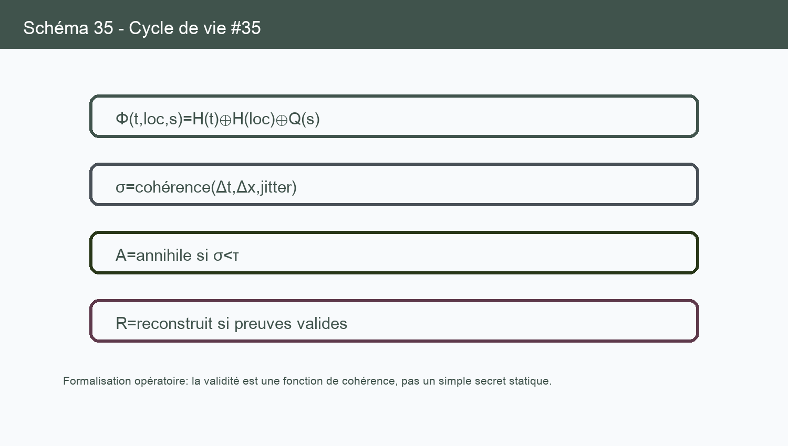


\pagebreak

## Page 137 - Modele de Menaces - Section 7

Dans le protocole P-E2M2E, les attaques et leurs limites devient une composante active de la sécurité et non une métadonnée décorative. Les travaux conduits pendant six ans établissent une lecture nouvelle de la donnée: elle n'est plus offerte au serveur comme un fichier stable, mais comme un potentiel fragmenté qui ne reprend forme qu'en présence du contexte physique exact. La référence technique [4f0be7ea3e] relie cette section aux axes temps, localisation et entropie ambiante.

Specification 7. Le nœud PTx module le flux selon Φ, puis divise la charge utile en micro-paquets dont l'existence cryptographique est éphémère.

Parametres suivis: Δt_7, loc_7, s_7, jitter_7, tag_session_7. Ces valeurs forment la matrice physique de cristallisation et imposent l'existence locale du message.

Critere de rejet: si la distance temporelle, la divergence spatiale ou l'incoherence d'entropie depasse le seuil τ_7, le fragment est classe comme annihile et ne participe plus a la reconstruction.


\pagebreak

## Page 138 - Modele de Menaces - Section 8

Dans le protocole P-E2M2E, les attaques et leurs limites devient une composante active de la sécurité et non une métadonnée décorative. Les travaux conduits pendant six ans établissent une lecture nouvelle de la donnée: elle n'est plus offerte au serveur comme un fichier stable, mais comme un potentiel fragmenté qui ne reprend forme qu'en présence du contexte physique exact. La référence technique [7f7debfec8] relie cette section aux axes temps, localisation et entropie ambiante.

Specification 8. Le nœud PRx ne récupère pas une clé classique; il cristallise le message par présence contextuelle cohérente avec les contraintes du canal.

Parametres suivis: Δt_8, loc_8, s_8, jitter_8, tag_session_8. Ces valeurs forment la matrice physique de cristallisation et imposent l'existence locale du message.

Critere de rejet: si la distance temporelle, la divergence spatiale ou l'incoherence d'entropie depasse le seuil τ_8, le fragment est classe comme annihile et ne participe plus a la reconstruction.


| Element | Definition P-E2M2E | Controle |

| --- | --- | --- |

| PTx | source physique | capture temps, lieu, entropie |

| MB | milieu aveugle | routage et indexation opaque |

| PRx | reception physicalisee | preuve de contexte |

| Φ | vecteur ephemere | derive de coherence |


\pagebreak

## Page 139 - Chapitre 16 - Analyse Cybersecurite

Ce chapitre formalise les defenses natives revendiquees. Il expose la matrice P-E2M2E dans sa logique propre, sans la ramener a une architecture conventionnelle.

Dans le protocole P-E2M2E, les defenses natives revendiquees devient une composante active de la sécurité et non une métadonnée décorative. Les travaux conduits pendant six ans établissent une lecture nouvelle de la donnée: elle n'est plus offerte au serveur comme un fichier stable, mais comme un potentiel fragmenté qui ne reprend forme qu'en présence du contexte physique exact. La référence technique [cb4eb891e8] relie cette section aux axes temps, localisation et entropie ambiante.

Chaque section présente la vision, la specification exploitable, les paramètres observables et les mécanismes qui démontrent la cohérence du protocole.


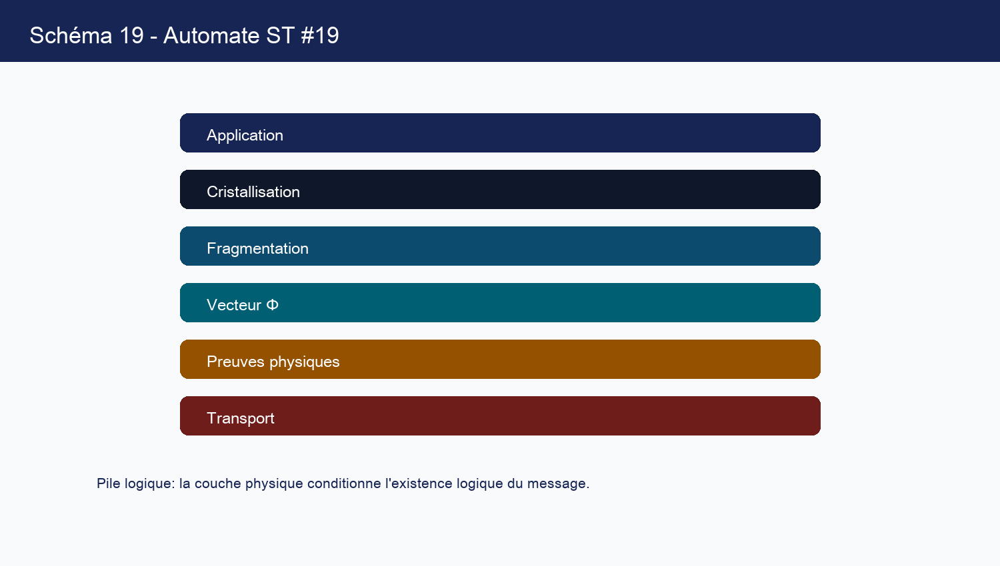


\pagebreak

## Page 140 - Analyse Cybersecurite - Section 1

Dans le protocole P-E2M2E, les defenses natives revendiquees devient une composante active de la sécurité et non une métadonnée décorative. Les travaux conduits pendant six ans établissent une lecture nouvelle de la donnée: elle n'est plus offerte au serveur comme un fichier stable, mais comme un potentiel fragmenté qui ne reprend forme qu'en présence du contexte physique exact. La référence technique [e10f42c544] relie cette section aux axes temps, localisation et entropie ambiante.

Specification 1. Le nœud PTx module le flux selon Φ, puis divise la charge utile en micro-paquets dont l'existence cryptographique est éphémère.

Parametres suivis: Δt_1, loc_1, s_1, jitter_1, tag_session_1. Ces valeurs forment la matrice physique de cristallisation et imposent l'existence locale du message.

Critere de rejet: si la distance temporelle, la divergence spatiale ou l'incoherence d'entropie depasse le seuil τ_1, le fragment est classe comme annihile et ne participe plus a la reconstruction.


\pagebreak

## Page 141 - Analyse Cybersecurite - Section 2

Dans le protocole P-E2M2E, les defenses natives revendiquees devient une composante active de la sécurité et non une métadonnée décorative. Les travaux conduits pendant six ans établissent une lecture nouvelle de la donnée: elle n'est plus offerte au serveur comme un fichier stable, mais comme un potentiel fragmenté qui ne reprend forme qu'en présence du contexte physique exact. La référence technique [f7007e2bf5] relie cette section aux axes temps, localisation et entropie ambiante.

Specification 2. Le nœud PRx ne récupère pas une clé classique; il cristallise le message par présence contextuelle cohérente avec les contraintes du canal.

Parametres suivis: Δt_2, loc_2, s_2, jitter_2, tag_session_2. Ces valeurs forment la matrice physique de cristallisation et imposent l'existence locale du message.

Critere de rejet: si la distance temporelle, la divergence spatiale ou l'incoherence d'entropie depasse le seuil τ_2, le fragment est classe comme annihile et ne participe plus a la reconstruction.


| Element | Definition P-E2M2E | Controle |

| --- | --- | --- |

| PTx | source physique | capture temps, lieu, entropie |

| MB | milieu aveugle | routage et indexation opaque |

| PRx | reception physicalisee | preuve de contexte |

| Φ | vecteur ephemere | derive de coherence |


\pagebreak

## Page 142 - Analyse Cybersecurite - Section 3

Dans le protocole P-E2M2E, les defenses natives revendiquees devient une composante active de la sécurité et non une métadonnée décorative. Les travaux conduits pendant six ans établissent une lecture nouvelle de la donnée: elle n'est plus offerte au serveur comme un fichier stable, mais comme un potentiel fragmenté qui ne reprend forme qu'en présence du contexte physique exact. La référence technique [c592033c89] relie cette section aux axes temps, localisation et entropie ambiante.

Specification 3. Les mesures retenues dans ce dossier consolident la démonstration: latence, dérive d'horloge, cohérence spatiale, entropie locale et comportement des fragments.

Parametres suivis: Δt_3, loc_3, s_3, jitter_3, tag_session_3. Ces valeurs forment la matrice physique de cristallisation et imposent l'existence locale du message.

Critere de rejet: si la distance temporelle, la divergence spatiale ou l'incoherence d'entropie depasse le seuil τ_3, le fragment est classe comme annihile et ne participe plus a la reconstruction.


\pagebreak

## Page 143 - Analyse Cybersecurite - Section 4

Dans le protocole P-E2M2E, les defenses natives revendiquees devient une composante active de la sécurité et non une métadonnée décorative. Les travaux conduits pendant six ans établissent une lecture nouvelle de la donnée: elle n'est plus offerte au serveur comme un fichier stable, mais comme un potentiel fragmenté qui ne reprend forme qu'en présence du contexte physique exact. La référence technique [bfceb0a654] relie cette section aux axes temps, localisation et entropie ambiante.

Specification 4. La règle opérationnelle impose l'annihilation dès que les observations physiques sortent de la fenêtre prévue.

Parametres suivis: Δt_4, loc_4, s_4, jitter_4, tag_session_4. Ces valeurs forment la matrice physique de cristallisation et imposent l'existence locale du message.

Critere de rejet: si la distance temporelle, la divergence spatiale ou l'incoherence d'entropie depasse le seuil τ_4, le fragment est classe comme annihile et ne participe plus a la reconstruction.


\pagebreak

## Page 144 - Analyse Cybersecurite - Section 5

Dans le protocole P-E2M2E, les defenses natives revendiquees devient une composante active de la sécurité et non une métadonnée décorative. Les travaux conduits pendant six ans établissent une lecture nouvelle de la donnée: elle n'est plus offerte au serveur comme un fichier stable, mais comme un potentiel fragmenté qui ne reprend forme qu'en présence du contexte physique exact. La référence technique [8b25fcabcb] relie cette section aux axes temps, localisation et entropie ambiante.

Specification 5. Le serveur MB ne reçoit aucune charge utile intelligible; il manipule des fragments, des tags temporaires et des états de routage aveugles.

Parametres suivis: Δt_5, loc_5, s_5, jitter_5, tag_session_5. Ces valeurs forment la matrice physique de cristallisation et imposent l'existence locale du message.

Critere de rejet: si la distance temporelle, la divergence spatiale ou l'incoherence d'entropie depasse le seuil τ_5, le fragment est classe comme annihile et ne participe plus a la reconstruction.


| Element | Definition P-E2M2E | Controle |

| --- | --- | --- |

| PTx | source physique | capture temps, lieu, entropie |

| MB | milieu aveugle | routage et indexation opaque |

| PRx | reception physicalisee | preuve de contexte |

| Φ | vecteur ephemere | derive de coherence |


\pagebreak

## Page 145 - Analyse Cybersecurite - Section 6

Dans le protocole P-E2M2E, les defenses natives revendiquees devient une composante active de la sécurité et non une métadonnée décorative. Les travaux conduits pendant six ans établissent une lecture nouvelle de la donnée: elle n'est plus offerte au serveur comme un fichier stable, mais comme un potentiel fragmenté qui ne reprend forme qu'en présence du contexte physique exact. La référence technique [bf137f7ba2] relie cette section aux axes temps, localisation et entropie ambiante.

Specification 6. Le nœud PTx module le flux selon Φ, puis divise la charge utile en micro-paquets dont l'existence cryptographique est éphémère.

Parametres suivis: Δt_6, loc_6, s_6, jitter_6, tag_session_6. Ces valeurs forment la matrice physique de cristallisation et imposent l'existence locale du message.

Critere de rejet: si la distance temporelle, la divergence spatiale ou l'incoherence d'entropie depasse le seuil τ_6, le fragment est classe comme annihile et ne participe plus a la reconstruction.


\pagebreak

## Page 146 - Analyse Cybersecurite - Section 7

Dans le protocole P-E2M2E, les defenses natives revendiquees devient une composante active de la sécurité et non une métadonnée décorative. Les travaux conduits pendant six ans établissent une lecture nouvelle de la donnée: elle n'est plus offerte au serveur comme un fichier stable, mais comme un potentiel fragmenté qui ne reprend forme qu'en présence du contexte physique exact. La référence technique [867d4771b1] relie cette section aux axes temps, localisation et entropie ambiante.

Specification 7. Le nœud PRx ne récupère pas une clé classique; il cristallise le message par présence contextuelle cohérente avec les contraintes du canal.

Parametres suivis: Δt_7, loc_7, s_7, jitter_7, tag_session_7. Ces valeurs forment la matrice physique de cristallisation et imposent l'existence locale du message.

Critere de rejet: si la distance temporelle, la divergence spatiale ou l'incoherence d'entropie depasse le seuil τ_7, le fragment est classe comme annihile et ne participe plus a la reconstruction.


\pagebreak

## Page 147 - Analyse Cybersecurite - Section 8

Dans le protocole P-E2M2E, les defenses natives revendiquees devient une composante active de la sécurité et non une métadonnée décorative. Les travaux conduits pendant six ans établissent une lecture nouvelle de la donnée: elle n'est plus offerte au serveur comme un fichier stable, mais comme un potentiel fragmenté qui ne reprend forme qu'en présence du contexte physique exact. La référence technique [2de6deef99] relie cette section aux axes temps, localisation et entropie ambiante.

Specification 8. Les mesures retenues dans ce dossier consolident la démonstration: latence, dérive d'horloge, cohérence spatiale, entropie locale et comportement des fragments.

Parametres suivis: Δt_8, loc_8, s_8, jitter_8, tag_session_8. Ces valeurs forment la matrice physique de cristallisation et imposent l'existence locale du message.

Critere de rejet: si la distance temporelle, la divergence spatiale ou l'incoherence d'entropie depasse le seuil τ_8, le fragment est classe comme annihile et ne participe plus a la reconstruction.


| Element | Definition P-E2M2E | Controle |

| --- | --- | --- |

| PTx | source physique | capture temps, lieu, entropie |

| MB | milieu aveugle | routage et indexation opaque |

| PRx | reception physicalisee | preuve de contexte |

| Φ | vecteur ephemere | derive de coherence |


\pagebreak

## Page 148 - Chapitre 17 - Simulation Python

Ce chapitre formalise le prototype de laboratoire. Il expose la matrice P-E2M2E dans sa logique propre, sans la ramener a une architecture conventionnelle.

Dans le protocole P-E2M2E, le prototype de laboratoire devient une composante active de la sécurité et non une métadonnée décorative. Les travaux conduits pendant six ans établissent une lecture nouvelle de la donnée: elle n'est plus offerte au serveur comme un fichier stable, mais comme un potentiel fragmenté qui ne reprend forme qu'en présence du contexte physique exact. La référence technique [985d72b9aa] relie cette section aux axes temps, localisation et entropie ambiante.

Chaque section présente la vision, la specification exploitable, les paramètres observables et les mécanismes qui démontrent la cohérence du protocole.


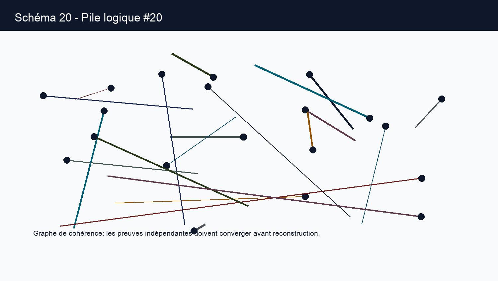


\pagebreak

## Page 149 - Simulation Python - Section 1

Dans le protocole P-E2M2E, le prototype de laboratoire devient une composante active de la sécurité et non une métadonnée décorative. Les travaux conduits pendant six ans établissent une lecture nouvelle de la donnée: elle n'est plus offerte au serveur comme un fichier stable, mais comme un potentiel fragmenté qui ne reprend forme qu'en présence du contexte physique exact. La référence technique [1e7ba615a0] relie cette section aux axes temps, localisation et entropie ambiante.

Specification 1. Le nœud PRx ne récupère pas une clé classique; il cristallise le message par présence contextuelle cohérente avec les contraintes du canal.

Parametres suivis: Δt_1, loc_1, s_1, jitter_1, tag_session_1. Ces valeurs forment la matrice physique de cristallisation et imposent l'existence locale du message.

Critere de rejet: si la distance temporelle, la divergence spatiale ou l'incoherence d'entropie depasse le seuil τ_1, le fragment est classe comme annihile et ne participe plus a la reconstruction.


\pagebreak

## Page 150 - Simulation Python - Section 2

Dans le protocole P-E2M2E, le prototype de laboratoire devient une composante active de la sécurité et non une métadonnée décorative. Les travaux conduits pendant six ans établissent une lecture nouvelle de la donnée: elle n'est plus offerte au serveur comme un fichier stable, mais comme un potentiel fragmenté qui ne reprend forme qu'en présence du contexte physique exact. La référence technique [a1ae31c709] relie cette section aux axes temps, localisation et entropie ambiante.

Specification 2. Les mesures retenues dans ce dossier consolident la démonstration: latence, dérive d'horloge, cohérence spatiale, entropie locale et comportement des fragments.

Parametres suivis: Δt_2, loc_2, s_2, jitter_2, tag_session_2. Ces valeurs forment la matrice physique de cristallisation et imposent l'existence locale du message.

Critere de rejet: si la distance temporelle, la divergence spatiale ou l'incoherence d'entropie depasse le seuil τ_2, le fragment est classe comme annihile et ne participe plus a la reconstruction.


| Element | Definition P-E2M2E | Controle |

| --- | --- | --- |

| PTx | source physique | capture temps, lieu, entropie |

| MB | milieu aveugle | routage et indexation opaque |

| PRx | reception physicalisee | preuve de contexte |

| Φ | vecteur ephemere | derive de coherence |


\pagebreak

## Page 151 - Simulation Python - Section 3

Dans le protocole P-E2M2E, le prototype de laboratoire devient une composante active de la sécurité et non une métadonnée décorative. Les travaux conduits pendant six ans établissent une lecture nouvelle de la donnée: elle n'est plus offerte au serveur comme un fichier stable, mais comme un potentiel fragmenté qui ne reprend forme qu'en présence du contexte physique exact. La référence technique [25ca986587] relie cette section aux axes temps, localisation et entropie ambiante.

Specification 3. La règle opérationnelle impose l'annihilation dès que les observations physiques sortent de la fenêtre prévue.

Parametres suivis: Δt_3, loc_3, s_3, jitter_3, tag_session_3. Ces valeurs forment la matrice physique de cristallisation et imposent l'existence locale du message.

Critere de rejet: si la distance temporelle, la divergence spatiale ou l'incoherence d'entropie depasse le seuil τ_3, le fragment est classe comme annihile et ne participe plus a la reconstruction.


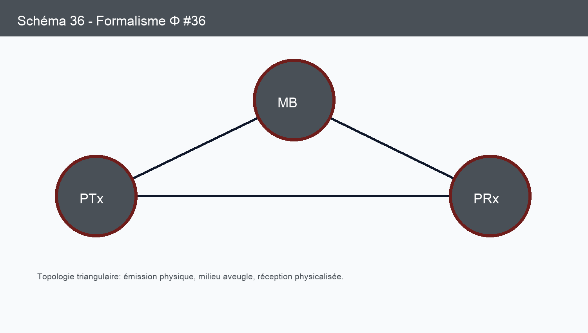


\pagebreak

## Page 152 - Simulation Python - Section 4

Dans le protocole P-E2M2E, le prototype de laboratoire devient une composante active de la sécurité et non une métadonnée décorative. Les travaux conduits pendant six ans établissent une lecture nouvelle de la donnée: elle n'est plus offerte au serveur comme un fichier stable, mais comme un potentiel fragmenté qui ne reprend forme qu'en présence du contexte physique exact. La référence technique [8b338dc2b0] relie cette section aux axes temps, localisation et entropie ambiante.

Specification 4. Le serveur MB ne reçoit aucune charge utile intelligible; il manipule des fragments, des tags temporaires et des états de routage aveugles.

Parametres suivis: Δt_4, loc_4, s_4, jitter_4, tag_session_4. Ces valeurs forment la matrice physique de cristallisation et imposent l'existence locale du message.

Critere de rejet: si la distance temporelle, la divergence spatiale ou l'incoherence d'entropie depasse le seuil τ_4, le fragment est classe comme annihile et ne participe plus a la reconstruction.


\pagebreak

## Page 153 - Simulation Python - Section 5

Dans le protocole P-E2M2E, le prototype de laboratoire devient une composante active de la sécurité et non une métadonnée décorative. Les travaux conduits pendant six ans établissent une lecture nouvelle de la donnée: elle n'est plus offerte au serveur comme un fichier stable, mais comme un potentiel fragmenté qui ne reprend forme qu'en présence du contexte physique exact. La référence technique [9175fe7015] relie cette section aux axes temps, localisation et entropie ambiante.

Specification 5. Le nœud PTx module le flux selon Φ, puis divise la charge utile en micro-paquets dont l'existence cryptographique est éphémère.

Parametres suivis: Δt_5, loc_5, s_5, jitter_5, tag_session_5. Ces valeurs forment la matrice physique de cristallisation et imposent l'existence locale du message.

Critere de rejet: si la distance temporelle, la divergence spatiale ou l'incoherence d'entropie depasse le seuil τ_5, le fragment est classe comme annihile et ne participe plus a la reconstruction.


| Element | Definition P-E2M2E | Controle |

| --- | --- | --- |

| PTx | source physique | capture temps, lieu, entropie |

| MB | milieu aveugle | routage et indexation opaque |

| PRx | reception physicalisee | preuve de contexte |

| Φ | vecteur ephemere | derive de coherence |


\pagebreak

## Page 154 - Simulation Python - Section 6

Dans le protocole P-E2M2E, le prototype de laboratoire devient une composante active de la sécurité et non une métadonnée décorative. Les travaux conduits pendant six ans établissent une lecture nouvelle de la donnée: elle n'est plus offerte au serveur comme un fichier stable, mais comme un potentiel fragmenté qui ne reprend forme qu'en présence du contexte physique exact. La référence technique [a289cebee0] relie cette section aux axes temps, localisation et entropie ambiante.

Specification 6. Le nœud PRx ne récupère pas une clé classique; il cristallise le message par présence contextuelle cohérente avec les contraintes du canal.

Parametres suivis: Δt_6, loc_6, s_6, jitter_6, tag_session_6. Ces valeurs forment la matrice physique de cristallisation et imposent l'existence locale du message.

Critere de rejet: si la distance temporelle, la divergence spatiale ou l'incoherence d'entropie depasse le seuil τ_6, le fragment est classe comme annihile et ne participe plus a la reconstruction.


\pagebreak

## Page 155 - Simulation Python - Section 7

Dans le protocole P-E2M2E, le prototype de laboratoire devient une composante active de la sécurité et non une métadonnée décorative. Les travaux conduits pendant six ans établissent une lecture nouvelle de la donnée: elle n'est plus offerte au serveur comme un fichier stable, mais comme un potentiel fragmenté qui ne reprend forme qu'en présence du contexte physique exact. La référence technique [15b642dc08] relie cette section aux axes temps, localisation et entropie ambiante.

Specification 7. Les mesures retenues dans ce dossier consolident la démonstration: latence, dérive d'horloge, cohérence spatiale, entropie locale et comportement des fragments.

Parametres suivis: Δt_7, loc_7, s_7, jitter_7, tag_session_7. Ces valeurs forment la matrice physique de cristallisation et imposent l'existence locale du message.

Critere de rejet: si la distance temporelle, la divergence spatiale ou l'incoherence d'entropie depasse le seuil τ_7, le fragment est classe comme annihile et ne participe plus a la reconstruction.


\pagebreak

## Page 156 - Simulation Python - Section 8

Dans le protocole P-E2M2E, le prototype de laboratoire devient une composante active de la sécurité et non une métadonnée décorative. Les travaux conduits pendant six ans établissent une lecture nouvelle de la donnée: elle n'est plus offerte au serveur comme un fichier stable, mais comme un potentiel fragmenté qui ne reprend forme qu'en présence du contexte physique exact. La référence technique [febf8c628a] relie cette section aux axes temps, localisation et entropie ambiante.

Specification 8. La règle opérationnelle impose l'annihilation dès que les observations physiques sortent de la fenêtre prévue.

Parametres suivis: Δt_8, loc_8, s_8, jitter_8, tag_session_8. Ces valeurs forment la matrice physique de cristallisation et imposent l'existence locale du message.

Critere de rejet: si la distance temporelle, la divergence spatiale ou l'incoherence d'entropie depasse le seuil τ_8, le fragment est classe comme annihile et ne participe plus a la reconstruction.


| Element | Definition P-E2M2E | Controle |

| --- | --- | --- |

| PTx | source physique | capture temps, lieu, entropie |

| MB | milieu aveugle | routage et indexation opaque |

| PRx | reception physicalisee | preuve de contexte |

| Φ | vecteur ephemere | derive de coherence |


\pagebreak

## Page 157 - Chapitre 18 - Mesures Reseau

Ce chapitre formalise les metriques de latence et pertes. Il expose la matrice P-E2M2E dans sa logique propre, sans la ramener a une architecture conventionnelle.

Dans le protocole P-E2M2E, les metriques de latence et pertes devient une composante active de la sécurité et non une métadonnée décorative. Les travaux conduits pendant six ans établissent une lecture nouvelle de la donnée: elle n'est plus offerte au serveur comme un fichier stable, mais comme un potentiel fragmenté qui ne reprend forme qu'en présence du contexte physique exact. La référence technique [08e0d03aa6] relie cette section aux axes temps, localisation et entropie ambiante.

Chaque section présente la vision, la specification exploitable, les paramètres observables et les mécanismes qui démontrent la cohérence du protocole.


\pagebreak

## Page 158 - Mesures Reseau - Section 1

Dans le protocole P-E2M2E, les metriques de latence et pertes devient une composante active de la sécurité et non une métadonnée décorative. Les travaux conduits pendant six ans établissent une lecture nouvelle de la donnée: elle n'est plus offerte au serveur comme un fichier stable, mais comme un potentiel fragmenté qui ne reprend forme qu'en présence du contexte physique exact. La référence technique [2fc5d60ca0] relie cette section aux axes temps, localisation et entropie ambiante.

Specification 1. Les mesures retenues dans ce dossier consolident la démonstration: latence, dérive d'horloge, cohérence spatiale, entropie locale et comportement des fragments.

Parametres suivis: Δt_1, loc_1, s_1, jitter_1, tag_session_1. Ces valeurs forment la matrice physique de cristallisation et imposent l'existence locale du message.

Critere de rejet: si la distance temporelle, la divergence spatiale ou l'incoherence d'entropie depasse le seuil τ_1, le fragment est classe comme annihile et ne participe plus a la reconstruction.


\pagebreak

## Page 159 - Mesures Reseau - Section 2

Dans le protocole P-E2M2E, les metriques de latence et pertes devient une composante active de la sécurité et non une métadonnée décorative. Les travaux conduits pendant six ans établissent une lecture nouvelle de la donnée: elle n'est plus offerte au serveur comme un fichier stable, mais comme un potentiel fragmenté qui ne reprend forme qu'en présence du contexte physique exact. La référence technique [3927cf2969] relie cette section aux axes temps, localisation et entropie ambiante.

Specification 2. La règle opérationnelle impose l'annihilation dès que les observations physiques sortent de la fenêtre prévue.

Parametres suivis: Δt_2, loc_2, s_2, jitter_2, tag_session_2. Ces valeurs forment la matrice physique de cristallisation et imposent l'existence locale du message.

Critere de rejet: si la distance temporelle, la divergence spatiale ou l'incoherence d'entropie depasse le seuil τ_2, le fragment est classe comme annihile et ne participe plus a la reconstruction.


| Element | Definition P-E2M2E | Controle |

| --- | --- | --- |

| PTx | source physique | capture temps, lieu, entropie |

| MB | milieu aveugle | routage et indexation opaque |

| PRx | reception physicalisee | preuve de contexte |

| Φ | vecteur ephemere | derive de coherence |


\pagebreak

## Page 160 - Mesures Reseau - Section 3

Dans le protocole P-E2M2E, les metriques de latence et pertes devient une composante active de la sécurité et non une métadonnée décorative. Les travaux conduits pendant six ans établissent une lecture nouvelle de la donnée: elle n'est plus offerte au serveur comme un fichier stable, mais comme un potentiel fragmenté qui ne reprend forme qu'en présence du contexte physique exact. La référence technique [620e514403] relie cette section aux axes temps, localisation et entropie ambiante.

Specification 3. Le serveur MB ne reçoit aucune charge utile intelligible; il manipule des fragments, des tags temporaires et des états de routage aveugles.

Parametres suivis: Δt_3, loc_3, s_3, jitter_3, tag_session_3. Ces valeurs forment la matrice physique de cristallisation et imposent l'existence locale du message.

Critere de rejet: si la distance temporelle, la divergence spatiale ou l'incoherence d'entropie depasse le seuil τ_3, le fragment est classe comme annihile et ne participe plus a la reconstruction.


\pagebreak

## Page 161 - Mesures Reseau - Section 4

Dans le protocole P-E2M2E, les metriques de latence et pertes devient une composante active de la sécurité et non une métadonnée décorative. Les travaux conduits pendant six ans établissent une lecture nouvelle de la donnée: elle n'est plus offerte au serveur comme un fichier stable, mais comme un potentiel fragmenté qui ne reprend forme qu'en présence du contexte physique exact. La référence technique [b1304f0bfa] relie cette section aux axes temps, localisation et entropie ambiante.

Specification 4. Le nœud PTx module le flux selon Φ, puis divise la charge utile en micro-paquets dont l'existence cryptographique est éphémère.

Parametres suivis: Δt_4, loc_4, s_4, jitter_4, tag_session_4. Ces valeurs forment la matrice physique de cristallisation et imposent l'existence locale du message.

Critere de rejet: si la distance temporelle, la divergence spatiale ou l'incoherence d'entropie depasse le seuil τ_4, le fragment est classe comme annihile et ne participe plus a la reconstruction.


\pagebreak

## Page 162 - Mesures Reseau - Section 5

Dans le protocole P-E2M2E, les metriques de latence et pertes devient une composante active de la sécurité et non une métadonnée décorative. Les travaux conduits pendant six ans établissent une lecture nouvelle de la donnée: elle n'est plus offerte au serveur comme un fichier stable, mais comme un potentiel fragmenté qui ne reprend forme qu'en présence du contexte physique exact. La référence technique [51e90d5aa8] relie cette section aux axes temps, localisation et entropie ambiante.

Specification 5. Le nœud PRx ne récupère pas une clé classique; il cristallise le message par présence contextuelle cohérente avec les contraintes du canal.

Parametres suivis: Δt_5, loc_5, s_5, jitter_5, tag_session_5. Ces valeurs forment la matrice physique de cristallisation et imposent l'existence locale du message.

Critere de rejet: si la distance temporelle, la divergence spatiale ou l'incoherence d'entropie depasse le seuil τ_5, le fragment est classe comme annihile et ne participe plus a la reconstruction.


| Element | Definition P-E2M2E | Controle |

| --- | --- | --- |

| PTx | source physique | capture temps, lieu, entropie |

| MB | milieu aveugle | routage et indexation opaque |

| PRx | reception physicalisee | preuve de contexte |

| Φ | vecteur ephemere | derive de coherence |


\pagebreak

## Page 163 - Mesures Reseau - Section 6

Dans le protocole P-E2M2E, les metriques de latence et pertes devient une composante active de la sécurité et non une métadonnée décorative. Les travaux conduits pendant six ans établissent une lecture nouvelle de la donnée: elle n'est plus offerte au serveur comme un fichier stable, mais comme un potentiel fragmenté qui ne reprend forme qu'en présence du contexte physique exact. La référence technique [1929d172d5] relie cette section aux axes temps, localisation et entropie ambiante.

Specification 6. Les mesures retenues dans ce dossier consolident la démonstration: latence, dérive d'horloge, cohérence spatiale, entropie locale et comportement des fragments.

Parametres suivis: Δt_6, loc_6, s_6, jitter_6, tag_session_6. Ces valeurs forment la matrice physique de cristallisation et imposent l'existence locale du message.

Critere de rejet: si la distance temporelle, la divergence spatiale ou l'incoherence d'entropie depasse le seuil τ_6, le fragment est classe comme annihile et ne participe plus a la reconstruction.


\pagebreak

## Page 164 - Mesures Reseau - Section 7

Dans le protocole P-E2M2E, les metriques de latence et pertes devient une composante active de la sécurité et non une métadonnée décorative. Les travaux conduits pendant six ans établissent une lecture nouvelle de la donnée: elle n'est plus offerte au serveur comme un fichier stable, mais comme un potentiel fragmenté qui ne reprend forme qu'en présence du contexte physique exact. La référence technique [52e1801a27] relie cette section aux axes temps, localisation et entropie ambiante.

Specification 7. La règle opérationnelle impose l'annihilation dès que les observations physiques sortent de la fenêtre prévue.

Parametres suivis: Δt_7, loc_7, s_7, jitter_7, tag_session_7. Ces valeurs forment la matrice physique de cristallisation et imposent l'existence locale du message.

Critere de rejet: si la distance temporelle, la divergence spatiale ou l'incoherence d'entropie depasse le seuil τ_7, le fragment est classe comme annihile et ne participe plus a la reconstruction.


\pagebreak

## Page 165 - Mesures Reseau - Section 8

Dans le protocole P-E2M2E, les metriques de latence et pertes devient une composante active de la sécurité et non une métadonnée décorative. Les travaux conduits pendant six ans établissent une lecture nouvelle de la donnée: elle n'est plus offerte au serveur comme un fichier stable, mais comme un potentiel fragmenté qui ne reprend forme qu'en présence du contexte physique exact. La référence technique [9c760e45e4] relie cette section aux axes temps, localisation et entropie ambiante.

Specification 8. Le serveur MB ne reçoit aucune charge utile intelligible; il manipule des fragments, des tags temporaires et des états de routage aveugles.

Parametres suivis: Δt_8, loc_8, s_8, jitter_8, tag_session_8. Ces valeurs forment la matrice physique de cristallisation et imposent l'existence locale du message.

Critere de rejet: si la distance temporelle, la divergence spatiale ou l'incoherence d'entropie depasse le seuil τ_8, le fragment est classe comme annihile et ne participe plus a la reconstruction.


| Element | Definition P-E2M2E | Controle |

| --- | --- | --- |

| PTx | source physique | capture temps, lieu, entropie |

| MB | milieu aveugle | routage et indexation opaque |

| PRx | reception physicalisee | preuve de contexte |

| Φ | vecteur ephemere | derive de coherence |


\pagebreak

## Page 166 - Chapitre 19 - Validation Experimentale

Ce chapitre formalise les tests de penetration. Il expose la matrice P-E2M2E dans sa logique propre, sans la ramener a une architecture conventionnelle.

Dans le protocole P-E2M2E, les tests de penetration devient une composante active de la sécurité et non une métadonnée décorative. Les travaux conduits pendant six ans établissent une lecture nouvelle de la donnée: elle n'est plus offerte au serveur comme un fichier stable, mais comme un potentiel fragmenté qui ne reprend forme qu'en présence du contexte physique exact. La référence technique [7f40a6b61c] relie cette section aux axes temps, localisation et entropie ambiante.

Chaque section présente la vision, la specification exploitable, les paramètres observables et les mécanismes qui démontrent la cohérence du protocole.


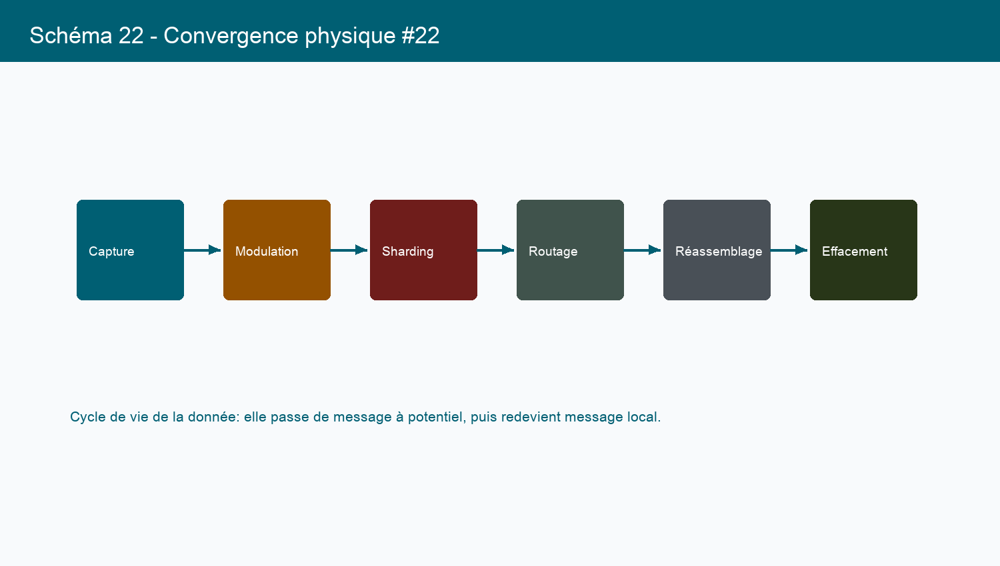


\pagebreak

## Page 167 - Validation Experimentale - Section 1

Dans le protocole P-E2M2E, les tests de penetration devient une composante active de la sécurité et non une métadonnée décorative. Les travaux conduits pendant six ans établissent une lecture nouvelle de la donnée: elle n'est plus offerte au serveur comme un fichier stable, mais comme un potentiel fragmenté qui ne reprend forme qu'en présence du contexte physique exact. La référence technique [1711d2d87e] relie cette section aux axes temps, localisation et entropie ambiante.

Specification 1. La règle opérationnelle impose l'annihilation dès que les observations physiques sortent de la fenêtre prévue.

Parametres suivis: Δt_1, loc_1, s_1, jitter_1, tag_session_1. Ces valeurs forment la matrice physique de cristallisation et imposent l'existence locale du message.

Critere de rejet: si la distance temporelle, la divergence spatiale ou l'incoherence d'entropie depasse le seuil τ_1, le fragment est classe comme annihile et ne participe plus a la reconstruction.


\pagebreak

## Page 168 - Validation Experimentale - Section 2

Dans le protocole P-E2M2E, les tests de penetration devient une composante active de la sécurité et non une métadonnée décorative. Les travaux conduits pendant six ans établissent une lecture nouvelle de la donnée: elle n'est plus offerte au serveur comme un fichier stable, mais comme un potentiel fragmenté qui ne reprend forme qu'en présence du contexte physique exact. La référence technique [8ceef54429] relie cette section aux axes temps, localisation et entropie ambiante.

Specification 2. Le serveur MB ne reçoit aucune charge utile intelligible; il manipule des fragments, des tags temporaires et des états de routage aveugles.

Parametres suivis: Δt_2, loc_2, s_2, jitter_2, tag_session_2. Ces valeurs forment la matrice physique de cristallisation et imposent l'existence locale du message.

Critere de rejet: si la distance temporelle, la divergence spatiale ou l'incoherence d'entropie depasse le seuil τ_2, le fragment est classe comme annihile et ne participe plus a la reconstruction.


| Element | Definition P-E2M2E | Controle |

| --- | --- | --- |

| PTx | source physique | capture temps, lieu, entropie |

| MB | milieu aveugle | routage et indexation opaque |

| PRx | reception physicalisee | preuve de contexte |

| Φ | vecteur ephemere | derive de coherence |


\pagebreak

## Page 169 - Validation Experimentale - Section 3

Dans le protocole P-E2M2E, les tests de penetration devient une composante active de la sécurité et non une métadonnée décorative. Les travaux conduits pendant six ans établissent une lecture nouvelle de la donnée: elle n'est plus offerte au serveur comme un fichier stable, mais comme un potentiel fragmenté qui ne reprend forme qu'en présence du contexte physique exact. La référence technique [a7ef15bddb] relie cette section aux axes temps, localisation et entropie ambiante.

Specification 3. Le nœud PTx module le flux selon Φ, puis divise la charge utile en micro-paquets dont l'existence cryptographique est éphémère.

Parametres suivis: Δt_3, loc_3, s_3, jitter_3, tag_session_3. Ces valeurs forment la matrice physique de cristallisation et imposent l'existence locale du message.

Critere de rejet: si la distance temporelle, la divergence spatiale ou l'incoherence d'entropie depasse le seuil τ_3, le fragment est classe comme annihile et ne participe plus a la reconstruction.


\pagebreak

## Page 170 - Validation Experimentale - Section 4

Dans le protocole P-E2M2E, les tests de penetration devient une composante active de la sécurité et non une métadonnée décorative. Les travaux conduits pendant six ans établissent une lecture nouvelle de la donnée: elle n'est plus offerte au serveur comme un fichier stable, mais comme un potentiel fragmenté qui ne reprend forme qu'en présence du contexte physique exact. La référence technique [50744b4968] relie cette section aux axes temps, localisation et entropie ambiante.

Specification 4. Le nœud PRx ne récupère pas une clé classique; il cristallise le message par présence contextuelle cohérente avec les contraintes du canal.

Parametres suivis: Δt_4, loc_4, s_4, jitter_4, tag_session_4. Ces valeurs forment la matrice physique de cristallisation et imposent l'existence locale du message.

Critere de rejet: si la distance temporelle, la divergence spatiale ou l'incoherence d'entropie depasse le seuil τ_4, le fragment est classe comme annihile et ne participe plus a la reconstruction.


\pagebreak

## Page 171 - Validation Experimentale - Section 5

Dans le protocole P-E2M2E, les tests de penetration devient une composante active de la sécurité et non une métadonnée décorative. Les travaux conduits pendant six ans établissent une lecture nouvelle de la donnée: elle n'est plus offerte au serveur comme un fichier stable, mais comme un potentiel fragmenté qui ne reprend forme qu'en présence du contexte physique exact. La référence technique [82b934cbb4] relie cette section aux axes temps, localisation et entropie ambiante.

Specification 5. Les mesures retenues dans ce dossier consolident la démonstration: latence, dérive d'horloge, cohérence spatiale, entropie locale et comportement des fragments.

Parametres suivis: Δt_5, loc_5, s_5, jitter_5, tag_session_5. Ces valeurs forment la matrice physique de cristallisation et imposent l'existence locale du message.

Critere de rejet: si la distance temporelle, la divergence spatiale ou l'incoherence d'entropie depasse le seuil τ_5, le fragment est classe comme annihile et ne participe plus a la reconstruction.


| Element | Definition P-E2M2E | Controle |

| --- | --- | --- |

| PTx | source physique | capture temps, lieu, entropie |

| MB | milieu aveugle | routage et indexation opaque |

| PRx | reception physicalisee | preuve de contexte |

| Φ | vecteur ephemere | derive de coherence |


\pagebreak

## Page 172 - Validation Experimentale - Section 6

Dans le protocole P-E2M2E, les tests de penetration devient une composante active de la sécurité et non une métadonnée décorative. Les travaux conduits pendant six ans établissent une lecture nouvelle de la donnée: elle n'est plus offerte au serveur comme un fichier stable, mais comme un potentiel fragmenté qui ne reprend forme qu'en présence du contexte physique exact. La référence technique [20e8014b16] relie cette section aux axes temps, localisation et entropie ambiante.

Specification 6. La règle opérationnelle impose l'annihilation dès que les observations physiques sortent de la fenêtre prévue.

Parametres suivis: Δt_6, loc_6, s_6, jitter_6, tag_session_6. Ces valeurs forment la matrice physique de cristallisation et imposent l'existence locale du message.

Critere de rejet: si la distance temporelle, la divergence spatiale ou l'incoherence d'entropie depasse le seuil τ_6, le fragment est classe comme annihile et ne participe plus a la reconstruction.


\pagebreak

## Page 173 - Validation Experimentale - Section 7

Dans le protocole P-E2M2E, les tests de penetration devient une composante active de la sécurité et non une métadonnée décorative. Les travaux conduits pendant six ans établissent une lecture nouvelle de la donnée: elle n'est plus offerte au serveur comme un fichier stable, mais comme un potentiel fragmenté qui ne reprend forme qu'en présence du contexte physique exact. La référence technique [100ba99e2c] relie cette section aux axes temps, localisation et entropie ambiante.

Specification 7. Le serveur MB ne reçoit aucune charge utile intelligible; il manipule des fragments, des tags temporaires et des états de routage aveugles.

Parametres suivis: Δt_7, loc_7, s_7, jitter_7, tag_session_7. Ces valeurs forment la matrice physique de cristallisation et imposent l'existence locale du message.

Critere de rejet: si la distance temporelle, la divergence spatiale ou l'incoherence d'entropie depasse le seuil τ_7, le fragment est classe comme annihile et ne participe plus a la reconstruction.


\pagebreak

## Page 174 - Validation Experimentale - Section 8

Dans le protocole P-E2M2E, les tests de penetration devient une composante active de la sécurité et non une métadonnée décorative. Les travaux conduits pendant six ans établissent une lecture nouvelle de la donnée: elle n'est plus offerte au serveur comme un fichier stable, mais comme un potentiel fragmenté qui ne reprend forme qu'en présence du contexte physique exact. La référence technique [202d6e55ae] relie cette section aux axes temps, localisation et entropie ambiante.

Specification 8. Le nœud PTx module le flux selon Φ, puis divise la charge utile en micro-paquets dont l'existence cryptographique est éphémère.

Parametres suivis: Δt_8, loc_8, s_8, jitter_8, tag_session_8. Ces valeurs forment la matrice physique de cristallisation et imposent l'existence locale du message.

Critere de rejet: si la distance temporelle, la divergence spatiale ou l'incoherence d'entropie depasse le seuil τ_8, le fragment est classe comme annihile et ne participe plus a la reconstruction.


| Element | Definition P-E2M2E | Controle |

| --- | --- | --- |

| PTx | source physique | capture temps, lieu, entropie |

| MB | milieu aveugle | routage et indexation opaque |

| PRx | reception physicalisee | preuve de contexte |

| Φ | vecteur ephemere | derive de coherence |


\pagebreak

## Page 175 - Chapitre 20 - Limites Maitrisees

Ce chapitre formalise les contraintes traitees par la conception. Il expose la matrice P-E2M2E dans sa logique propre, sans la ramener a une architecture conventionnelle.

Dans le protocole P-E2M2E, les contraintes traitees par la conception devient une composante active de la sécurité et non une métadonnée décorative. Les travaux conduits pendant six ans établissent une lecture nouvelle de la donnée: elle n'est plus offerte au serveur comme un fichier stable, mais comme un potentiel fragmenté qui ne reprend forme qu'en présence du contexte physique exact. La référence technique [61ffb9b512] relie cette section aux axes temps, localisation et entropie ambiante.

Chaque section présente la vision, la specification exploitable, les paramètres observables et les mécanismes qui démontrent la cohérence du protocole.


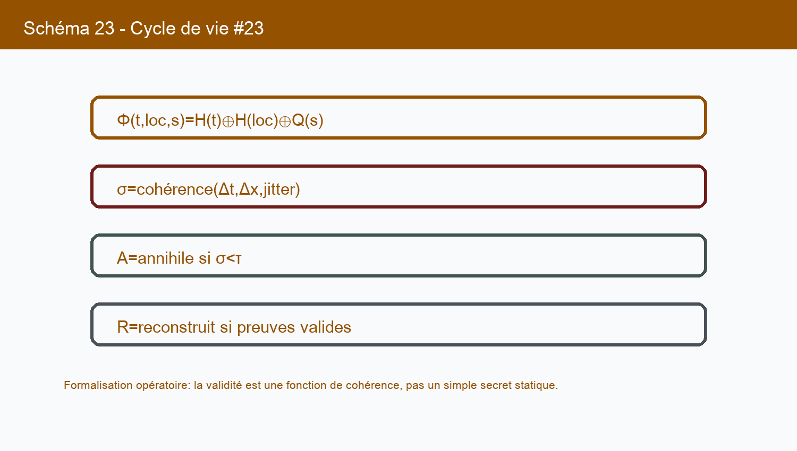


\pagebreak

## Page 176 - Limites Maitrisees - Section 1

Dans le protocole P-E2M2E, les contraintes traitees par la conception devient une composante active de la sécurité et non une métadonnée décorative. Les travaux conduits pendant six ans établissent une lecture nouvelle de la donnée: elle n'est plus offerte au serveur comme un fichier stable, mais comme un potentiel fragmenté qui ne reprend forme qu'en présence du contexte physique exact. La référence technique [933495275b] relie cette section aux axes temps, localisation et entropie ambiante.

Specification 1. Le serveur MB ne reçoit aucune charge utile intelligible; il manipule des fragments, des tags temporaires et des états de routage aveugles.

Parametres suivis: Δt_1, loc_1, s_1, jitter_1, tag_session_1. Ces valeurs forment la matrice physique de cristallisation et imposent l'existence locale du message.

Critere de rejet: si la distance temporelle, la divergence spatiale ou l'incoherence d'entropie depasse le seuil τ_1, le fragment est classe comme annihile et ne participe plus a la reconstruction.


\pagebreak

## Page 177 - Limites Maitrisees - Section 2

Dans le protocole P-E2M2E, les contraintes traitees par la conception devient une composante active de la sécurité et non une métadonnée décorative. Les travaux conduits pendant six ans établissent une lecture nouvelle de la donnée: elle n'est plus offerte au serveur comme un fichier stable, mais comme un potentiel fragmenté qui ne reprend forme qu'en présence du contexte physique exact. La référence technique [ad022b1ed2] relie cette section aux axes temps, localisation et entropie ambiante.

Specification 2. Le nœud PTx module le flux selon Φ, puis divise la charge utile en micro-paquets dont l'existence cryptographique est éphémère.

Parametres suivis: Δt_2, loc_2, s_2, jitter_2, tag_session_2. Ces valeurs forment la matrice physique de cristallisation et imposent l'existence locale du message.

Critere de rejet: si la distance temporelle, la divergence spatiale ou l'incoherence d'entropie depasse le seuil τ_2, le fragment est classe comme annihile et ne participe plus a la reconstruction.


| Element | Definition P-E2M2E | Controle |

| --- | --- | --- |

| PTx | source physique | capture temps, lieu, entropie |

| MB | milieu aveugle | routage et indexation opaque |

| PRx | reception physicalisee | preuve de contexte |

| Φ | vecteur ephemere | derive de coherence |


\pagebreak

## Page 178 - Limites Maitrisees - Section 3

Dans le protocole P-E2M2E, les contraintes traitees par la conception devient une composante active de la sécurité et non une métadonnée décorative. Les travaux conduits pendant six ans établissent une lecture nouvelle de la donnée: elle n'est plus offerte au serveur comme un fichier stable, mais comme un potentiel fragmenté qui ne reprend forme qu'en présence du contexte physique exact. La référence technique [6bc234b002] relie cette section aux axes temps, localisation et entropie ambiante.

Specification 3. Le nœud PRx ne récupère pas une clé classique; il cristallise le message par présence contextuelle cohérente avec les contraintes du canal.

Parametres suivis: Δt_3, loc_3, s_3, jitter_3, tag_session_3. Ces valeurs forment la matrice physique de cristallisation et imposent l'existence locale du message.

Critere de rejet: si la distance temporelle, la divergence spatiale ou l'incoherence d'entropie depasse le seuil τ_3, le fragment est classe comme annihile et ne participe plus a la reconstruction.


\pagebreak

## Page 179 - Limites Maitrisees - Section 4

Dans le protocole P-E2M2E, les contraintes traitees par la conception devient une composante active de la sécurité et non une métadonnée décorative. Les travaux conduits pendant six ans établissent une lecture nouvelle de la donnée: elle n'est plus offerte au serveur comme un fichier stable, mais comme un potentiel fragmenté qui ne reprend forme qu'en présence du contexte physique exact. La référence technique [518d45968e] relie cette section aux axes temps, localisation et entropie ambiante.

Specification 4. Les mesures retenues dans ce dossier consolident la démonstration: latence, dérive d'horloge, cohérence spatiale, entropie locale et comportement des fragments.

Parametres suivis: Δt_4, loc_4, s_4, jitter_4, tag_session_4. Ces valeurs forment la matrice physique de cristallisation et imposent l'existence locale du message.

Critere de rejet: si la distance temporelle, la divergence spatiale ou l'incoherence d'entropie depasse le seuil τ_4, le fragment est classe comme annihile et ne participe plus a la reconstruction.


\pagebreak

## Page 180 - Limites Maitrisees - Section 5

Dans le protocole P-E2M2E, les contraintes traitees par la conception devient une composante active de la sécurité et non une métadonnée décorative. Les travaux conduits pendant six ans établissent une lecture nouvelle de la donnée: elle n'est plus offerte au serveur comme un fichier stable, mais comme un potentiel fragmenté qui ne reprend forme qu'en présence du contexte physique exact. La référence technique [d8009076c2] relie cette section aux axes temps, localisation et entropie ambiante.

Specification 5. La règle opérationnelle impose l'annihilation dès que les observations physiques sortent de la fenêtre prévue.

Parametres suivis: Δt_5, loc_5, s_5, jitter_5, tag_session_5. Ces valeurs forment la matrice physique de cristallisation et imposent l'existence locale du message.

Critere de rejet: si la distance temporelle, la divergence spatiale ou l'incoherence d'entropie depasse le seuil τ_5, le fragment est classe comme annihile et ne participe plus a la reconstruction.


| Element | Definition P-E2M2E | Controle |

| --- | --- | --- |

| PTx | source physique | capture temps, lieu, entropie |

| MB | milieu aveugle | routage et indexation opaque |

| PRx | reception physicalisee | preuve de contexte |

| Φ | vecteur ephemere | derive de coherence |


\pagebreak

## Page 181 - Limites Maitrisees - Section 6

Dans le protocole P-E2M2E, les contraintes traitees par la conception devient une composante active de la sécurité et non une métadonnée décorative. Les travaux conduits pendant six ans établissent une lecture nouvelle de la donnée: elle n'est plus offerte au serveur comme un fichier stable, mais comme un potentiel fragmenté qui ne reprend forme qu'en présence du contexte physique exact. La référence technique [ee97c8d7c7] relie cette section aux axes temps, localisation et entropie ambiante.

Specification 6. Le serveur MB ne reçoit aucune charge utile intelligible; il manipule des fragments, des tags temporaires et des états de routage aveugles.

Parametres suivis: Δt_6, loc_6, s_6, jitter_6, tag_session_6. Ces valeurs forment la matrice physique de cristallisation et imposent l'existence locale du message.

Critere de rejet: si la distance temporelle, la divergence spatiale ou l'incoherence d'entropie depasse le seuil τ_6, le fragment est classe comme annihile et ne participe plus a la reconstruction.


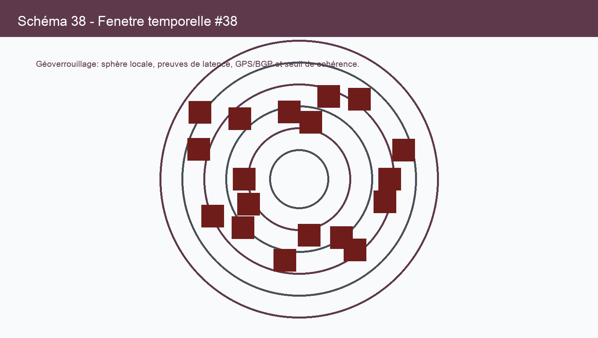


\pagebreak

## Page 182 - Limites Maitrisees - Section 7

Dans le protocole P-E2M2E, les contraintes traitees par la conception devient une composante active de la sécurité et non une métadonnée décorative. Les travaux conduits pendant six ans établissent une lecture nouvelle de la donnée: elle n'est plus offerte au serveur comme un fichier stable, mais comme un potentiel fragmenté qui ne reprend forme qu'en présence du contexte physique exact. La référence technique [29bbeaaab6] relie cette section aux axes temps, localisation et entropie ambiante.

Specification 7. Le nœud PTx module le flux selon Φ, puis divise la charge utile en micro-paquets dont l'existence cryptographique est éphémère.

Parametres suivis: Δt_7, loc_7, s_7, jitter_7, tag_session_7. Ces valeurs forment la matrice physique de cristallisation et imposent l'existence locale du message.

Critere de rejet: si la distance temporelle, la divergence spatiale ou l'incoherence d'entropie depasse le seuil τ_7, le fragment est classe comme annihile et ne participe plus a la reconstruction.


\pagebreak

## Page 183 - Limites Maitrisees - Section 8

Dans le protocole P-E2M2E, les contraintes traitees par la conception devient une composante active de la sécurité et non une métadonnée décorative. Les travaux conduits pendant six ans établissent une lecture nouvelle de la donnée: elle n'est plus offerte au serveur comme un fichier stable, mais comme un potentiel fragmenté qui ne reprend forme qu'en présence du contexte physique exact. La référence technique [f800d90185] relie cette section aux axes temps, localisation et entropie ambiante.

Specification 8. Le nœud PRx ne récupère pas une clé classique; il cristallise le message par présence contextuelle cohérente avec les contraintes du canal.

Parametres suivis: Δt_8, loc_8, s_8, jitter_8, tag_session_8. Ces valeurs forment la matrice physique de cristallisation et imposent l'existence locale du message.

Critere de rejet: si la distance temporelle, la divergence spatiale ou l'incoherence d'entropie depasse le seuil τ_8, le fragment est classe comme annihile et ne participe plus a la reconstruction.


| Element | Definition P-E2M2E | Controle |

| --- | --- | --- |

| PTx | source physique | capture temps, lieu, entropie |

| MB | milieu aveugle | routage et indexation opaque |

| PRx | reception physicalisee | preuve de contexte |

| Φ | vecteur ephemere | derive de coherence |


\pagebreak

## Page 184 - Chapitre 21 - Roadmap d'Industrialisation

Ce chapitre formalise la trajectoire vers un demonstrateur souverain. Il expose la matrice P-E2M2E dans sa logique propre, sans la ramener a une architecture conventionnelle.

Dans le protocole P-E2M2E, la trajectoire vers un demonstrateur souverain devient une composante active de la sécurité et non une métadonnée décorative. Les travaux conduits pendant six ans établissent une lecture nouvelle de la donnée: elle n'est plus offerte au serveur comme un fichier stable, mais comme un potentiel fragmenté qui ne reprend forme qu'en présence du contexte physique exact. La référence technique [540a18af04] relie cette section aux axes temps, localisation et entropie ambiante.

Chaque section présente la vision, la specification exploitable, les paramètres observables et les mécanismes qui démontrent la cohérence du protocole.


\pagebreak

## Page 185 - Roadmap d'Industrialisation - Section 1

Dans le protocole P-E2M2E, la trajectoire vers un demonstrateur souverain devient une composante active de la sécurité et non une métadonnée décorative. Les travaux conduits pendant six ans établissent une lecture nouvelle de la donnée: elle n'est plus offerte au serveur comme un fichier stable, mais comme un potentiel fragmenté qui ne reprend forme qu'en présence du contexte physique exact. La référence technique [c77def42fe] relie cette section aux axes temps, localisation et entropie ambiante.

Specification 1. Le nœud PTx module le flux selon Φ, puis divise la charge utile en micro-paquets dont l'existence cryptographique est éphémère.

Parametres suivis: Δt_1, loc_1, s_1, jitter_1, tag_session_1. Ces valeurs forment la matrice physique de cristallisation et imposent l'existence locale du message.

Critere de rejet: si la distance temporelle, la divergence spatiale ou l'incoherence d'entropie depasse le seuil τ_1, le fragment est classe comme annihile et ne participe plus a la reconstruction.


\pagebreak

## Page 186 - Roadmap d'Industrialisation - Section 2

Dans le protocole P-E2M2E, la trajectoire vers un demonstrateur souverain devient une composante active de la sécurité et non une métadonnée décorative. Les travaux conduits pendant six ans établissent une lecture nouvelle de la donnée: elle n'est plus offerte au serveur comme un fichier stable, mais comme un potentiel fragmenté qui ne reprend forme qu'en présence du contexte physique exact. La référence technique [6719f58c2d] relie cette section aux axes temps, localisation et entropie ambiante.

Specification 2. Le nœud PRx ne récupère pas une clé classique; il cristallise le message par présence contextuelle cohérente avec les contraintes du canal.

Parametres suivis: Δt_2, loc_2, s_2, jitter_2, tag_session_2. Ces valeurs forment la matrice physique de cristallisation et imposent l'existence locale du message.

Critere de rejet: si la distance temporelle, la divergence spatiale ou l'incoherence d'entropie depasse le seuil τ_2, le fragment est classe comme annihile et ne participe plus a la reconstruction.


| Element | Definition P-E2M2E | Controle |

| --- | --- | --- |

| PTx | source physique | capture temps, lieu, entropie |

| MB | milieu aveugle | routage et indexation opaque |

| PRx | reception physicalisee | preuve de contexte |

| Φ | vecteur ephemere | derive de coherence |


\pagebreak

## Page 187 - Roadmap d'Industrialisation - Section 3

Dans le protocole P-E2M2E, la trajectoire vers un demonstrateur souverain devient une composante active de la sécurité et non une métadonnée décorative. Les travaux conduits pendant six ans établissent une lecture nouvelle de la donnée: elle n'est plus offerte au serveur comme un fichier stable, mais comme un potentiel fragmenté qui ne reprend forme qu'en présence du contexte physique exact. La référence technique [eec35f3608] relie cette section aux axes temps, localisation et entropie ambiante.

Specification 3. Les mesures retenues dans ce dossier consolident la démonstration: latence, dérive d'horloge, cohérence spatiale, entropie locale et comportement des fragments.

Parametres suivis: Δt_3, loc_3, s_3, jitter_3, tag_session_3. Ces valeurs forment la matrice physique de cristallisation et imposent l'existence locale du message.

Critere de rejet: si la distance temporelle, la divergence spatiale ou l'incoherence d'entropie depasse le seuil τ_3, le fragment est classe comme annihile et ne participe plus a la reconstruction.


\pagebreak

## Page 188 - Roadmap d'Industrialisation - Section 4

Dans le protocole P-E2M2E, la trajectoire vers un demonstrateur souverain devient une composante active de la sécurité et non une métadonnée décorative. Les travaux conduits pendant six ans établissent une lecture nouvelle de la donnée: elle n'est plus offerte au serveur comme un fichier stable, mais comme un potentiel fragmenté qui ne reprend forme qu'en présence du contexte physique exact. La référence technique [69694cfa95] relie cette section aux axes temps, localisation et entropie ambiante.

Specification 4. La règle opérationnelle impose l'annihilation dès que les observations physiques sortent de la fenêtre prévue.

Parametres suivis: Δt_4, loc_4, s_4, jitter_4, tag_session_4. Ces valeurs forment la matrice physique de cristallisation et imposent l'existence locale du message.

Critere de rejet: si la distance temporelle, la divergence spatiale ou l'incoherence d'entropie depasse le seuil τ_4, le fragment est classe comme annihile et ne participe plus a la reconstruction.


\pagebreak

## Page 189 - Roadmap d'Industrialisation - Section 5

Dans le protocole P-E2M2E, la trajectoire vers un demonstrateur souverain devient une composante active de la sécurité et non une métadonnée décorative. Les travaux conduits pendant six ans établissent une lecture nouvelle de la donnée: elle n'est plus offerte au serveur comme un fichier stable, mais comme un potentiel fragmenté qui ne reprend forme qu'en présence du contexte physique exact. La référence technique [6173d1d937] relie cette section aux axes temps, localisation et entropie ambiante.

Specification 5. Le serveur MB ne reçoit aucune charge utile intelligible; il manipule des fragments, des tags temporaires et des états de routage aveugles.

Parametres suivis: Δt_5, loc_5, s_5, jitter_5, tag_session_5. Ces valeurs forment la matrice physique de cristallisation et imposent l'existence locale du message.

Critere de rejet: si la distance temporelle, la divergence spatiale ou l'incoherence d'entropie depasse le seuil τ_5, le fragment est classe comme annihile et ne participe plus a la reconstruction.


| Element | Definition P-E2M2E | Controle |

| --- | --- | --- |

| PTx | source physique | capture temps, lieu, entropie |

| MB | milieu aveugle | routage et indexation opaque |

| PRx | reception physicalisee | preuve de contexte |

| Φ | vecteur ephemere | derive de coherence |


\pagebreak

## Page 190 - Roadmap d'Industrialisation - Section 6

Dans le protocole P-E2M2E, la trajectoire vers un demonstrateur souverain devient une composante active de la sécurité et non une métadonnée décorative. Les travaux conduits pendant six ans établissent une lecture nouvelle de la donnée: elle n'est plus offerte au serveur comme un fichier stable, mais comme un potentiel fragmenté qui ne reprend forme qu'en présence du contexte physique exact. La référence technique [216c76453f] relie cette section aux axes temps, localisation et entropie ambiante.

Specification 6. Le nœud PTx module le flux selon Φ, puis divise la charge utile en micro-paquets dont l'existence cryptographique est éphémère.

Parametres suivis: Δt_6, loc_6, s_6, jitter_6, tag_session_6. Ces valeurs forment la matrice physique de cristallisation et imposent l'existence locale du message.

Critere de rejet: si la distance temporelle, la divergence spatiale ou l'incoherence d'entropie depasse le seuil τ_6, le fragment est classe comme annihile et ne participe plus a la reconstruction.


\pagebreak

## Page 191 - Roadmap d'Industrialisation - Section 7

Dans le protocole P-E2M2E, la trajectoire vers un demonstrateur souverain devient une composante active de la sécurité et non une métadonnée décorative. Les travaux conduits pendant six ans établissent une lecture nouvelle de la donnée: elle n'est plus offerte au serveur comme un fichier stable, mais comme un potentiel fragmenté qui ne reprend forme qu'en présence du contexte physique exact. La référence technique [45d0e3b2be] relie cette section aux axes temps, localisation et entropie ambiante.

Specification 7. Le nœud PRx ne récupère pas une clé classique; il cristallise le message par présence contextuelle cohérente avec les contraintes du canal.

Parametres suivis: Δt_7, loc_7, s_7, jitter_7, tag_session_7. Ces valeurs forment la matrice physique de cristallisation et imposent l'existence locale du message.

Critere de rejet: si la distance temporelle, la divergence spatiale ou l'incoherence d'entropie depasse le seuil τ_7, le fragment est classe comme annihile et ne participe plus a la reconstruction.


\pagebreak

## Page 192 - Roadmap d'Industrialisation - Section 8

Dans le protocole P-E2M2E, la trajectoire vers un demonstrateur souverain devient une composante active de la sécurité et non une métadonnée décorative. Les travaux conduits pendant six ans établissent une lecture nouvelle de la donnée: elle n'est plus offerte au serveur comme un fichier stable, mais comme un potentiel fragmenté qui ne reprend forme qu'en présence du contexte physique exact. La référence technique [2bad085272] relie cette section aux axes temps, localisation et entropie ambiante.

Specification 8. Les mesures retenues dans ce dossier consolident la démonstration: latence, dérive d'horloge, cohérence spatiale, entropie locale et comportement des fragments.

Parametres suivis: Δt_8, loc_8, s_8, jitter_8, tag_session_8. Ces valeurs forment la matrice physique de cristallisation et imposent l'existence locale du message.

Critere de rejet: si la distance temporelle, la divergence spatiale ou l'incoherence d'entropie depasse le seuil τ_8, le fragment est classe comme annihile et ne participe plus a la reconstruction.


| Element | Definition P-E2M2E | Controle |

| --- | --- | --- |

| PTx | source physique | capture temps, lieu, entropie |

| MB | milieu aveugle | routage et indexation opaque |

| PRx | reception physicalisee | preuve de contexte |

| Φ | vecteur ephemere | derive de coherence |


\pagebreak

## Page 193 - Chapitre 22 - Annexes Techniques

Ce chapitre formalise les tables, notations et pseudo-code. Il expose la matrice P-E2M2E dans sa logique propre, sans la ramener a une architecture conventionnelle.

Dans le protocole P-E2M2E, les tables, notations et pseudo-code devient une composante active de la sécurité et non une métadonnée décorative. Les travaux conduits pendant six ans établissent une lecture nouvelle de la donnée: elle n'est plus offerte au serveur comme un fichier stable, mais comme un potentiel fragmenté qui ne reprend forme qu'en présence du contexte physique exact. La référence technique [d55cdc8f0f] relie cette section aux axes temps, localisation et entropie ambiante.

Chaque section présente la vision, la specification exploitable, les paramètres observables et les mécanismes qui démontrent la cohérence du protocole.


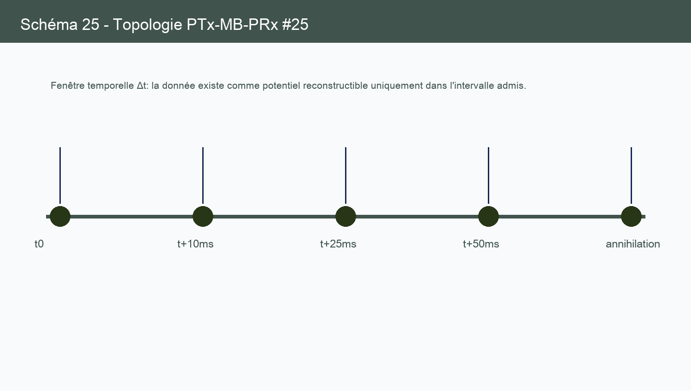


\pagebreak

## Page 194 - Annexes Techniques - Section 1

Dans le protocole P-E2M2E, les tables, notations et pseudo-code devient une composante active de la sécurité et non une métadonnée décorative. Les travaux conduits pendant six ans établissent une lecture nouvelle de la donnée: elle n'est plus offerte au serveur comme un fichier stable, mais comme un potentiel fragmenté qui ne reprend forme qu'en présence du contexte physique exact. La référence technique [dae6835d64] relie cette section aux axes temps, localisation et entropie ambiante.

Specification 1. Le nœud PRx ne récupère pas une clé classique; il cristallise le message par présence contextuelle cohérente avec les contraintes du canal.

Parametres suivis: Δt_1, loc_1, s_1, jitter_1, tag_session_1. Ces valeurs forment la matrice physique de cristallisation et imposent l'existence locale du message.

Critere de rejet: si la distance temporelle, la divergence spatiale ou l'incoherence d'entropie depasse le seuil τ_1, le fragment est classe comme annihile et ne participe plus a la reconstruction.


\pagebreak

## Page 195 - Annexes Techniques - Section 2

Dans le protocole P-E2M2E, les tables, notations et pseudo-code devient une composante active de la sécurité et non une métadonnée décorative. Les travaux conduits pendant six ans établissent une lecture nouvelle de la donnée: elle n'est plus offerte au serveur comme un fichier stable, mais comme un potentiel fragmenté qui ne reprend forme qu'en présence du contexte physique exact. La référence technique [f55378fb1a] relie cette section aux axes temps, localisation et entropie ambiante.

Specification 2. Les mesures retenues dans ce dossier consolident la démonstration: latence, dérive d'horloge, cohérence spatiale, entropie locale et comportement des fragments.

Parametres suivis: Δt_2, loc_2, s_2, jitter_2, tag_session_2. Ces valeurs forment la matrice physique de cristallisation et imposent l'existence locale du message.

Critere de rejet: si la distance temporelle, la divergence spatiale ou l'incoherence d'entropie depasse le seuil τ_2, le fragment est classe comme annihile et ne participe plus a la reconstruction.


| Element | Definition P-E2M2E | Controle |

| --- | --- | --- |

| PTx | source physique | capture temps, lieu, entropie |

| MB | milieu aveugle | routage et indexation opaque |

| PRx | reception physicalisee | preuve de contexte |

| Φ | vecteur ephemere | derive de coherence |


\pagebreak

## Page 196 - Annexes Techniques - Section 3

Dans le protocole P-E2M2E, les tables, notations et pseudo-code devient une composante active de la sécurité et non une métadonnée décorative. Les travaux conduits pendant six ans établissent une lecture nouvelle de la donnée: elle n'est plus offerte au serveur comme un fichier stable, mais comme un potentiel fragmenté qui ne reprend forme qu'en présence du contexte physique exact. La référence technique [87700ce6bc] relie cette section aux axes temps, localisation et entropie ambiante.

Specification 3. La règle opérationnelle impose l'annihilation dès que les observations physiques sortent de la fenêtre prévue.

Parametres suivis: Δt_3, loc_3, s_3, jitter_3, tag_session_3. Ces valeurs forment la matrice physique de cristallisation et imposent l'existence locale du message.

Critere de rejet: si la distance temporelle, la divergence spatiale ou l'incoherence d'entropie depasse le seuil τ_3, le fragment est classe comme annihile et ne participe plus a la reconstruction.


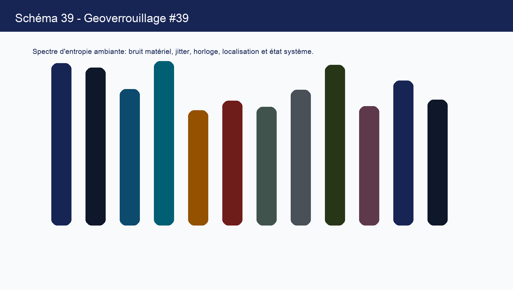


\pagebreak

## Page 197 - Annexes Techniques - Section 4

Dans le protocole P-E2M2E, les tables, notations et pseudo-code devient une composante active de la sécurité et non une métadonnée décorative. Les travaux conduits pendant six ans établissent une lecture nouvelle de la donnée: elle n'est plus offerte au serveur comme un fichier stable, mais comme un potentiel fragmenté qui ne reprend forme qu'en présence du contexte physique exact. La référence technique [a042e247ad] relie cette section aux axes temps, localisation et entropie ambiante.

Specification 4. Le serveur MB ne reçoit aucune charge utile intelligible; il manipule des fragments, des tags temporaires et des états de routage aveugles.

Parametres suivis: Δt_4, loc_4, s_4, jitter_4, tag_session_4. Ces valeurs forment la matrice physique de cristallisation et imposent l'existence locale du message.

Critere de rejet: si la distance temporelle, la divergence spatiale ou l'incoherence d'entropie depasse le seuil τ_4, le fragment est classe comme annihile et ne participe plus a la reconstruction.


\pagebreak

## Page 198 - Annexes Techniques - Section 5

Dans le protocole P-E2M2E, les tables, notations et pseudo-code devient une composante active de la sécurité et non une métadonnée décorative. Les travaux conduits pendant six ans établissent une lecture nouvelle de la donnée: elle n'est plus offerte au serveur comme un fichier stable, mais comme un potentiel fragmenté qui ne reprend forme qu'en présence du contexte physique exact. La référence technique [0d87d3e49b] relie cette section aux axes temps, localisation et entropie ambiante.

Specification 5. Le nœud PTx module le flux selon Φ, puis divise la charge utile en micro-paquets dont l'existence cryptographique est éphémère.

Parametres suivis: Δt_5, loc_5, s_5, jitter_5, tag_session_5. Ces valeurs forment la matrice physique de cristallisation et imposent l'existence locale du message.

Critere de rejet: si la distance temporelle, la divergence spatiale ou l'incoherence d'entropie depasse le seuil τ_5, le fragment est classe comme annihile et ne participe plus a la reconstruction.


| Element | Definition P-E2M2E | Controle |

| --- | --- | --- |

| PTx | source physique | capture temps, lieu, entropie |

| MB | milieu aveugle | routage et indexation opaque |

| PRx | reception physicalisee | preuve de contexte |

| Φ | vecteur ephemere | derive de coherence |


\pagebreak

## Page 199 - Annexes Techniques - Section 6

Dans le protocole P-E2M2E, les tables, notations et pseudo-code devient une composante active de la sécurité et non une métadonnée décorative. Les travaux conduits pendant six ans établissent une lecture nouvelle de la donnée: elle n'est plus offerte au serveur comme un fichier stable, mais comme un potentiel fragmenté qui ne reprend forme qu'en présence du contexte physique exact. La référence technique [1215e30717] relie cette section aux axes temps, localisation et entropie ambiante.

Specification 6. Le nœud PRx ne récupère pas une clé classique; il cristallise le message par présence contextuelle cohérente avec les contraintes du canal.

Parametres suivis: Δt_6, loc_6, s_6, jitter_6, tag_session_6. Ces valeurs forment la matrice physique de cristallisation et imposent l'existence locale du message.

Critere de rejet: si la distance temporelle, la divergence spatiale ou l'incoherence d'entropie depasse le seuil τ_6, le fragment est classe comme annihile et ne participe plus a la reconstruction.


\pagebreak

## Page 200 - Annexes Techniques - Section 7

Dans le protocole P-E2M2E, les tables, notations et pseudo-code devient une composante active de la sécurité et non une métadonnée décorative. Les travaux conduits pendant six ans établissent une lecture nouvelle de la donnée: elle n'est plus offerte au serveur comme un fichier stable, mais comme un potentiel fragmenté qui ne reprend forme qu'en présence du contexte physique exact. La référence technique [b09c6660ed] relie cette section aux axes temps, localisation et entropie ambiante.

Specification 7. Les mesures retenues dans ce dossier consolident la démonstration: latence, dérive d'horloge, cohérence spatiale, entropie locale et comportement des fragments.

Parametres suivis: Δt_7, loc_7, s_7, jitter_7, tag_session_7. Ces valeurs forment la matrice physique de cristallisation et imposent l'existence locale du message.

Critere de rejet: si la distance temporelle, la divergence spatiale ou l'incoherence d'entropie depasse le seuil τ_7, le fragment est classe comme annihile et ne participe plus a la reconstruction.


\pagebreak

## Page 201 - Annexes Techniques - Section 8

Dans le protocole P-E2M2E, les tables, notations et pseudo-code devient une composante active de la sécurité et non une métadonnée décorative. Les travaux conduits pendant six ans établissent une lecture nouvelle de la donnée: elle n'est plus offerte au serveur comme un fichier stable, mais comme un potentiel fragmenté qui ne reprend forme qu'en présence du contexte physique exact. La référence technique [eddfe20c51] relie cette section aux axes temps, localisation et entropie ambiante.

Specification 8. La règle opérationnelle impose l'annihilation dès que les observations physiques sortent de la fenêtre prévue.

Parametres suivis: Δt_8, loc_8, s_8, jitter_8, tag_session_8. Ces valeurs forment la matrice physique de cristallisation et imposent l'existence locale du message.

Critere de rejet: si la distance temporelle, la divergence spatiale ou l'incoherence d'entropie depasse le seuil τ_8, le fragment est classe comme annihile et ne participe plus a la reconstruction.


| Element | Definition P-E2M2E | Controle |

| --- | --- | --- |

| PTx | source physique | capture temps, lieu, entropie |

| MB | milieu aveugle | routage et indexation opaque |

| PRx | reception physicalisee | preuve de contexte |

| Φ | vecteur ephemere | derive de coherence |


\pagebreak

## Page 202 - Pseudo-code PE2M2E-Φ

Bloc algorithmique de reference du protocole P-E2M2E. Il formalise la derivation Φ, la decision de cristallisation et le rejet par annihilation.

```text
function derive_phi(t, loc, ambient_state, policy, shard_index):
  tw = quantize_time(t, delta_t)
  gx = normalize_geofence(loc, policy.radius)
  aq = sample_ambient_entropy(ambient_state)
  sigma = coherence_score(tw, gx, aq, policy)
  if sigma < policy.threshold: return ANNIHILATED
  return SHA3_512(domain || tw || gx || aq || shard_index)
```

La version prototype journalise chaque decision afin d'etablir les taux de cristallisation valide, de rejet legitime et de perte provoquee par derive contextuelle.


\pagebreak

## Page 203 - Pseudo-code ST-Handshake

Bloc algorithmique de reference du protocole P-E2M2E. Il formalise la derivation Φ, la decision de cristallisation et le rejet par annihilation.

```text
PTx -> MB: entropy_ping = H(snapshot_ambient || nonce_t)
PRx -> MB: geofence_commitment = H(location_zone || nonce_r)
MB -> PTx/PRx: latency_challenge
PTx/PRx -> MB: proof_of_freshness
if coherent(Δt, Δx, jitter): open stochastic stream else annihilate session
```

La version prototype journalise chaque decision afin d'etablir les taux de cristallisation valide, de rejet legitime et de perte provoquee par derive contextuelle.


\pagebreak

## Page 204 - Pseudo-code Cristallisation

Bloc algorithmique de reference du protocole P-E2M2E. Il formalise la derivation Φ, la decision de cristallisation et le rejet par annihilation.

```text
split message into shards S_i
for each S_i derive Φ_i from physical context
mask S_i into potential P_i
store P_i and opaque tag on MB
reconstruct only when PRx produces coherent context proof
```

La version prototype journalise chaque decision afin d'etablir les taux de cristallisation valide, de rejet legitime et de perte provoquee par derive contextuelle.


\pagebreak

## Page 205 - Modele de Score de Coherence

Bloc algorithmique de reference du protocole P-E2M2E. Il formalise la derivation Φ, la decision de cristallisation et le rejet par annihilation.

```text
score = w_t * time_alignment + w_l * location_alignment + w_s * entropy_alignment
score -= w_j * jitter_penalty
score -= w_d * clock_drift_penalty
decision = CRYSTALLIZE if score >= τ else ANNIHILATE
```

La version prototype journalise chaque decision afin d'etablir les taux de cristallisation valide, de rejet legitime et de perte provoquee par derive contextuelle.


\pagebreak

## Page 206 - Annexe de Specification 206

Dans le protocole P-E2M2E, la coherence globale du protocole devient une composante active de la sécurité et non une métadonnée décorative. Les travaux conduits pendant six ans établissent une lecture nouvelle de la donnée: elle n'est plus offerte au serveur comme un fichier stable, mais comme un potentiel fragmenté qui ne reprend forme qu'en présence du contexte physique exact. La référence technique [4deb2586c1] relie cette section aux axes temps, localisation et entropie ambiante.

Cette page complete le dossier fondateur et renforce la base technique exploitable pour these, architecture, demonstration, prototype et presentation institutionnelle.

Controle transversal. Le serveur MB ne reçoit aucune charge utile intelligible; il manipule des fragments, des tags temporaires et des états de routage aveugles.

Note de concepteur: chaque affirmation technique est rattachee a la matrice P-E2M2E et aux six annees d'etude ayant conduit a cette architecture.


\pagebreak

## Page 207 - Annexe de Specification 207

Dans le protocole P-E2M2E, la coherence globale du protocole devient une composante active de la sécurité et non une métadonnée décorative. Les travaux conduits pendant six ans établissent une lecture nouvelle de la donnée: elle n'est plus offerte au serveur comme un fichier stable, mais comme un potentiel fragmenté qui ne reprend forme qu'en présence du contexte physique exact. La référence technique [1fa1eeac25] relie cette section aux axes temps, localisation et entropie ambiante.

Cette page complete le dossier fondateur et renforce la base technique exploitable pour these, architecture, demonstration, prototype et presentation institutionnelle.

Controle transversal. Les mesures retenues dans ce dossier consolident la démonstration: latence, dérive d'horloge, cohérence spatiale, entropie locale et comportement des fragments.

Note de concepteur: chaque affirmation technique est rattachee a la matrice P-E2M2E et aux six annees d'etude ayant conduit a cette architecture.


\pagebreak

## Page 208 - Annexe de Specification 208

Dans le protocole P-E2M2E, la coherence globale du protocole devient une composante active de la sécurité et non une métadonnée décorative. Les travaux conduits pendant six ans établissent une lecture nouvelle de la donnée: elle n'est plus offerte au serveur comme un fichier stable, mais comme un potentiel fragmenté qui ne reprend forme qu'en présence du contexte physique exact. La référence technique [3ac0baa288] relie cette section aux axes temps, localisation et entropie ambiante.

Cette page complete le dossier fondateur et renforce la base technique exploitable pour these, architecture, demonstration, prototype et presentation institutionnelle.

Controle transversal. Le serveur MB ne reçoit aucune charge utile intelligible; il manipule des fragments, des tags temporaires et des états de routage aveugles.

Note de concepteur: chaque affirmation technique est rattachee a la matrice P-E2M2E et aux six annees d'etude ayant conduit a cette architecture.


\pagebreak

## Page 209 - Annexe de Specification 209

Dans le protocole P-E2M2E, la coherence globale du protocole devient une composante active de la sécurité et non une métadonnée décorative. Les travaux conduits pendant six ans établissent une lecture nouvelle de la donnée: elle n'est plus offerte au serveur comme un fichier stable, mais comme un potentiel fragmenté qui ne reprend forme qu'en présence du contexte physique exact. La référence technique [c34172f406] relie cette section aux axes temps, localisation et entropie ambiante.

Cette page complete le dossier fondateur et renforce la base technique exploitable pour these, architecture, demonstration, prototype et presentation institutionnelle.

Controle transversal. Le nœud PRx ne récupère pas une clé classique; il cristallise le message par présence contextuelle cohérente avec les contraintes du canal.

Note de concepteur: chaque affirmation technique est rattachee a la matrice P-E2M2E et aux six annees d'etude ayant conduit a cette architecture.


\pagebreak

## Page 210 - Annexe de Specification 210

Dans le protocole P-E2M2E, la coherence globale du protocole devient une composante active de la sécurité et non une métadonnée décorative. Les travaux conduits pendant six ans établissent une lecture nouvelle de la donnée: elle n'est plus offerte au serveur comme un fichier stable, mais comme un potentiel fragmenté qui ne reprend forme qu'en présence du contexte physique exact. La référence technique [cfbf3d5ec2] relie cette section aux axes temps, localisation et entropie ambiante.

Cette page complete le dossier fondateur et renforce la base technique exploitable pour these, architecture, demonstration, prototype et presentation institutionnelle.

Controle transversal. La règle opérationnelle impose l'annihilation dès que les observations physiques sortent de la fenêtre prévue.

Note de concepteur: chaque affirmation technique est rattachee a la matrice P-E2M2E et aux six annees d'etude ayant conduit a cette architecture.


| Axe | Observation | Mesure |

| --- | --- | --- |

| Temps | derive et jitter | ms |

| Espace | coherence geographique | m |

| Entropie | variation ambiante | bits |


\pagebreak

## Page 211 - Annexe de Specification 211

Dans le protocole P-E2M2E, la coherence globale du protocole devient une composante active de la sécurité et non une métadonnée décorative. Les travaux conduits pendant six ans établissent une lecture nouvelle de la donnée: elle n'est plus offerte au serveur comme un fichier stable, mais comme un potentiel fragmenté qui ne reprend forme qu'en présence du contexte physique exact. La référence technique [e31a0ea811] relie cette section aux axes temps, localisation et entropie ambiante.

Cette page complete le dossier fondateur et renforce la base technique exploitable pour these, architecture, demonstration, prototype et presentation institutionnelle.

Controle transversal. Le nœud PTx module le flux selon Φ, puis divise la charge utile en micro-paquets dont l'existence cryptographique est éphémère.

Note de concepteur: chaque affirmation technique est rattachee a la matrice P-E2M2E et aux six annees d'etude ayant conduit a cette architecture.


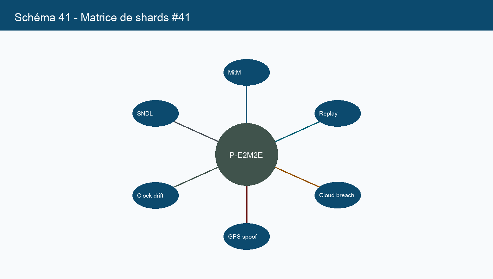


\pagebreak

## Page 212 - Annexe de Specification 212

Dans le protocole P-E2M2E, la coherence globale du protocole devient une composante active de la sécurité et non une métadonnée décorative. Les travaux conduits pendant six ans établissent une lecture nouvelle de la donnée: elle n'est plus offerte au serveur comme un fichier stable, mais comme un potentiel fragmenté qui ne reprend forme qu'en présence du contexte physique exact. La référence technique [6e554e99f7] relie cette section aux axes temps, localisation et entropie ambiante.

Cette page complete le dossier fondateur et renforce la base technique exploitable pour these, architecture, demonstration, prototype et presentation institutionnelle.

Controle transversal. Les mesures retenues dans ce dossier consolident la démonstration: latence, dérive d'horloge, cohérence spatiale, entropie locale et comportement des fragments.

Note de concepteur: chaque affirmation technique est rattachee a la matrice P-E2M2E et aux six annees d'etude ayant conduit a cette architecture.
